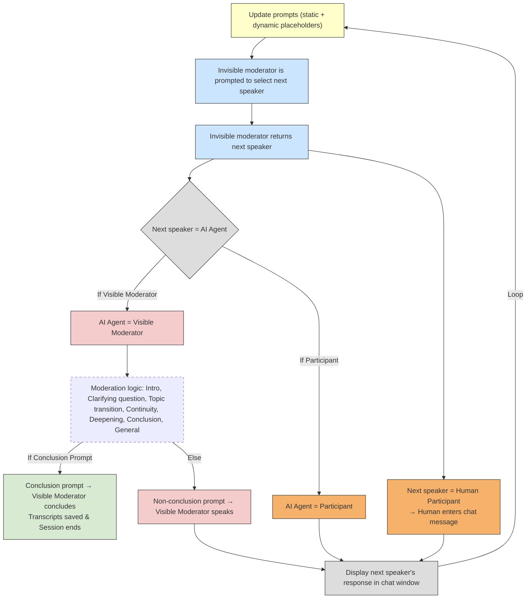
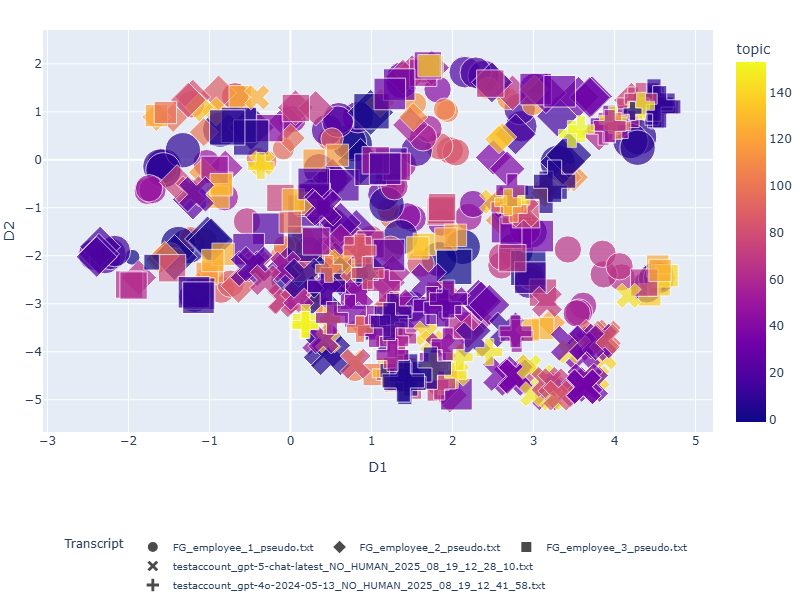

# AI-powered Qualitative Interviews and Focus Groups
by Torben Fischer \[Email: s72tfisc@uni-bonn.de\] - prepared for the
course ‘Data Science, Machine Learning, and AI’ held by Prof. Thiemo
Fetzer
2025-08-22

- [<span class="toc-section-number">1</span> Motivation &
  Introduction](#sec-introduction_motivation)
- [<span class="toc-section-number">2</span> Links](#sec-links)
- [<span class="toc-section-number">3</span>
  Replication](#sec-replication)
  - [<span class="toc-section-number">3.1</span> Comparison of AI-led
    Interview
    Implementations](#comparison-of-ai-led-interview-implementations)
  - [<span class="toc-section-number">3.2</span> Chopra and Haaland
    (2024)](#sec-replication-chopra)
    - [<span class="toc-section-number">3.2.1</span> Local
      Setup](#sec-replication-chopra-local)
    - [<span class="toc-section-number">3.2.2</span> Global
      Setup](#sec-replication-chopra-global)
  - [<span class="toc-section-number">3.3</span> Geiecke and Jaravel
    (2025)](#sec-replication-geiecke)
    - [<span class="toc-section-number">3.3.1</span> Ollama
      Extension](#sec-replication-geiecke-ollama)
    - [<span class="toc-section-number">3.3.2</span> Local
      Setup](#sec-replication-geiecke-local)
    - [<span class="toc-section-number">3.3.3</span> Global
      Setup](#sec-replication-geiecke-global)
- [<span class="toc-section-number">4</span> Extension: AI Focus
  Group](#sec-focusgroup)
  - [<span class="toc-section-number">4.1</span> Focus Group
    Architecture - Guidelines, AI Agents & Human
    Participant](#sec-focusgroup-aiagents)
    - [<span class="toc-section-number">4.1.1</span> Invisible
      Moderator](#sec-focusgroup-aiagents-invisiblemoderator)
    - [<span class="toc-section-number">4.1.2</span> Visible
      Moderator](#sec-focusgroup-aiagents-visiblemoderator)
    - [<span class="toc-section-number">4.1.3</span> AI
      Participants](#sec-focusgroup-aiagents-participants)
    - [<span class="toc-section-number">4.1.4</span> Human
      Participant](#sec-focusgroup-aiagents-human)
  - [<span class="toc-section-number">4.2</span> Design
    Choices](#sec-focusgroup-design)
    - [<span class="toc-section-number">4.2.1</span> Streamlit
      App](#sec-focusgroup-design-streamlitapp)
    - [<span class="toc-section-number">4.2.2</span> Moderator
      Design](#sec-focusgroup-design-moderatordesign)
    - [<span class="toc-section-number">4.2.3</span> LLM
      parameters](#sec-focusgroup-design-llmparameters)
    - [<span class="toc-section-number">4.2.4</span> Additional
      Contributions: Options & Functions](#sec-focusgroup-options)
  - [<span class="toc-section-number">4.3</span> Implementation - Local
    & Global Setup](#sec-focusgroup-implementation)
  - [<span class="toc-section-number">4.4</span>
    Limitations](#sec-focusgroup-limitations)
  - [<span class="toc-section-number">4.5</span>
    Extensions](#sec-focusgroup-extensions)
- [<span class="toc-section-number">5</span>
  Evaluation](#sec-evaluation)
- [<span class="toc-section-number">6</span>
  Conclusion](#sec-discussion)
- [<span class="toc-section-number">7</span>
  References](#sec:references)

**<u>Abstract:</u>** This repository builds on previous work by Chopra
and Haaland ([2024](#ref-chopra_haaland_2024)) and Geiecke and Jaravel
([2025](#ref-geiecke_jaravel_2025)) who introduced the new methodology
to conduct qualitative interviews by delegating the role of the
moderator to a well-prompted AI moderator. This deliverable extends
their work in two ways. Firstly, additional code allows to run the
qualitative AI-interviews using local, open-source AI models, e.g.,
gemma3, provided by Ollama, now. Secondly, as the main contribution of
this deliverable, the codebase creates a scalebale and cost-efficient
AI-moderated focus group discussion between several AI agents simulating
participants and optionally one human participant. A simple qualitative
analysis - using AI for topic modeling - shows that transcripts of AI
and human focus groups cover similar topics and themes. Links to try out
the AI-led qualitative interviews and AI-powered focus group (with or
without yurself as the human participant) are shared in Section
<a href="#sec-links" class="quarto-xref">Section 2</a>.

# Motivation & Introduction

Qualitative methods are experiencing a resurgence in the social
sciences. While computational advances have long supported the analysis
of qualitative data, only recent breakthroughs in Artificial
Intelligence (AI) have made qualitative research scalable. In
experimental economics, for example, applications were traditionally
confined to single open-ended survey questions. As Haaland et al.
([forthcoming](#ref-haaland_roth_stantcheva_wohlfahrt_forthcoming))
note, such methods are valuable for uncovering pieces of narratives,
mechanisms, and reasoning, but remain limited to *top-of-mind*
responses. Thus, there is a need for the application of more elaborate
methods. A natural extension of single open-ended questions is the
method of semi-structured **qualitative interviews**, usually guided by
a topic outline. These interviews have generated important insights,
such as explaining why low-income families often remain in
low-opportunity neighborhoods ([Bergman et al.
2024](#ref-bergman_chetty_deluca_hendren_katz_palmer_2024)), but their
widespread use is constrained by high costs and incompatibility with
experimental or survey designs.

To address these barriers, Chopra and Haaland
([2024](#ref-chopra_haaland_2024)) and Geiecke and Jaravel
([2025](#ref-geiecke_jaravel_2025)) pioneered AI-led qualitative
interviews, in which a well-prompted AI agent acts as the interviewer.
This design reduces both, interviewer and interviewee social
desirability bias ([Bursztyn et al.
2025](#ref-bursztyn_haaland_roever_roth_2025)) and, strikingly, is even
weakly preferred by participants over human-led interviews. The papers
showcase that AI-led qualitative interviews are able to reveal unknown
mental models explaining why people are reluctant to invest and create a
deeper understanding of voting decisions.

This deliverable builds directly on the code of Geiecke and Jaravel
([2025](#ref-geiecke_jaravel_2025)) and extends it to a **focus group**
format.

Focus groups are a cornerstone of qualitative research in health and
social care ([Rabiee 2004](#ref-rabiee_2004)), marketing, and policy
evaluation ([Kahan 2001](#ref-kahan_2001)). They typically bring
together 6–12 participants for 60–90 minutes of semi-structured
discussion, moderated through a guide that balances structure with open
dialogue. The format is particularly effective at eliciting collective
perspectives, surfacing social dynamics, and probing motivations and
decision-making processes ([Billups 2021](#ref-billups_2021)).

The AI-led focus group created here reproduces this format with an AI
moderator and AI-simulated participants, optionally combined with a
human participant. This approach offers four key advantages:

**1. Scalability and efficiency:** Sessions can be conducted quickly and
at low cost. There are (almost) no people that have to be paid. A pure
AI focus group that lasts 60 minutes costs about between \$1 and \$2.

**2. Consistency and adaptability:** AI moderators do not suffer from
behavioral biases and remain tireless, no matter how long the discussion
is already ongoing.

**3. Diversity of perspectives:** AI participants, designed to reflect
different stakeholder positions or trained on broad datasets, likely
introduce novel or underexplored viewpoints.

**4. Flexible group composition:** Homogeneous or heterogeneous groups
can be assembled instantly, bypassing recruitment challenges. Also the
moderator has not to be trained on the topic first.

By combining the depth of traditional focus groups with the scalability
of AI, this method opens new possibilities for exploring “what-if”
scenarios, testing reactions to emerging issues, and generating richer,
more diverse qualitative insights. In particular, we show that the here
constructed AI focus group performs similarly to human focus groups
outputwise.

The deliverable is structured as follows. To give you and idea what the
deliverable/repository does, we offer you to run both AI-led qualitative
interviews, as well as both versions of the AI-powered focus group in
<a href="#sec-links" class="quarto-xref">Section 2</a>.
<a href="#sec-replication" class="quarto-xref">Section 3</a> provides an
overview and instructions for replicating and setting up the AI-led
qualitative interviews developed by Chopra and Haaland
([2024](#ref-chopra_haaland_2024)) and Geiecke and Jaravel
([2025](#ref-geiecke_jaravel_2025)), both locally and globally.
<a href="#sec-focusgroup" class="quarto-xref">Section 4</a> then
introduces the main contribution of this deliverable: code for
configuring an AI-moderated focus group discussion with additional AI
agents simulating participants, alongside the option of including a
human participant. This section also details the key coding and
prompting choices, while addressing limitations and outlining potential
extensions. <a href="#sec-evaluation" class="quarto-xref">Section 5</a>
assesses the quality of the fully AI-based focus group by comparing the
topics and themes it generates with those emerging from human focus
group interactions reported in Morton et al.
([2024](#ref-morton_fitzsimons_sivaramakrishan_jepson_niven_2024)).
Finally, <a href="#sec-discussion" class="quarto-xref">Section 6</a>
concludes by summarizing the strengths and weaknesses of the AI focus
group format presented here.

# Links

This section allows you to explore both AI-led qualitative interviews
and AI-powered focus groups, with or without a human participant.

1.  AI-Led Qualitative Interviews

We use the default interviews implemented in the respective
repositories:

- Chopra and Haaland ([2024](#ref-chopra_haaland_2024)): The interview
  focuses on the participation puzzle — why do people not invest in
  stocks or mutual funds? The topic guide consists of almost 20
  questions.

- Geiecke and Jaravel ([2025](#ref-geiecke_jaravel_2025)): The interview
  explores your educational journey and its determinants. The topic
  guide consists of approximately 35 questions.

2.  AI-Powered Focus Group

For the focus group, an exemplary scenario was coded around the topic
*Reducing sedentary behavior while working from home: How can we promote
healthier and more active remote work routines?*

- This setup was inspired by research from Morton et al.
  ([2024](#ref-morton_fitzsimons_sivaramakrishan_jepson_niven_2024)).

- The AI focus group can be run with or without a human participant.

- The session typically without a human lasts 5–10 minutes, but if
  translated into spoken words, it roughly equates to 60 minutes of
  discussion.

You can try the *AI-led qualitative interview* designed by Chopra and
Haaland ([2024](#ref-chopra_haaland_2024))
[here](https://tdbdo90q9g.execute-api.eu-north-1.amazonaws.com/default/qualtricsRedirectHandler).

You can try the *AI-led qualitative interview* designed by Geiecke and
Jaravel ([2025](#ref-geiecke_jaravel_2025))
[here](https://ai-led-interview.streamlit.app/).

You can try the *AI-powered focus group* **without** a *human
participant* [here](https://focusgroup.streamlit.app/).

You can try the *AI-powered focus group* **with** a *human participant*
[here](https://focusgroup-human.streamlit.app/).

These examples are running using my API keys. If you encounter any
issues, such as the examples not working because the API key has run out
of credits, please contact me at `s72tfisc@uni-bonn.de`. However, there
should be enough credits for at least 30 trys so that this is unlikely
to occur.

# Replication

This section replicates the AI-led qualitative interview designed by
Chopra and Haaland ([2024](#ref-chopra_haaland_2024)) and Geiecke and
Jaravel ([2025](#ref-geiecke_jaravel_2025)).

## Comparison of AI-led Interview Implementations

Both Chopra and Haaland ([2024](#ref-chopra_haaland_2024)) and Geiecke
and Jaravel ([2025](#ref-geiecke_jaravel_2025)) follow a similar
conceptual approach, using **OpenAI API Keys** combined with a
`chat-gpt-4o` model to conduct AI-led qualitative interviews. Both
codebases perform equally fine from my perspective. However, there are
minor differences in their architecture, performance, and implementation
style.

1.  **Token Management and Multi-Agent Architecture**
    - **Chopra and Haaland ([2024](#ref-chopra_haaland_2024))**: Being
      the first to develop AI-led interviews, they faced challenges with
      token limits in long conversations. To overcome this, they
      implemented a **multi-AI-agent architecture** that summarizes
      context and conversation flow across multiple agents.  
    - **Geiecke and Jaravel ([2025](#ref-geiecke_jaravel_2025))**: This
      architecture is no longer necessary. They simplify the setup by
      using a single AI agent - in particular the `messages` input of
      the moderator prompt - benefiting from more efficient token usage.
2.  **Response Streaming**
    - **Geiecke and Jaravel ([2025](#ref-geiecke_jaravel_2025))**:
      Implements **streaming of AI responses**, which allows
      participants to see answers as they are generated. This enhances
      interactivity and reduces waiting time.  
    - **Chopra and Haaland ([2024](#ref-chopra_haaland_2024))**: Uses a
      more traditional response model, which may have slightly longer
      latency for each AI reply.
3.  **Application Framework**
    - **Chopra and Haaland ([2024](#ref-chopra_haaland_2024))**: Built
      on a **Flask app**, providing a classic web server setup suitable
      for flexible backend integrations and deployment (e.g., on AWS
      Lambda). The app setup is based on JSON and HTML, making the
      design of the app more complex, but also easier to edit.
    - **Geiecke and Jaravel ([2025](#ref-geiecke_jaravel_2025))**: Uses
      a **Streamlit app**, offering faster setup for local or online
      deployment with an interactive interface out-of-the-box. This does
      not need any JSON or HTML input, and therefore is especially
      convenient for rapid prototyping and testing.

## Chopra and Haaland ([2024](#ref-chopra_haaland_2024))

The codebase to replicate Chopra and Haaland
([2024](#ref-chopra_haaland_2024)) is stored in the folder
`Chopra_Haaland_2024` of this repository.  
If you want to work with the original code, you can clone Felix Chopra’s
[repository](https://github.com/fchop/interviews).  
Since no relevant changes were made to the code, the following steps
should work in both cases.  
You may also follow the instructions given in Chopra’s repo — most parts
are identical — but here I provide additional information for the global
setup.

Once you have cloned one of the repositories, you can set up the AI-led
qualitative interview either **locally** or **globally (online)** by
following the steps below.

**Step 0: OpenAI API Keys**

This AI-led qualitative interview template requires OpenAI API keys.  
Before you start, replace the placeholder credentials in `app/app.py`.
Otherwise, the interviewer will not respond.

If you don’t have an API key yet, you can create one
[here](https://platform.openai.com/settings/organization/api-keys).

**Note:** If you have used OpenAI in Python before, you might need to
uninstall `openai` and install an older version, since newer versions
may not support the syntax used for API calls.

**Step 1: Local Environment**

For both local and global setups, first create a virtual environment and
install the required packages:

``` bash
python -m venv interviews-env
cd interviews-env
source bin/activate
pip install -r local_requirements.txt
```

### Local Setup

**Step 2: Deploy App**

To host the app locally, you have to setup a development server:

``` bash
python app/app.py
```

The application is hosted at http://127.0.0.1:8000. By default, this
page only displays the message Running. To start an interview, you need
to extend the URL with two parameters:

1.  Interview key – identifies which interview prompt template to use
    (e.g., the default is `STOCK_MARKET`).

2.  Session ID – a unique string to distinguish your session.

This is necessary because `app/app.py` can contain multiple prompt
templates for different qualitative interviews. For example, navigating
to:

``` ccp
http://127.0.0.1:8000/STOCK_MARKET/TEST-SESSION-ID-123
```

will open a working interview session, where you can interact with the
AI interviewer in the role of the interviewee. You can stop the
development server at any time by pressing `Ctrl` + `C` in the terminal.
All interview transcripts are automatically saved in the `app/data`
folder.

### Global Setup

To host the app globally, you have two main options:

1.  Deploy the interview as a **Flask App** on your own server (see
    [Felix Chopra’s repository](https://github.com/fchop/interviews)).

2.  Deploy the interview as an **AWS Lambda function** using a
    serverless architecture.

This section explains how to deploy the application with **AWS Lambda**,
which avoids the need to manage your own server and scales
automatically.

(It might be useful to install
[Docker](https://docs.docker.com/engine/install/) and open Docker
Desktop during the installation as the deployment works via a Docker
container.)

**Step 2: AWS Account & Credentials**

If you do not already have an AWS account, create one here: [AWS Sign
Up](https://signin.aws.amazon.com/signup?request_type=register).

*IAM Users and Roles*

In AWS, it is considered best practice *not to use your root account
credentials* for deployments. Instead, create an *IAM User* and assign
it the necessary permissions, ideally through an *IAM Role*.  
- *IAM User* is a user identity for programmatic or console access.  
- *IAM Role* is a set of permissions that can be assumed by users,
applications, or services.

By granting your IAM User the right IAM Role, you ensure the principle
of least privilege (only the permissions needed are given).

*Access Keys*

To interact with AWS services programmatically, you need an *Access Key
ID* and a *Secret Access Key*:  
- *Access Key ID*: Like a username (public).  
- *Secret Access Key*: Like a password (private).

You can create and download these credentials from the *IAM Console* for
your *IAM User* (under *Security Credentials*).  
These keys are required to tunnel your application to AWS.

Replace the placeholders in the `app/lambda.py` file with your access
keys. This will allow your application to establish a secure connection
(“tunnel”) to AWS Lambda.

**Step 3: Install the AWS SAM CLI**

Since you will be deploying a *serverless application*, you need the
*AWS Serverless Application Model (SAM) CLI*. SAM provides tooling to
build, test, and deploy Lambda-based applications, along with resources
such as *API Gateway* (for REST endpoints) and *DynamoDB* (for
structured data storage).

Install SAM with:

``` bash
pip install aws-sam-cli
```

**Step 4: Create an AWS S3 Storage Bucket**

Because the server infrastructure is outsourced to AWS, you need a
reliable place to store the transcripts of your interviews.  
For this, use a *AWS S3 Storage Bucket*. The S3 bucket will hold all
interview session data and can later be accessed by your Lambda
function.

<u>Note:</u> You only need to create the S3 bucket once. After that, all
deployments can reuse it.

*Option A: Using the provided setup script*

``` bash
./aws_setup.sh <AWS_ACCESS_KEY_ID> <AWS_SECRET_ACCESS_KEY> <AWS_REGION> <S3_BUCKET>
```

*Option B: Using the AWS CLI directly*

``` bash
aws s3api create-bucket \
  --bucket <S3_BUCKET> \
  --region <AWS_REGION> \
  --create-bucket-configuration LocationConstraint=<AWS_REGION>
```

<u>Note:</u> In addition to S3, the setup creates a DynamoDB table named
`interview-sessions` by default.

**Step 5: Deploy Lambda Function**

Now that you have your S3 bucket, you can deploy the interview
application as a Lambda function. Lambda allows you to run the app
without managing servers, and it integrates with API Gateway to provide
a public HTTP endpoint.

Run the deployment script:

``` bash
./aws_deploy.sh <S3_BUCKET>
```

This will return your public endpoint URL:

``` bash
------------------------------------------------------------------------------
Outputs
------------------------------------------------------------------------------
Key         InterviewApi
Description API Gateway endpoint URL for function
Value       https://<SOME_AWS_ID>.execute-api.<AWS_REGION>.amazonaws.com/Prod/
------------------------------------------------------------------------------
```

You can now use the given API Gateway URL as the entry point to your
globally accessible interview application. For example:

    https://<SOME_AWS_ID>.execute-api.<AWS_REGION>.amazonaws.com/Prod/STOCK_MARKET/TEST-SESSION-ID-123

**Step 6: Qualtrics Integration**

An advantage of Chopra and Haaland ([2024](#ref-chopra_haaland_2024)) is
that it is highly compatible with survey platforms and can be easily
integrated into survey designs.  
In particular, the AI-led interview can be embedded into
[Qualtrics](https://login.qualtrics.com/login), a widely used platform
for creating and publishing surveys.  
In Qualtrics, `Text/Graphic` questions support editing via *JSON* and
*HTML* code. Note, however, that *HTML customizations are not available
in the free version* of Qualtrics.

Chopra and Haaland ([2024](#ref-chopra_haaland_2024)) provides both JSON
and HTML code that replicates the same chat interface used in the local
setup of the interview (see the folder `Qualtrics`).  
Additionally, the setup allows you to choose between a text-only
interface or a voice-enabled interface for participants, depending on
your study requirements.

The connection between AWS and Qualtrics is established via the public
endpoint of your hosted application (see the `Value` field in the
Outputs of Step 5).  
To integrate this endpoint into the survey, add an *embedded variable*
`interview_endpoint` in the Qualtrics survey flow.

**Step 7: Publishing Interview & Redirection Handler (API Gateway)**

From Qualtrics, the interview can be published, meaning that Qualtrics
generates a link that can be shared with participants.

However, to assign a *unique link to each subject*, there are two
possible approaches:  
1. *Redirection handler* – Create a handler that redirects each
participant to a unique session.  
2. *Embedded variables in the Qualtrics survey flow* – Pass
session-specific parameters through Qualtrics (see [Felix Chopra’s
repository](https://github.com/fchop/interviews) for details on this
method).

The redirection handler can be implemented using an *AWS Lambda
function* with *API Gateway* as the trigger. This setup ensures that
when a participant clicks on the shared Qualtrics link, they are
automatically redirected to their unique interview session.

The Python implementation of this handler is provided in
`app/redirect.py`.  
This function is an **extension** of the work by Chopra and Haaland
([2024](#ref-chopra_haaland_2024)) and includes the following
features:  
- Handling redirection requests from Qualtrics.  
- Generating unique interview session links.  
- Creating an additional *S3 bucket* to store metadata or transcripts
associated with redirected sessions. - Be careful to create the bucket
and the Lambda function in the same/correct region.

For more details on how the handler works and how to configure the
bucket, please refer to the comments in `app/redirect.py`. If this
Lambda function works, you get a link similar to the one in
<a href="#sec-links" class="quarto-xref">Section 2</a> that creates you
unique links for all interviewees’ - even if thy run the interview at
the same time.

**Step 8: Retrieve Data**

Lastly, to retrieve the interview transcripts execute:

``` bash
python aws_retrieve.py 
    --table_name=interview-sessions 
    --output_path=DESIRED_PATH_TO_DATA.csv
```

## Geiecke and Jaravel ([2025](#ref-geiecke_jaravel_2025))

If you want to work with the original code, you can clone Friedrich
Geiecke’s
[repository](https://github.com/friedrichgeiecke/interviews).  
The only modification made in this replication is the addition of the
option to run the interview using a **local Ollama AI model** (e.g.,
`gemma3`). Therefore, the following steps should work with both the
original and modified versions of the code.  
You may also follow the instructions in Geiecke’s repository, as most
parts are identical. However, here I provide **new information on how to
set up the interview globally**.  
Once you have cloned one of the repositories, you can set up the AI-led
qualitative interview either **locally** or **globally (online)** by
following the steps below.  
Overall, setting up this interview from scratch takes about one hour
according to Geiecke and Jaravel ([2025](#ref-geiecke_jaravel_2025)). In
my experience, this setup can be implemented much faster and and is also
easier to install than Chopra and Haaland
([2024](#ref-chopra_haaland_2024)), especially for the global
deployment.

### Ollama Extension

This replication adds the option to run the interview locally without an
OpenAI API Key using [Ollama](https://ollama.com/download/windows),
specifically the model `gemma3:4b`. The following adjustments were made:

- If you want to make Ollama models accessible from within Python
  environments (e.g., VS Code), install the Python binding with:

``` bash
    pip install ollama
```

- The default OpenAI model `"gpt-4o-2024-05-13"` in `config.py`(contains
  prompts, temperature etc.) can be replaced with the Ollama model
  `"gemma3:4b"`.  
- Additional code was added to `interview.py` (contains mainly the loop
  for the interview), highlighted by:

``` python
    # --- BEGIN: Added Ollama option for gemma3 model ---
    ...
    # --- END: Added Ollama option for gemma3 model ---
```

**Notes & Limitations:**

Smaller local models such as `gemma3:4b` tend to have higher latency
compared to using the OpenAI API. This can result in slower responses
during one-on-one interviews and less natural turn-taking in group
discussions. Such limitations are expected and consistent with the
observations of Chopra and Haaland ([2024](#ref-chopra_haaland_2024)).
While larger local models may achieve better performance, they were not
tested in this replication due to computational resource constraints.

For smoother, faster, and higher-quality interviews or focus-group
discussions (see
<a href="#sec-focusgroup" class="quarto-xref">Section 4</a>), it is
therefore recommended to rely on OpenAI API keys rather than local
models.

### Local Setup

Follow these steps to run the AI-led interview locally using the
`Geiecke_Jaravel_2025` codebase. This setup allows you to test
interviews on your own machine without deploying to a global server.

**Step 1: Install Python / Miniconda**

If you do not already have Python installed, it is recommended to use
Miniconda. Miniconda provides a lightweight Python distribution with
package and environment management.  
You can download Miniconda
[here](https://docs.anaconda.com/miniconda/miniconda-install/).

**Step 2: Obtain an API Key for the AI Model**

You will need an API key for the large language model (LLM) used in the
interview. Geiecke and Jaravel ([2025](#ref-geiecke_jaravel_2025))
support the following two API keys:
[OpenAI](https://platform.openai.com/) and [Anthropic
Claude](https://www.anthropic.com/api). For more information on
OpenAIkeys see also
<a href="#sec-replication-chopra" class="quarto-xref">Section 3.2</a>
(Step 0).

**Step 3: Configure API Key and Interview Settings**

1.  In the repository folder on your computer, paste your API key into
    the file `code/.streamlit/secrets.toml`.

2.  Select the language model in `config.py` accordingly, and adjust the
    interview outline.

**Step 4: Create Python Environment**

If Miniconda is installed, create the environment from the `.yml` file
by running

``` powershell
conda env create -f interviewsenv.yml
```

in PowerShell (with Conda extension), Command Prompt, or Anaconda
Prompt. If you experience issues with VS Code terminals, open VS Code
from Anaconda Prompt using the input `code` to ensure the correct Conda
environment is available. This environment will install Python and all
required libraries to run the AI interview platform. **It only needs to
be created once.**

**Step 5: Activate the Environment**

``` powershell
conda activate interviews
```

**Step 6: Deploy Streamlit App Locally**

``` powershell
streamlit run interview.py
```

This will return a link for your browser where you can test the default
interview or the interview with your adjusted outline locally.
Interviews will be stored in the created `data` folder.

**Step 7: Stop the Streamlit App**

To stop the Streamlit app use the combination `Ctrl + C` in the
Terminal.

### Global Setup

In their repository Geiecke and Jaravel
([2025](#ref-geiecke_jaravel_2025)) do not provide any way how to
publish their interview globally.

One way that I like is to host the AI-led qualitative interview online
using **Streamlit Cloud**:

1.  Push your repository (or the relevant `Geiecke_Jaravel_2025` folder)
    to **GitHub**.

2.  Go to [Streamlit Cloud](https://streamlit.io/cloud) and create an
    account, and log in. Then, link your Streamlit Cloud account to your
    GitHub account.

3.  Click **New app → From GitHub**, select your repository, branch, and
    main file (`interview.py`).

4.  Click **Deploy**. Streamlit Cloud will create a public URL for your
    app.

5.  **Share** the generated URL with participants. They can now access
    the AI-led qualitative interview from any browser.

Make sure your `.streamlit/secrets.toml` file contains your API key, but
never commit it to your public repository.

If you want to keep your API key safe, you have two options:

1.  Keep your repository private – Streamlit Cloud allows one private
    app per account.

2.  Make the repository public – you can host unlimited public apps, but
    you must ensure no sensitive data (like API keys) is exposed. You
    have to upload your `secrets.toml` file directly to the Cloud.

**Important:** If your repository is public and people access your
interview via the Streamlit Cloud link, their transcripts will be saved
in your public GitHub repo (under the `data` folder). To avoid this
issue, I personally host the three Streamlit Cloud apps I shared in
<a href="#sec-links" class="quarto-xref">Section 2</a> across three
different GitHub accounts, each with one private repository. This
guarentees that your focus group contributions/data is kept private.

# Extension: AI Focus Group

This section represents the central contribution of the deliverable: the
extension of the AI-led qualitative interview into an AI-powered focus
group. The focus group is structured around multiple roles. At its core
is an **invisible moderator**, who in its simplest form obversees the
discussion behind the scenes and determines the next speaker.
Complementing this role is a **visible moderator**, who guides the
discussion in public by introducing the session, posing (clarifying)
questions, summarizing key points, and drawing conclusions. The group
further consists of several **AI-simulated participants** that
contribute diverse perspectives, alongside the option of including one
**human participant**, allowing for mixed AI–human interaction.

The general idea of hosting a Streamlit app is adapted from Geiecke and
Jaravel ([2025](#ref-geiecke_jaravel_2025)). While small elements of
their setup, such as the login window and API calls, were reused, the
file that enables the focus group discussion (`code/focusgroup.py`) was
written entirely from scratch. It goes well beyond minor adaptations and
introduces a new architecture tailored specifically to multi-agent group
interaction. Moreover, the file `code/focusgroup.py` is extensively
commented, and thus self-contained. Especially code snippets that are
not mentioned here, are described there in detail. The folder
`data_focusgroup` stores AI focus group discussions. There you can also
find two exemplary trancripts of the AI foucs group using either
`gpt-5-chat-latest` or `gpt-4o` from OpenAI as the Large Language Model
(LLM). Note that the focus group is not made compatible with
Claude/Antrophic API keys since I don’t own the corresponding
account/API keys and thus was not able to test any potential code. With
the code from the AI interviews it should be not too difficult to add
this option, though.

The theme of the default focus group provided with this codebase is:
“Reducing sedentary behavior while working from home: How can we promote
healthier and more active remote work routines?” and is motivated by
human focus group discussion on the same topic ([Morton et al.
2024](#ref-morton_fitzsimons_sivaramakrishan_jepson_niven_2024)). The
reason for choosing this topic is mainly that the authors share the
complete transcripts of several human focus groups. You can try this
default topic by clicking on the link provided in
<a href="#sec-links" class="quarto-xref">Section 2</a>.

In what follows, I first describe the required AI agent architecture
including the LLMs’ AI agent prompts
(<a href="#sec-focusgroup-aiagents" class="quarto-xref">Section 4.1</a>).
<a href="#sec-focusgroup-design" class="quarto-xref">Section 4.2</a>
details the rationale for implementing the AI focus group as a Streamlit
app, the design of the moderator (separation of invisible and visible
part), the selection of LLM parameters (e.g., temperature), and outlines
additional options (e.g., login window, debugging, human participant)
that were added to those of Geiecke and Jaravel
([2025](#ref-geiecke_jaravel_2025)) and can be (de)activated before
setting up the Streamlit app. This is followed by a brief discussion of
the implementation itself (<a href="#sec-focusgroup-implementation"
class="quarto-xref">Section 4.3</a>). Finally, I address the limitations
of the current setup (<a href="#sec-focusgroup-limitations"
class="quarto-xref">Section 4.4</a>) and discuss possible extensions for
future work
(<a href="#sec-focusgroup-extensions" class="quarto-xref">Section 4.5</a>).

## Focus Group Architecture - Guidelines, AI Agents & Human Participant

The AI-powered focus group described above essentially operates as an
iterative loop, which in simplified form proceeds as follows:

1.  The **invisible moderator** is prompted to determine who, in the
    flow of a natural conversation, should speak next.

2.  The **invisible moderator’s** response specifies the **next
    speaker**.

3.  Depending on whether the **next speaker** is an AI agent (visible
    moderator or participant) or a human participant, the system takes
    one of two actions:

    - If the next speaker is an **AI agent**, the model is called with
      an updated prompt that includes the current chat history.  
    - If the next speaker is the **human participant**, the system
      requests the human’s input in the chat.

4.  The **next speaker’s response** is displayed in the chat window,
    either generated by the AI agent or entered by the human
    participant.

5.  Steps **1–4** are repeated.

This cycle/loop continues until the **invisible moderator** designates
the **visible moderator** to close the focus group. At that point, a
termination sequence is executed in the background, the discussion is
formally concluded, and the transcripts are saved.

Also note that the *moderation logic* is slightly more complex. Whenever
the **visible moderator** is selected to take a turn, the **invisible
moderator** can choose from several specialized sub-prompts designed to
produce more nuanced moderation. This has not be done. In principle, a
general visible moderator prompt should also be enough. However, in my
opionion to use subprompts increases the realistic of the focus group
and guarantees a good transition timing to the next discussion guide
part. There are subprompts for:

- **Introductions** (`Moderator ({NAME_MODERATOR})_prompt_introduction`)
- **Clarifying questions**
  (`Moderator ({NAME_MODERATOR})_prompt_claryfying_question`)
- **Transitions between topics**
  (`Moderator ({NAME_MODERATOR})_prompt_transition`)
- **Maintaining topic continuity, Steering the discussion, Avoiding
  off-topic passages**
  (`Moderator ({NAME_MODERATOR})_prompt_topical_continuity`)
- **Deepening the discussion**
  (`Moderator ({NAME_MODERATOR})_prompt_topic_deepening`)
- **Concluding the session**
  (`Moderator ({NAME_MODERATOR})_prompt_closing_statement`)

A **general moderation prompt**
(`Moderator ({NAME_MODERATOR})_prompt_general`) is also available for
situations where none of the above sub-prompts fit well.

Further, the AI agents’ prompts rely on two types of **placeholders**:

- **Static placeholders**: fixed information such as the overall topic,
  discussion/topic guide, or closing instructions.  
- **Dynamic placeholders**: updated during each loop iteration,
  including elements such as:
  - The current chat history  
  - Cumulative elapsed time  
  - Each participant’s speaking time  
  - The specific part of the discussion guide currently being addressed



**?@fig-logic** illustrates the logic of the AI focus group. For more
specific information on the various AI agents and their prompts see the
following subsections. In contrast to Geiecke and Jaravel
([2025](#ref-geiecke_jaravel_2025)) who share the prompts in a separate
`code/config.py`, the focus groups’ prompt are alongside the loop logic
directly embedded in `code/focusgroup.py`.

The following subsections display the prompts of the various actors
partly and comment on these briefly.

### Invisible Moderator

The prompt of the invisible moderator is part of the dictionary
`invisible_moderator` in `code/focusgroup.py` and looks as follows:

``` python
 "prompt": f"""
You are the Invisible Moderator of an online focus group, silently observing and selecting the next speaker, or transitioning to the next discussion part as appropriate. Base decisions on elapsed time, discussion rules, and participation.

## Context
- Topic: {TOPIC}

- Discussion Guide/Outline: 
  {FOCUS_GROUP_OUTLINE}
  
- Participants: {ALL_VISIBLE_PARTICIPANTS}

- Note: In case, you read 'You' as a participant's name this refers to a participant, not yourself.

- The participants were selected since they are employees and have experienced working from home in the past.

- The focus group is motivated by the COVID lockdown leading to new ways of working.

## Conversation State

Chat history:

*****************************************************************************************************************************************************
{{chat_history}}
*****************************************************************************************************************************************************

Speaking time by participant (minutes): {{speaking_time}}

Elapsed time: {{time_spent}} minutes

Current discussion part of discussion guide: {{transition_count}} 


## Guidelines for choosing the next speaker:

Follow these priorities and considerations, but allow some flexibility to ensure natural, engaging conversation flow:

1. If the chat history is empty or no moderator message has appeared yet:

   Return: `Moderator ({NAME_MODERATOR})_prompt_introduction`

   Note that this is the only case where to return this prompt.

2. Never select the same speaker twice in a row—applies to both moderator and participants.

3. Prefer participants who have spoken less or less recently. Aim for even speaking time; minor 2–3 min differences are acceptable. Moderator only speaks when needed.

4. Prioritize topical continuity; select the participant best positioned to address the most recent point.

5. If the conversation has drifted off-topic or needs refocusing, the moderator can gently steer it back:

   Return: `Moderator ({NAME_MODERATOR})_prompt_topical_continuity`

6. If a participant's last input is unclear:

   Return: `Moderator ({NAME_MODERATOR})_prompt_claryfying_question`

7. If an idea requires deepening:

   Return: `Moderator ({NAME_MODERATOR})_prompt_topic_deepening`

8. If a participant was just directly addressed, pick them next.

9. If discussion is ending, time is almost up, interest is waning, and especially if participants write legally or ethically problematic content: 

    Return: `Moderator ({NAME_MODERATOR})_prompt_closing_statement`

10. If moderator is next for natural flow and no above rule applies:

    Return: `Moderator ({NAME_MODERATOR})_prompt_general`


## Output options (choose exactly one):

- For participants: use their exact names from {ALL_VISIBLE_PARTICIPANTS} (Note: 'You' refers to a participant, not yourself.)

- For the moderator, choose one of:

  - Moderator ({NAME_MODERATOR})_prompt_introduction

  - Moderator ({NAME_MODERATOR})_prompt_transition

  - Moderator ({NAME_MODERATOR})_prompt_topic_deepening

  - Moderator ({NAME_MODERATOR})_prompt_claryfying_question

  - Moderator ({NAME_MODERATOR})_prompt_closing_statement

  - Moderator ({NAME_MODERATOR})_prompt_topical_continuity

  - Moderator ({NAME_MODERATOR})_prompt_general


## Important Instructions

1. **Output format**  
   - Output only the chosen code string.  
   - Do not add explanations or extra text.  

2. **Decision inputs**  
   - Base your decision on:
     - The chat history (between the *** lines)
     - The participants’ speaking times
     - The elapsed time compared to the discussion guide schedule

3. **Introduction round**  
   - After the moderator’s first introduction message, ensure that each participant speaks once.
   - Go around systematically until all participants have spoken once.
   - Afterwards transition to Part 1 of the discussion guide. Return: `Moderator ({NAME_MODERATOR})_prompt_transition`.

4. **Smooth conversation flow**  
   - Make the dialogue feel natural, coherent, and balanced.  
   - Prefer participants who have spoken less or less recently.  
   - Minor differences of 2–3 minutes in speaking time are acceptable.  

5. **Speaker restriction rule**  
   - **Never select the same speaker twice in a row.**  
   - If the last speaker was participant X, X cannot be selected next.  
   - If the last speaker was the moderator, you cannot select a moderator prompt next.  
   - This rule is absolute and must always be enforced.  

6. **Timing and transitions**  
   - Always keep track of elapsed time: {{time_spent}} minutes.  
   - Recall the focus group is in part {{transition_count}} right now.
   - Each part of the discussion guide has a target transition time. ENSURE the TRANSITIONS ARE MADE AT THE RIGHT TIME and the FOCUS GROUP ENDS EXACTLY AFTER 60 MINUTES:
     - Part 0 (intro) → immediately transition to Part 1 if everyone has responded to the moderator's first message by introducing themselves once. Don't allow that participants react with a second message to othe rparticipants' comments in Part 0 (Intro). 
     - Part 1 → transition to Part 2 when the **elapsed time** amounts to **21-23 minutes**.
     - Part 2 → transition to Part 3 when the **elapsed time** amounts to **38-40 minutes**.
     - Part 3 → transition to Part 4 when the **elapsed time** amounts to **55-57 minutes**.
     - Part 4 (final) → close the focus group session when the **elapsed time** amounts to **60 minutes**.
   - Don't finish early, i.e., several minutes before the elapsed time amounts to 60 minutes, unless participants actively say that they don't know what they could contribute anymore. 
   -  Only transition when the elapsed time window for this part is reached (e.g., Part 1 ends at 20–25 minutes) or you really have the feeling that no partcipant could add anything new to the part (in particular, if they say that they do not know what to add anymore), you must transition with:  
     `Moderator ({NAME_MODERATOR})_prompt_transition`  
   - At the end (Part 4), close with:  
     `Moderator ({NAME_MODERATOR})_prompt_closing_statement`  
   - Do not end earlier unless participants misbehave.

Especially follow 5. **Speaker restriction rule** and 6. **Timing and transitions**  to decide when to select the moderator and not a participant!
Most importantly, Participants may (and should) speak multiple times in each part, except in the introduction round (Part 0). Do not transition simply because everyone has spoken once.
The focus group must last exactly 60 minutes unless participants explicitly say they have nothing more to add or misbehave. Do not end early, even if all discussion guide bullet points have been covered. 
In case "You" is a participant, you must select "You" to give him the opprtunity to give feedback before you conclude the discussion. You do not necessarily have to give this option to all other participants.
"""
```

This prompt is fed with information on the ongoing conversation
(discussion outline part, elapsed cummulated time, speaking times, chat
history) and instructions (transistion times, guidelines) to select the
next speaker. For the rationale to split up the moderator persona in the
invisible AI agent and the following visible AI agent (see next
subsection), see <a href="#sec-focusgroup-design-moderatordesign"
class="quarto-xref">Section 4.2.2</a>.

### Visible Moderator

The different moderator subprompts are entries of the dictionary
`visible_moderator` in `code/focusgroup.py`. For example, the
default/fallback subprompt `Moderator ({NAME_MODERATOR})_prompt_general`
is:

``` python
"prompt_general": f"""
You are the Moderator of an online focus group. Your name is {NAME_MODERATOR}.

The focus group is on '{TOPIC}' and motivated by COVID lockdowns having led to new ways of working. 

Discussion outline: 
{FOCUS_GROUP_OUTLINE}.

Chat history:
{{chat_history}}

Task: Continue the discussion naturally, keeping it relevant to the topic and aligned with the discussion guide. For your orientation, the conversation is in Part {{transition_count}} of the topic guide right now. 
Ask questions or make comments that sustain engagement.

Only create one message how you as the moderator of the focus group would proceed in ensuring a natural conversation/discussion flow of the focus group. Do NOT hallucinate a whole focus group, i.e. answers of participants.

Always speak in the first person, keep it to at most 3–4 concise lines, react to the most recent discussion, answer not in parantheses (""),
and do not repeat earlier messages verbatim or start with your own or another participant’s name.

Follow these general moderation instructions: 
{GENERAL_INSTRUCTIONS}.
                            """
```

Static placeholders are marked by `{...}`, while dynamic placeholders
use `{ {...} }`. Most importantly, this **dynamic prompt** ensures that
the moderator always has access to the most recent conversation state as
well as the full focus group outline, allowing them to guide the
discussion effectively.

### AI Participants

In addition, the file `code/focusgroup.py` contains the `participants`
dictionary. Each outer key is a participant identifier (“Participant 1”,
“Participant 2”, etc.). Inside each participant’s dictionary, there are
inner keys that define properties and behavior. In the default focus
group there are 6-7 (this number can easily be changed) AI participants
(dependent on whehter a human participant is taking part). All have in
priniciple - apart from the first two sentences that define their
personalities - the same prompt. This prompt looks as follows:

``` python
"prompt": f"""
You are Amelia (30, UK), a Public Involvement Coordinator in health research.
You’re thoughtful, articulate, and often draw on real-life adjustments you’ve made when working from home.

You are participating in an online focus group on '{TOPIC}' and motivated by COVID lockdowns having led to new ways of working. 

Here is the ongoing conversation so far:
{{chat_history}}

Respond as Amelia would, contributing naturally to the current conversation. Generate your message with an individual, natural sentence structure that is distinct from other agents using this prompt structure. Create only one message per turn, without generating dialogue for other participants. 
Speak in the first person, react to the latest comment, and avoid putting statements in parentheses. 
Do not begin your introduction with the same greetings structure as the others (e.g., “Hi/Hey everyone...”) or your reply with repetitive sentence starters (like always beginning with “I...”). 
Also, refrain from repeating your or others’ names or repeating previous messages verbatim.
Vary the length and style of your contributions so your responses feel authentic and unique compared to other agents. 
Short responses may be appropriate for simple agreement, while deeper topics can justify longer—yet concise—replies. 
Most comments should be a maximum of 3–4 concise lines. Use diverse sentence structures and phrasing to further ensure your responses are distinct and engaging.
                """
```

Again, these are **dynamic prompts**, meaning that only the chat history
is updated from turn to turn. The participants themselves do not have
access to the general instructions, the full discussion outline, or any
material reserved for the moderator. The prompts also include
constraints to reduce awkward or repetitive behaviors, such as uniform
greetings or first-person sentence starters (“I…”). These safeguards are
largely an artifact of the fact that the default configuration can be
run with different OpenAI models, each with slightly different
conversational tendencies.

### Human Participant

A human participant can be enabled by setting the boolean variable
`HUMAN_ACTIVATION = True`. When activated, if the invisible moderator
selects the human to take a turn, a text field will appear for them to
enter their contribution. Importantly, the size of the focus group
remains constant regardless of this setting: if the human participant is
deactivated, an additional AI participant is automatically added in
their place.

## Design Choices

### Streamlit App

I decided to follow the approach of Geiecke and Jaravel
([2025](#ref-geiecke_jaravel_2025)) and implement the focus group as a
Streamlit app for three main reasons:

1.  In contrast to Chopra and Haaland
    ([2024](#ref-chopra_haaland_2024)), who rely on a Flask app with
    multiple AI agents, Streamlit offers a simpler framework that is
    easier to adapt to the needs of the focus group, i.e., the AI agent
    architecture described in
    <a href="#sec-focusgroup-aiagents" class="quarto-xref">Section 4.1</a>.

2.  Streamlit provides `session_state` variables, which can be easily
    applied to update prompts with minimal effort. This allows for more
    dynamic and automated interactions within the app.

3.  Unlike Flask, Streamlit does not require writing HTML or JSON code.
    This makes the setup significantly more accessible to new
    contributors who may lack prior web development experience.

### Moderator Design

The moderator is split into two sub-personas, the **invisible
moderator** and the **visible moderator**, for the following reasons:

1.  In both real-life and virtual focus groups, a human moderator
    typically decides who should speak next. Only when it is natural for
    the moderator to intervene do they speak themselves, for instance,
    by clarifying a question, inviting a participant to contribute, or
    redirecting the discussion. In practice, the *decision to speak* and
    the *formulation of a message* rarely occur simultaneously. The AI
    moderator design mirrors this separation.

2.  Dividing the moderator into two prompts reduces the overall prompt
    length, which helps mitigate issues related to token memory.

3.  LLMs with weaker reasoning abilities often struggle to consistently
    separate their roles, returning a participant’s utterance versus
    speaking as the moderator. Combining both roles in a single prompt
    would therefore require carefully engineered instructions. By
    contrast, splitting the moderator into two sub-personas provides a
    more robust and reliable solution, albeit with a slight increase in
    latency. However, since API token rate limits constrain how often
    agents can be prompted within a minute, this trade-off is acceptable
    (see <a href="#sec-focusgroup-limitations"
    class="quarto-xref">Section 4.4</a>).

Possible future extensions or modifications of the moderator design are
discussed in
<a href="#sec-focusgroup-extensions" class="quarto-xref">Section 4.5</a>.

### LLM parameters

The follwing code calls the chosen API models - `openai` for OpenAI LLM
models using API keys and `ollama` for Ollama models like `gemma3` - and
returns responses in the form of normal text string as we are used to
see The following code is an excerpt of the loop in `code/focusgroup.py`
and used to call the **visible moderator**. In particular, the code
sends a chat prompt to either the OpenAI API or a local Ollama model,
using the specified model (`MODEL`), messages, and temperature
(`TEMPERATURE_VIS_MOD`), maximum completion/output tokens
(`**token_params` respectively `MAX_OUTPUT_TOKENS`) and retrieves the
generated response. The responses from the models are returned as
JSON-like objects. For OpenAI’s Chat API, the response includes a
`choices` list, where each choice contains a `message` object with
`role` and `content` fields. For Ollama, the response is also a JSON
object with a `message` field containing `content`. In both cases, the
actual text generated by the model is found in the `content` string
which is stored to `vis_msg`. `prompt_text` represents the dynamically
updated prompt of the visible moderator.

``` python
            if api == "openai":
                response_vis = client.chat.completions.create(
                    model=MODEL,
                    messages=[{"role": "assistant", "content": prompt_text}],
                    temperature=TEMPERATURE_VIS_MOD,
                    **token_params
                )
                vis_msg = response_vis.choices[0].message.content.strip()

            elif api == "ollama":
                response_vis = requests.post(
                    url="http://localhost:11434/api/chat",
                    json={
                        "model": MODEL,
                        "messages": [{"role": "assistant", "content": prompt_text}],
                        "temperature": TEMPERATURE_VIS_MOD,
                        "max_tokens": MAX_OUTPUT_TOKENS,
                    }
                )
```

**Prompts:** As mentioned earlier, the AI agents’ prompts in the example
focus group are a combination of trial and error, [prompt
optimization](https://platform.openai.com/chat/edit?models=gpt-5&optimize=true)
(note that prompt optimization is model-specific and only works well if
the optimizer itself is properly prompted), and efforts to make the AI
behave as human-like as possible without imposing overly strict
boundaries that would fully determine their character. There is
certainly considerable room for improvement, for example by shortening
prompts. However, the current length also reflects the attempt to make
the focus group functions work well well with local models or smaller,
more cost-efficient API accessible models, see below.

**Model:** This focus group was not designed to optimize prompts for a
specific AI model, partly due to time constraints and partly to allow
fully remote execution with local models. In principle, this works (see
Ollama/gemma code), but smaller or cost-efficient models like `gemma` or
`gpt-4o-mini` lack the reasoning capacity needed for a full focus group.
Depending on the **invisible moderator** prompt, these models may
repeatedly select the same speaker, skip the **visible moderator**, or
have **AI participants** rephrase guidelines unnaturally. This is
expected, as such models prioritize fast retrieval over complex
reasoning. Older or smaller models also perform poorly in
multi-participant discussions, as noted by Chopra and Haaland
([2024](#ref-chopra_haaland_2024)). Therefore, we recommend using
`gpt-4o` or `gpt-5-chat-latest`, both designed to simulate natural
conversations. `gpt-5` works well too, but `gpt-5-chat-latest` is
optimized for chat interactions. Both models handle transitions between
discussion sections consistently. For an overview of OpenAI LLMs and
their capabilities, see [here](https://platform.openai.com/docs/models).

**Temperature:** For `gpt-4o` and `gpt-5-chat-latest`, the default
temperature is suitable since these models are optimized for chat.
Following Chopra and Haaland ([2024](#ref-chopra_haaland_2024)), we use
the default `0.7` for the publicly active AI personas. For the
**invisible moderator**, we set a lower temperature of `0.1` to ensure
the **visible moderator** is selected first. However, in practice, using
the default temperature has also always consistently worked well so far.
Note that the new general model `gpt-5` - in contrast to
`gpt-5-chat-latest`- for some reason, probably the even more complex
reasoning structure used for vibe coding, only has one unique
temperature.

**Tokens:** You can set a maximum token limit for each LLM response
using `MAX_OUTPUT_TOKENS = <integer>`. Depending on the model, this
value may refer either to the number of *output tokens* or to
*completion tokens*. For example, `gpt-5` uses completion tokens, which
also account for internal reasoning tokens in addition to visible
output.  
In practice, however, I find it more natural to guide the AI agents
through prompting rather than relying solely on hard token limits as
this undermines the general message length by often returning equally
long messages again and again. For instance, I specify that responses
should generally not exceed three to four lines of text. This approach
keeps answers concise while remaining flexible—though the exact style
and length can, of course, be adjusted according to preference.

**Messages:** Most LLMs use a prompting syntax with three roles:
*system*, *assistant*, and *user*. For example, in ChatGPT
conversations, you act as the *user*, the chatbot replies as the
*assistant*, and the *system* role provides instructions that shape the
interaction between them.  
For a hands-on example, see `code/interview.py` in Geiecke and Jaravel
([2025](#ref-geiecke_jaravel_2025)). Their implementation appends each
message after a question so that, even when prompted with a shorter
input, the AI can still recall the entire interview context. While
effective for interviews between two persons/agents, this approach is
not feasible for a multi-agent focus group.  
Some alternatives exist, such as in Zhang et al.
([2024](#ref-zhang_zhang_cools_simeone_2024)), where several AI
participants speak through the *user* role, with prompts instructing the
model to *forge* its previous identity and adopt a new one. However, I
follow a more structured approach: instead of appending all prior
messages, I provide the updated conversation history directly. In other
words, every response of an AI agent can be seen as the first LLM
response in a conversation you just have started. This ensures clarity
and role separation, though it comes at the cost of a larger input token
count.

### Additional Contributions: Options & Functions

In addition to features already available in the original repository of
Geiecke and Jaravel ([2025](#ref-geiecke_jaravel_2025)) (e.g., the
optional login window), I implemented several new options and functions:

1.  **Human Activation:**  
    By setting `HUMAN_ACTIVATION = True` and sharing the focus group
    link, an external participant can join the discussion via a text
    input field alongside the AI agents.

2.  **Debugging:**  
    When developing or testing new prompts, it is often useful to
    inspect how the invisible moderator selects the next speaker and
    whether the prompts are updated correctly. If `DEBUGGING = True`,
    the app displays the AI agents’ prompts and JSON outputs, making it
    easier to analyze issues while running the focus group.

3.  **Prompt Updating & Chat History:**  
    I implemented functions such as `inv_filled` that update the prompts
    of the AI agents (e.g., the invisible moderator). In addition, I
    defined functions like `chat_history` that retrieve the current
    conversation history from the Streamlit `session_state` variables.
    This history is then embedded into the prompt-updating function,
    ensuring that the agents respond with full awareness of the ongoing
    discussion.

4.  **Speaking Time:**  
    I implemented a function (`minutes_spoken`) that helps to track
    tracks both, the speaking time of each participant and the
    cumulative elapsed time. The invisible moderator relies on this
    information to determine the next speaker based on several criteria:
    ensuring equal participation across agents, adhering to predefined
    time slots or intervals for each discussion segment, and
    transitioning smoothly at the appropriate moments (see the
    instructions, i.e., prompt, for the invisible moderator in
    <a href="#sec-focusgroup-aiagents-invisiblemoderator"
    class="quarto-xref">Section 4.1.1</a>).

    **Important:** Following Zhang et al.
    ([2024](#ref-zhang_zhang_cools_simeone_2024)), I apply a
    transformation where 100 written words correspond to 1 minute of
    speaking time.

## Implementation - Local & Global Setup

The implementation works analogously to
<a href="#sec-replication-geiecke" class="quarto-xref">Section 3.3</a>.
In principle, you only have to replace `code/interview.py` with
`code/focusgroup.py` in the instructions there. The interview
transcripts, time stamps, and backups are saved in the folder
`code/data_focusgroup`. Further, the file `code/config.py` is integrated
in `code/focusgroup.py`, and thus, no longer needed for the AI focus
group.

## Limitations

I encountered several limitations when writing the codebase for the
focus group. These are the most relevant:

- **Token rate and memory constraints:**  
  A key limitation lies in token rate and token memory constraints,
  which restrict how much context can be processed in real time and slow
  down multi-agent interactions. These limits make it challenging to
  provide rich prompts or maintain detailed conversation histories
  without hitting API boundaries. In particular, if you are relatively
  new to OpenAI and only on the first tier, the token rate limit for
  `gpt-4o` and `gpt-5` models is about 30,000 tokens per minute (TPM),
  which is low enough that you can only make 1–2 API calls per minute.
  On the third tier (800,000 TPM), this issue is less critical. To
  accommodate lower tiers, I implemented a short 6-second pause between
  loop iterations (`time.sleep(6)`), allowing up to 20 prompts per
  minute. This setup works well for the default focus group (≈60 minutes
  / ~6,000 words). You can check your current tier, limits, and upgrade
  options
  [here](https://platform.openai.com/settings/organization/limits).

- **Model differences:**  
  `gpt-5` tends to follow instructions more precisely than `gpt-4`, but
  this can also lead to subtle behavioral differences between agents.
  Balancing role separation, reasoning complexity, and natural
  conversation flow across different models remains a challenge.

- **Uniform prompts:**  
  Further, using the same base prompt for all participants ensures
  replicability but results in repetitive phrasing. While acceptable in
  purely AI-driven discussions, it feels unnatural in mixed groups with
  human participants. To counter this, I prompt agents not to copy each
  other’s sentence structure (see prompt in
  <a href="#sec-focusgroup-aiagents-participants"
  class="quarto-xref">Section 4.1.3</a>). The tradeoff lies between very
  specific prompts and more superficial ones. In particular the question
  is how many characteristics should be given to every AI agent
  simulating a realistic person.

- **Timing and transitions:**  
  Moreover, leaving topic shifts to the LLM often produces unpredictable
  results, with some discussions running much shorter or longer than
  intended. For instance, prompting the LLM to transistion to the next
  part of the topic guide, when it has the feeling that the goals of the
  current topic being covered and be able to end the focus group without
  hurrying exactly on time are fulfilled equally, might cause a huge
  variation in the decisions of the invisible moderator. To prevent
  this, I introduced time windows that guide the invisible moderator in
  triggering transitions (see prompt in
  <a href="#sec-focusgroup-aiagents-invisiblemoderator"
  class="quarto-xref">Section 4.1.1</a>). The tradeoff is between giving
  the LLM more flexibility and ensuring all planned topics are covered
  within the available time.

- **Natural Human Integration:**  
  Lastly, a major challenge is balancing LLM contributions so that the
  focus group resembles a discussion among humans if the human
  participant is activated. The key limitation is the absence of
  non-verbal communication, which plays a central role in human
  interaction. In real groups, participants rely on facial expressions,
  gestures, and eye contact to gauge agreement, disagreement, or
  readiness to speak. These cues are missing in the hybrid setting of AI
  and human participants, which can make the conversation feel less
  natural. Since this deliverable mainly focuses on a pure AI focus
  group design such aspects have been ignored so far. However,
  <a href="#sec-focusgroup-extensions" class="quarto-xref">Section 4.5</a>
  discusses potential extensions to address this limitation.

## Extensions

Since this deliverable represents only a minimal working example of an
AI or hybrid focus group, there is considerable room for future
improvements and extensions. Below are several directions I considered
while coding the prototype:

- **Natural Human Integration:**  
  To make the experience more realistic for human participants, several
  enhancements could be explored:

  - Allow both AI agents and human participants to indicate their
    willingness to speak (e.g., via a “raise hand” button). This could
    reduce frustration when someone wants to contribute but is not
    selected.  
  - Introduce voice input for human participants, enabling them to speak
    their contributions directly. For instance, Chopra and Haaland
    ([2024](#ref-chopra_haaland_2024)) provide a voice interface for
    AI-led interviews. Likewise, AI responses could be read aloud to
    human participants.  
  - Enable multiple human participants by allowing more than one login
    and linking each login to a separate participant role. A simple
    condition can then decide whose input is accepted at a given turn.  
  - Make the closing stage more natural. In real groups, participants
    often shake their heads or use gestures to indicate they have
    nothing more to add. In a chat interface, this absence feels
    unnatural. One solution would be to prompt all AI participants to
    respond with at least a brief acknowledgment (e.g., “No further
    comments.”), while ensuring the human participant is always invited
    to provide feedback.  
  - Use AI-generated video avatars for AI participants, creating the
    impression of a virtual face-to-face discussion.

- **Classification AI Agent:**  
  An additional invisible agent could be introduced to summarize
  transcripts, classify statements, or highlight interesting research
  questions - similar to the summary agent within the multi-agent setup
  in Chopra and Haaland ([2024](#ref-chopra_haaland_2024)).

- **Temperature and Model Variations:**  
  Varying the temperature setting across AI participants could simulate
  different personalities, making some more subjective, skeptical, or
  prone to conspiracy thinking, while others remain more neutral. This
  would allow the study of polarization dynamics in focus groups. It
  would also be useful to test which LLMs perform best in the invisible
  moderator role, since it requires strong analytical reasoning, and
  whether different temperature settings improve reliability.

# Evaluation

Vergleich der Transkripte mit den Transkripten von Morton et al.
([2024](#ref-morton_fitzsimons_sivaramakrishan_jepson_niven_2024)).
BERTopic benutzen, weil siehe Grootendorst
([2022](#ref-grootendorst_2022)). Für die Analyse von qualitativen Daten
mit AI und virtuellen Fokusgruppen, siehe Olawade et al.
([2025](#ref-olawade_omeni_gore_hadi_2025)).

Am liebsten würde man genau das gleiche mit AI Gruppe und menschlicher
Gruppe wie bei Zhang et al.
([2024](#ref-zhang_zhang_cools_simeone_2024)) machen.

<a href="#fig-heatmap" class="quarto-xref">Figure 1</a> **?@tbl-topics**

thematic analysis/code ([Braun and Clarke 2021](#ref-braun_clarke_2021))

Für hdbscan Microsoft C++14.0 is required. Get it with “Microsoft C++
Build Tools”: https://visualstudio.microsoft.com/visual-cpp-build-tools/

``` python
# --- Step 1: Import required libraries ---
from bertopic import BERTopic
import umap
import hdbscan
import pandas as pd
import os
from IPython.display import display
import plotly.io as pio
import plotly.express as px
import numpy as np

# --- Step 1a: Configure Plotly for inline rendering ---
pio.renderers.default = "notebook_connected"
 
# --- Step 2: Specify transcript files ---
transcript_files = [
    r"Morton et al - Material/Transcripts/Employee/FG_employee_1_pseudo.txt",
    r"Morton et al - Material/Transcripts/Employee/FG_employee_2_pseudo.txt",
    r"Morton et al - Material/Transcripts/Employee/FG_employee_3_pseudo.txt",
    r"Geiecke_Jaravel_2025/data_focusgroup/transcripts/testaccount_gpt-5-chat-latest_NO_HUMAN_2025_08_19_12_28_10.txt",
    r"Geiecke_Jaravel_2025/data_focusgroup/transcripts/testaccount_gpt-4o-2024-05-13_NO_HUMAN_2025_08_19_12_41_58.txt"
]
 
# --- Step 3: Load transcripts into memory ---
transcripts = []
file_names = []

for file_path in transcript_files:
    if os.path.exists(file_path):
        with open(file_path, "r", encoding="utf-8") as f:
            transcripts.append(f.read())
            file_names.append(os.path.basename(file_path))
    else:
        print(f"Warning: File not found: {file_path}")

#print(f"Loaded {len(transcripts)} transcripts.")
 
# --- Step 4: Chunk transcripts into smaller segments ---
def chunk_text(text, chunk_size=80):
    """Split a text into chunks of approximately `chunk_size` words."""
    words = text.split()
    return [" ".join(words[i:i+chunk_size]) for i in range(0, len(words), chunk_size)]

chunks = []
doc_map = []
for doc_id, transcript in enumerate(transcripts):
    for chunk in chunk_text(transcript, chunk_size=80):
        chunks.append(chunk)
        doc_map.append(doc_id)

#print(f"Total chunks created: {len(chunks)}")
 
# --- Step 5: Configure BERTopic model ---
umap_model = umap.UMAP(
    n_neighbors=2,
    n_components=2,
    min_dist=0.1,
    metric="cosine",
    random_state=42
)

hdbscan_model = hdbscan.HDBSCAN(
    min_cluster_size=2,
    min_samples=1,
    metric='euclidean',
    cluster_selection_method='eom'
)

topic_model = BERTopic(
    umap_model=umap_model,
    hdbscan_model=hdbscan_model,
    min_topic_size=2,
    verbose=True
)
 
# --- Step 6: Fit BERTopic to the chunks ---
topics, probs = topic_model.fit_transform(chunks)

# Create dataframe mapping chunks, docs, and topics
df = pd.DataFrame({
    "chunk": chunks,
    "doc_id": doc_map,
    "topic": topics
})

# --- Step 7: Inspect discovered topics ---
topic_info = topic_model.get_topic_info()
display(topic_info)
```

    2025-08-22 15:52:18,947 - BERTopic - Embedding - Transforming documents to embeddings.
    Batches:   0%|          | 0/15 [00:00<?, ?it/s]Batches:   7%|▋         | 1/15 [00:00<00:07,  1.88it/s]Batches:  13%|█▎        | 2/15 [00:01<00:07,  1.72it/s]Batches:  20%|██        | 3/15 [00:01<00:07,  1.62it/s]Batches:  27%|██▋       | 4/15 [00:02<00:07,  1.53it/s]Batches:  33%|███▎      | 5/15 [00:03<00:06,  1.47it/s]Batches:  40%|████      | 6/15 [00:03<00:05,  1.50it/s]Batches:  47%|████▋     | 7/15 [00:04<00:05,  1.46it/s]Batches:  53%|█████▎    | 8/15 [00:05<00:04,  1.49it/s]Batches:  60%|██████    | 9/15 [00:05<00:04,  1.46it/s]Batches:  67%|██████▋   | 10/15 [00:06<00:03,  1.48it/s]Batches:  73%|███████▎  | 11/15 [00:07<00:02,  1.50it/s]Batches:  80%|████████  | 12/15 [00:07<00:02,  1.48it/s]Batches:  87%|████████▋ | 13/15 [00:08<00:01,  1.53it/s]Batches:  93%|█████████▎| 14/15 [00:09<00:00,  1.52it/s]Batches: 100%|██████████| 15/15 [00:09<00:00,  1.61it/s]
    2025-08-22 15:52:29,823 - BERTopic - Embedding - Completed ✓
    2025-08-22 15:52:29,824 - BERTopic - Dimensionality - Fitting the dimensionality reduction algorithm
    2025-08-22 15:52:30,403 - BERTopic - Dimensionality - Completed ✓
    2025-08-22 15:52:30,404 - BERTopic - Cluster - Start clustering the reduced embeddings
    2025-08-22 15:52:30,427 - BERTopic - Cluster - Completed ✓
    2025-08-22 15:52:30,431 - BERTopic - Representation - Fine-tuning topics using representation models.
    2025-08-22 15:52:30,626 - BERTopic - Representation - Completed ✓

<div>
<style scoped>
    .dataframe tbody tr th:only-of-type {
        vertical-align: middle;
    }
&#10;    .dataframe tbody tr th {
        vertical-align: top;
    }
&#10;    .dataframe thead th {
        text-align: right;
    }
</style>

|  | Topic | Count | Name | Representation | Representative_Docs |
|----|----|----|----|----|----|
| 0 | -1 | 13 | -1_tired_removed_location_anyway | \[tired, removed, location, anyway, trying, win... | \[between tasks, the less I’m tired at the end ... |
| 1 | 0 | 6 | 0_dog_computer_nice_chairs | \[dog, computer, nice, chairs, horizontally, th... | \[you have to walk your dog. CF: Yes, definitel... |
| 2 | 1 | 6 | 1_prompts_study_individual_agreed | \[prompts, study, individual, agreed, phd, regu... | \[think it worked for my group for the first we... |
| 3 | 2 | 5 | 2_technology_adding_gamification_progress | \[technology, adding, gamification, progress, t... | \[way to introduce movement without too much in... |
| 4 | 3 | 5 | 3_carrying_use_surprisingly_quick | \[carrying, use, surprisingly, quick, small, st... | \[during work hours? Amelia: Taking short house... |
| ... | ... | ... | ... | ... | ... |
| 154 | 153 | 2 | 153_relaxation_zones_creating_routine | \[relaxation, zones, creating, routine, workspa... | \[signal my brain when to switch from work mode... |
| 155 | 154 | 2 | 154_refreshed_distinct_areas_physically | \[refreshed, distinct, areas, physically, relax... | \[and energy. It’s a simple way to stay active ... |
| 156 | 155 | 2 | 155_virtual_step_challenge_fantastic | \[virtual, step, challenge, fantastic, social, ... | \[can keep us all connected and motivated. Harp... |
| 157 | 156 | 2 | 156_shared_virtual_step_connected | \[shared, virtual, step, connected, remotely, c... | \[active but also helps combat the isolation of... |
| 158 | 157 | 2 | 157_discussed_share_solutions_transforming | \[discussed, share, solutions, transforming, la... | \[on how to stay active and engaged. As we wrap... |

<p>159 rows × 5 columns</p>
</div>

``` python
# --- Step 8: Standard BERTopic visualizations ---
fig_heatmap = topic_model.visualize_heatmap(top_n_topics=20)

# Keep only the main heatmap (optional)
fig_heatmap.update_layout(showlegend=True)  

# Return the figure for Quarto rendering
display(fig_heatmap)
fig_heatmap.write_image("fig_heatmap.png", width=800, height=600)

# --- Step 9: Chunk-level scatterplot with D1/D2 axes ---

# Step 9.1: Compute embeddings for each chunk
embeddings = topic_model.embedding_model.embed(chunks)

# Step 9.2: Reduce embeddings to 2D
umap_2d = umap.UMAP(
    n_neighbors=5,
    n_components=2,
    min_dist=0.1,
    metric="cosine",
    random_state=42
).fit_transform(embeddings)

# Step 9.3: Add D1/D2 and Transcript labels
df["D1"] = umap_2d[:, 0]
df["D2"] = umap_2d[:, 1]
df["Transcript"] = df["doc_id"].map(lambda i: file_names[i])

# Step 9.4: Compute topic frequencies for marker size
topic_counts = df.loc[df["topic"] != -1, "topic"].value_counts().to_dict()
df["Frequency"] = df["topic"].map(lambda t: topic_counts.get(t, 1))

# Step 9.5: Create scatter plot
fig = px.scatter(
    df,
    x="D1",
    y="D2",
    color="topic",        # color = Topic
    symbol="Transcript",  # symbol = Transcript
    size="Frequency",     # size = Topic frequency
    size_max=25,
    hover_data={
        "chunk": True,
        "topic": True,
        "Transcript": True,
        "Frequency": True,
        "D1": False,
        "D2": False
    },
    title=""
)

# Step 9.6: Adjust legend
fig.update_layout(
    legend=dict(
        orientation="h",
        yanchor="top",
        y=-0.25,
        xanchor="center",
        x=0.5,
        font=dict(size=10)
    ),
    legend_title_text="Transcript"
)

# Clarify size meaning
fig.add_annotation(
    x=0.5,
    y=-0.3,
    xref="paper",
    yref="paper",
    text="",
    showarrow=False,
    font=dict(size=10),
    xanchor="center"
)

display(fig)
fig.write_image("fig_chunks.png", width=800, height=600)
```

        <script type="text/javascript">
        window.PlotlyConfig = {MathJaxConfig: 'local'};
        if (window.MathJax && window.MathJax.Hub && window.MathJax.Hub.Config) {window.MathJax.Hub.Config({SVG: {font: "STIX-Web"}});}
        </script>
        <script type="module">import "https://cdn.plot.ly/plotly-3.1.0.min"</script>
        

<div>            <script src="https://cdnjs.cloudflare.com/ajax/libs/mathjax/2.7.5/MathJax.js?config=TeX-AMS-MML_SVG"></script><script type="text/javascript">if (window.MathJax && window.MathJax.Hub && window.MathJax.Hub.Config) {window.MathJax.Hub.Config({SVG: {font: "STIX-Web"}});}</script>                <script type="text/javascript">window.PlotlyConfig = {MathJaxConfig: 'local'};</script>
        <script charset="utf-8" src="https://cdn.plot.ly/plotly-3.1.0.min.js" integrity="sha256-Ei4740bWZhaUTQuD6q9yQlgVCMPBz6CZWhevDYPv93A=" crossorigin="anonymous"></script>                <div id="f12a4766-f070-442e-849b-695cb135b0ee" class="plotly-graph-div" style="height:800px; width:800px;"></div>            <script type="text/javascript">                window.PLOTLYENV=window.PLOTLYENV || {};                                if (document.getElementById("f12a4766-f070-442e-849b-695cb135b0ee")) {                    Plotly.newPlot(                        "f12a4766-f070-442e-849b-695cb135b0ee",                        [{"coloraxis":"coloraxis","name":"0","x":["0_dog_computer_nice","1_prompts_study_individual","2_technology_adding_gamific...","3_carrying_use_surprisingly","4_reply_immediately_answer","5_cancer_surprised_james","6_grace_freya_great","7_25_sarah_click","8_gathered_fruitful_wrap","9_theyll_app_name","10_kids_early_itll","11_aware_leg_long","12_eating_walks_things","13_aware_change_heard","14_yes_someone_something","15_organisation_kind_name","16_thank_again_olivia","17_touched_task_step","18_organisations_academia_c...","19_education_sedentary_empl..."],"y":["0_dog_computer_nice","1_prompts_study_individual","2_technology_adding_gamific...","3_carrying_use_surprisingly","4_reply_immediately_answer","5_cancer_surprised_james","6_grace_freya_great","7_25_sarah_click","8_gathered_fruitful_wrap","9_theyll_app_name","10_kids_early_itll","11_aware_leg_long","12_eating_walks_things","13_aware_change_heard","14_yes_someone_something","15_organisation_kind_name","16_thank_again_olivia","17_touched_task_step","18_organisations_academia_c...","19_education_sedentary_empl..."],"z":{"dtype":"f4","bdata":"\u002fv9\u002fP1VbKT4Q+d0+Ru0PPwaujz4ArrQ+RBF6PlYikT7eKyk\u002fqqrAPc60\u002fD7uzgY\u002fzZEZP2TqDT+g\u002f+Q+lWqUPvq+Aj0zQwA\u002fJJEHPqhHBz9VWyk+AACAP8sm1D6oS2U+XgQKPyteqz708aA+vvHzPrDZkT4SRqE+zAN1PkDwiD6diqw+BsnbPsW\u002f3j4sEso+sC6wPvo62T4d0+k+FCHgPhD53T7LJtQ+\u002fP9\u002fP4UvNj8hA7s+itj7PvJ8jj6ZCLI+9tUuP2Y5tT5EmQM\u002fX6PfPhrSID8+wOk+AJ0AP8Cj5z7Zj1I+KI04PyAzoT4amCQ\u002fRu0PP6hLZT6FLzY\u002fAgCAP1wwjj6ctck+j35wPsisjT4uVjg\u002f564sPqBn6T6GZ88+bqcVP8qg8j6Ats8+iBzGPmKGgj3f+Tk\u002fWeWEPhzoEz8Gro8+XgQKPyEDuz5cMI4+\u002fv9\u002fP1qrmz7iWGg+dsMJPyK2mD5fi2k+yyOpPg5cvD4YNKM+WBDmPgpcDj9aYIQ+9xt8Pmiztz7XWM4+4e6nPgCutD4rXqs+itj7Ppy1yT5aq5s+AgCAP6NNBz8QVf4+\u002fr3iPoyxLT4QhLE+Sg8XP6H4JD+EYiY\u002fXiu5PrRVwz5Ghuo+BeTtPpCo3z6H2Ak\u002fRBF6PvTxoD7yfI4+j35wPuJYaD6jTQc\u002fAACAPzAUFj8Rx60+TyaIPogaIT4eIlY+TIOmPmbHFT\u002fvsK8+7KKhPuZmDT+8+Y0+Kpr1PkF0YD5WIpE+vvHzPpkIsj7IrI0+dsMJPxBV\u002fj4wFBY\u002fAgCAPybEvT5XTG8+EkWPPn6ToT4mbpE+xIMUP2glBj\u002fu6ps+pH4GPz9Kuj5jVgM\u002fIJ2lPt4rKT+w2ZE+9tUuPy5WOD8itpg+\u002fr3iPhHHrT4mxL0+AACAPwC+jz590f8+Ac38PtgmKz+nZRc\u002f+s\u002f1Pln6AD9y4zQ+0NAmP4KRsD5EuyY\u002fqqrAPRJGoT5mObU+564sPl+LaT6MsS0+TyaIPldMbz4Avo8+AQCAP1qAxz0UThM+DCNCPgZydD60VtU90APhPtiKHT6\u002fC4Q+JoTIPvwxnD7OtPw+zAN1PkSZAz+gZ+k+yyOpPhCEsT6IGiE+EkWPPn3R\u002fz5agMc9AQCAP9jD2T6AxAE\u002fIqzIPrbDAz+AUKU+bhkiPQXu2T6Npxk+qoHuPu7OBj9A8Ig+X6PfPoZnzz4OXLw+Sg8XPx4iVj5+k6E+Ac38PhROEz7Yw9k+AgCAP8NHGT9gkxY\u002fJS\u002fDPjLYvT5cQN09kUQFP1V6kT7GnAY\u002fzZEZP52KrD4a0iA\u002fbqcVPxg0oz6h+CQ\u002fTIOmPiZukT7YJis\u002fDCNCPoDEAT\u002fDRxk\u002fAgCAPySgIj+Qsuc+S1DtPmHdOj5uPhU\u002fsMSiPrC8Lj9k6g0\u002fBsnbPj7A6T7KoPI+WBDmPoRiJj9mxxU\u002fxIMUP6dlFz8GcnQ+IqzIPmCTFj8koCI\u002fAQCAPzYw6T5s8vM+qlfsPisW8j7ZEQA\u002fRfENP6D\u002f5D7Fv94+AJ0AP4C2zz4KXA4\u002fXiu5Pu+wrz5oJQY\u002f+s\u002f1PrRW1T22wwM\u002fJS\u002fDPpCy5z42MOk+\u002fv9\u002fP5H2sD5gHXc+fC3wPnaYrT5yRME+lWqUPiwSyj7Ao+c+iBzGPlpghD60VcM+7KKhPu7qmz5Z+gA\u002f0APhPoBQpT4y2L0+S1DtPmzy8z6R9rA+AACAP4eheT40Qto+HW4PP9TgBj\u002f6vgI9sC6wPtmPUj5ihoI99xt8PkaG6j7mZg0\u002fpH4GP3LjND7Yih0+bhkiPVxA3T1h3To+qlfsPmAddz6HoXk+AQCAP2VlDz5EG+w+yEoTPjNDAD\u002f6Otk+KI04P9\u002f5OT9os7c+BeTtPrz5jT4\u002fSro+0NAmP78LhD4F7tk+kUQFP24+FT8rFvI+fC3wPjRC2j5lZQ8+\u002fv9\u002fP1iBsz6eQx4\u002fJJEHPh3T6T4gM6E+WeWEPtdYzj6QqN8+Kpr1PmNWAz+CkbA+JoTIPo2nGT5VepE+sMSiPtkRAD92mK0+HW4PP0Qb7D5YgbM+AQCAP3LFyT6oRwc\u002fFCHgPhqYJD8c6BM\u002f4e6nPofYCT9BdGA+IJ2lPkS7Jj\u002f8MZw+qoHuPsacBj+wvC4\u002fRfENP3JEwT7U4AY\u002fyEoTPp5DHj9yxck+AQCAPw==","shape":"20, 20"},"type":"heatmap","xaxis":"x","yaxis":"y","hovertemplate":"x: %{x}\u003cbr\u003ey: %{y}\u003cbr\u003eSimilarity Score: %{z}\u003cextra\u003e\u003c\u002fextra\u003e"}],                        {"template":{"data":{"histogram2dcontour":[{"type":"histogram2dcontour","colorbar":{"outlinewidth":0,"ticks":""},"colorscale":[[0.0,"#0d0887"],[0.1111111111111111,"#46039f"],[0.2222222222222222,"#7201a8"],[0.3333333333333333,"#9c179e"],[0.4444444444444444,"#bd3786"],[0.5555555555555556,"#d8576b"],[0.6666666666666666,"#ed7953"],[0.7777777777777778,"#fb9f3a"],[0.8888888888888888,"#fdca26"],[1.0,"#f0f921"]]}],"choropleth":[{"type":"choropleth","colorbar":{"outlinewidth":0,"ticks":""}}],"histogram2d":[{"type":"histogram2d","colorbar":{"outlinewidth":0,"ticks":""},"colorscale":[[0.0,"#0d0887"],[0.1111111111111111,"#46039f"],[0.2222222222222222,"#7201a8"],[0.3333333333333333,"#9c179e"],[0.4444444444444444,"#bd3786"],[0.5555555555555556,"#d8576b"],[0.6666666666666666,"#ed7953"],[0.7777777777777778,"#fb9f3a"],[0.8888888888888888,"#fdca26"],[1.0,"#f0f921"]]}],"heatmap":[{"type":"heatmap","colorbar":{"outlinewidth":0,"ticks":""},"colorscale":[[0.0,"#0d0887"],[0.1111111111111111,"#46039f"],[0.2222222222222222,"#7201a8"],[0.3333333333333333,"#9c179e"],[0.4444444444444444,"#bd3786"],[0.5555555555555556,"#d8576b"],[0.6666666666666666,"#ed7953"],[0.7777777777777778,"#fb9f3a"],[0.8888888888888888,"#fdca26"],[1.0,"#f0f921"]]}],"contourcarpet":[{"type":"contourcarpet","colorbar":{"outlinewidth":0,"ticks":""}}],"contour":[{"type":"contour","colorbar":{"outlinewidth":0,"ticks":""},"colorscale":[[0.0,"#0d0887"],[0.1111111111111111,"#46039f"],[0.2222222222222222,"#7201a8"],[0.3333333333333333,"#9c179e"],[0.4444444444444444,"#bd3786"],[0.5555555555555556,"#d8576b"],[0.6666666666666666,"#ed7953"],[0.7777777777777778,"#fb9f3a"],[0.8888888888888888,"#fdca26"],[1.0,"#f0f921"]]}],"surface":[{"type":"surface","colorbar":{"outlinewidth":0,"ticks":""},"colorscale":[[0.0,"#0d0887"],[0.1111111111111111,"#46039f"],[0.2222222222222222,"#7201a8"],[0.3333333333333333,"#9c179e"],[0.4444444444444444,"#bd3786"],[0.5555555555555556,"#d8576b"],[0.6666666666666666,"#ed7953"],[0.7777777777777778,"#fb9f3a"],[0.8888888888888888,"#fdca26"],[1.0,"#f0f921"]]}],"mesh3d":[{"type":"mesh3d","colorbar":{"outlinewidth":0,"ticks":""}}],"scatter":[{"fillpattern":{"fillmode":"overlay","size":10,"solidity":0.2},"type":"scatter"}],"parcoords":[{"type":"parcoords","line":{"colorbar":{"outlinewidth":0,"ticks":""}}}],"scatterpolargl":[{"type":"scatterpolargl","marker":{"colorbar":{"outlinewidth":0,"ticks":""}}}],"bar":[{"error_x":{"color":"#2a3f5f"},"error_y":{"color":"#2a3f5f"},"marker":{"line":{"color":"#E5ECF6","width":0.5},"pattern":{"fillmode":"overlay","size":10,"solidity":0.2}},"type":"bar"}],"scattergeo":[{"type":"scattergeo","marker":{"colorbar":{"outlinewidth":0,"ticks":""}}}],"scatterpolar":[{"type":"scatterpolar","marker":{"colorbar":{"outlinewidth":0,"ticks":""}}}],"histogram":[{"marker":{"pattern":{"fillmode":"overlay","size":10,"solidity":0.2}},"type":"histogram"}],"scattergl":[{"type":"scattergl","marker":{"colorbar":{"outlinewidth":0,"ticks":""}}}],"scatter3d":[{"type":"scatter3d","line":{"colorbar":{"outlinewidth":0,"ticks":""}},"marker":{"colorbar":{"outlinewidth":0,"ticks":""}}}],"scattermap":[{"type":"scattermap","marker":{"colorbar":{"outlinewidth":0,"ticks":""}}}],"scattermapbox":[{"type":"scattermapbox","marker":{"colorbar":{"outlinewidth":0,"ticks":""}}}],"scatterternary":[{"type":"scatterternary","marker":{"colorbar":{"outlinewidth":0,"ticks":""}}}],"scattercarpet":[{"type":"scattercarpet","marker":{"colorbar":{"outlinewidth":0,"ticks":""}}}],"carpet":[{"aaxis":{"endlinecolor":"#2a3f5f","gridcolor":"white","linecolor":"white","minorgridcolor":"white","startlinecolor":"#2a3f5f"},"baxis":{"endlinecolor":"#2a3f5f","gridcolor":"white","linecolor":"white","minorgridcolor":"white","startlinecolor":"#2a3f5f"},"type":"carpet"}],"table":[{"cells":{"fill":{"color":"#EBF0F8"},"line":{"color":"white"}},"header":{"fill":{"color":"#C8D4E3"},"line":{"color":"white"}},"type":"table"}],"barpolar":[{"marker":{"line":{"color":"#E5ECF6","width":0.5},"pattern":{"fillmode":"overlay","size":10,"solidity":0.2}},"type":"barpolar"}],"pie":[{"automargin":true,"type":"pie"}]},"layout":{"autotypenumbers":"strict","colorway":["#636efa","#EF553B","#00cc96","#ab63fa","#FFA15A","#19d3f3","#FF6692","#B6E880","#FF97FF","#FECB52"],"font":{"color":"#2a3f5f"},"hovermode":"closest","hoverlabel":{"align":"left"},"paper_bgcolor":"white","plot_bgcolor":"#E5ECF6","polar":{"bgcolor":"#E5ECF6","angularaxis":{"gridcolor":"white","linecolor":"white","ticks":""},"radialaxis":{"gridcolor":"white","linecolor":"white","ticks":""}},"ternary":{"bgcolor":"#E5ECF6","aaxis":{"gridcolor":"white","linecolor":"white","ticks":""},"baxis":{"gridcolor":"white","linecolor":"white","ticks":""},"caxis":{"gridcolor":"white","linecolor":"white","ticks":""}},"coloraxis":{"colorbar":{"outlinewidth":0,"ticks":""}},"colorscale":{"sequential":[[0.0,"#0d0887"],[0.1111111111111111,"#46039f"],[0.2222222222222222,"#7201a8"],[0.3333333333333333,"#9c179e"],[0.4444444444444444,"#bd3786"],[0.5555555555555556,"#d8576b"],[0.6666666666666666,"#ed7953"],[0.7777777777777778,"#fb9f3a"],[0.8888888888888888,"#fdca26"],[1.0,"#f0f921"]],"sequentialminus":[[0.0,"#0d0887"],[0.1111111111111111,"#46039f"],[0.2222222222222222,"#7201a8"],[0.3333333333333333,"#9c179e"],[0.4444444444444444,"#bd3786"],[0.5555555555555556,"#d8576b"],[0.6666666666666666,"#ed7953"],[0.7777777777777778,"#fb9f3a"],[0.8888888888888888,"#fdca26"],[1.0,"#f0f921"]],"diverging":[[0,"#8e0152"],[0.1,"#c51b7d"],[0.2,"#de77ae"],[0.3,"#f1b6da"],[0.4,"#fde0ef"],[0.5,"#f7f7f7"],[0.6,"#e6f5d0"],[0.7,"#b8e186"],[0.8,"#7fbc41"],[0.9,"#4d9221"],[1,"#276419"]]},"xaxis":{"gridcolor":"white","linecolor":"white","ticks":"","title":{"standoff":15},"zerolinecolor":"white","automargin":true,"zerolinewidth":2},"yaxis":{"gridcolor":"white","linecolor":"white","ticks":"","title":{"standoff":15},"zerolinecolor":"white","automargin":true,"zerolinewidth":2},"scene":{"xaxis":{"backgroundcolor":"#E5ECF6","gridcolor":"white","linecolor":"white","showbackground":true,"ticks":"","zerolinecolor":"white","gridwidth":2},"yaxis":{"backgroundcolor":"#E5ECF6","gridcolor":"white","linecolor":"white","showbackground":true,"ticks":"","zerolinecolor":"white","gridwidth":2},"zaxis":{"backgroundcolor":"#E5ECF6","gridcolor":"white","linecolor":"white","showbackground":true,"ticks":"","zerolinecolor":"white","gridwidth":2}},"shapedefaults":{"line":{"color":"#2a3f5f"}},"annotationdefaults":{"arrowcolor":"#2a3f5f","arrowhead":0,"arrowwidth":1},"geo":{"bgcolor":"white","landcolor":"#E5ECF6","subunitcolor":"white","showland":true,"showlakes":true,"lakecolor":"white"},"title":{"x":0.05},"mapbox":{"style":"light"},"margin":{"b":0,"l":0,"r":0,"t":30}}},"xaxis":{"anchor":"y","domain":[0.0,1.0],"scaleanchor":"y","constrain":"domain"},"yaxis":{"anchor":"x","domain":[0.0,1.0],"autorange":"reversed","constrain":"domain"},"coloraxis":{"colorbar":{"title":{"text":"Similarity Score"}},"colorscale":[[0.0,"rgb(247,252,240)"],[0.125,"rgb(224,243,219)"],[0.25,"rgb(204,235,197)"],[0.375,"rgb(168,221,181)"],[0.5,"rgb(123,204,196)"],[0.625,"rgb(78,179,211)"],[0.75,"rgb(43,140,190)"],[0.875,"rgb(8,104,172)"],[1.0,"rgb(8,64,129)"]]},"title":{"font":{"size":22,"color":"Black"},"text":"\u003cb\u003eSimilarity Matrix\u003c\u002fb\u003e","y":0.95,"x":0.55,"xanchor":"center","yanchor":"top"},"hoverlabel":{"font":{"size":16,"family":"Rockwell"},"bgcolor":"white"},"width":800,"height":800,"showlegend":true,"legend":{"title":{"text":"Trend"}}},                        {"responsive": true}                    ).then(function(){
                            &#10;var gd = document.getElementById('f12a4766-f070-442e-849b-695cb135b0ee');
var x = new MutationObserver(function (mutations, observer) {{
        var display = window.getComputedStyle(gd).display;
        if (!display || display === 'none') {{
            console.log([gd, 'removed!']);
            Plotly.purge(gd);
            observer.disconnect();
        }}
}});
&#10;// Listen for the removal of the full notebook cells
var notebookContainer = gd.closest('#notebook-container');
if (notebookContainer) {{
    x.observe(notebookContainer, {childList: true});
}}
&#10;// Listen for the clearing of the current output cell
var outputEl = gd.closest('.output');
if (outputEl) {{
    x.observe(outputEl, {childList: true});
}}
&#10;                        })                };            </script>        </div>

<div>            <script src="https://cdnjs.cloudflare.com/ajax/libs/mathjax/2.7.5/MathJax.js?config=TeX-AMS-MML_SVG"></script><script type="text/javascript">if (window.MathJax && window.MathJax.Hub && window.MathJax.Hub.Config) {window.MathJax.Hub.Config({SVG: {font: "STIX-Web"}});}</script>                <script type="text/javascript">window.PlotlyConfig = {MathJaxConfig: 'local'};</script>
        <script charset="utf-8" src="https://cdn.plot.ly/plotly-3.1.0.min.js" integrity="sha256-Ei4740bWZhaUTQuD6q9yQlgVCMPBz6CZWhevDYPv93A=" crossorigin="anonymous"></script>                <div id="accba0f0-ff10-49ec-826c-102707065aaf" class="plotly-graph-div" style="height:525px; width:100%;"></div>            <script type="text/javascript">                window.PLOTLYENV=window.PLOTLYENV || {};                                if (document.getElementById("accba0f0-ff10-49ec-826c-102707065aaf")) {                    Plotly.newPlot(                        "accba0f0-ff10-49ec-826c-102707065aaf",                        [{"customdata":[["PHIND employee group 1 [Transcription commenced 11:30] AN: I'm going to kick off and then [inaudible 11:30] is going to take over for the next question. But firstly, what did you think about the information that was in the infographic about sitting? Was any of that new to you? Was it surprising? Or reinforcing what you already know? Who…? Grace: I’ll go first. AN: Thank you, [inaudible 11:57]. Grace: There’s always someone has to. It…none of it was new to",47,"FG_employee_1_pseudo.txt",3],["me. I'm…my research is in lower back pain and I'm looking into sedentary behaviour so I'm well aware of the, kind of, issues that are alongside it. I liked, kind of, the graphs and layouts you had, ‘cause it really made it stick out how these patterns change. Because for me, [inaudible 12:19] on campus, standing and teaching everyone and moving about to then obviously having to teach online. But I wasn’t sure how much of a difference that would",46,"FG_employee_1_pseudo.txt",3],["have made to office workers as such who would be sitting in an office, compared to sitting at home. So that was quite interesting to see that change for me. But it wasn’t new information but it was displayed well, I thought. AN: Okay. Thanks, Grace. Anyone else want to come in at this point? Noah: I was just going to say, I'm pretty much exactly the same as Grace. I was already aware of, kind of, all this research",13,"FG_employee_1_pseudo.txt",4],["going on and things like that from my background and I'm very much aware that working from home probably has increased a lot of people’s sedentary behaviour and things like that. And, yeah, again that was, kind of, presented really well in the infographic that you gave us. AN: Thanks, Noah. Oh…Emily? Emily: Yeah, I'm not familiar with the research already but the findings aren't surprising at all and it's really clear how it comes across. AN: Great. And, Emily,",12,"FG_employee_1_pseudo.txt",4],["are you familiar with the, sort of, growing evidence about the issue of sedentary behaviour on health? Emily: Yeah. I'm a walk leader, or I was pre-COVID. And I'm quite passionate about getting very small people walking from as soon as they can walk, younger kids, for the point of walk rather than just for taking them to a place that they can't get to very quickly. So I'm an advocate for walking specifically. So…yeah. I'm familiar with the benefits",48,"FG_employee_1_pseudo.txt",3],["of moving and moving more. 1 AN: Brilliant. Thank you, Emily. Was any of the information about the health consequences of sedentary behaviour and prolonged sitting new to anybody? Freya: So I think it's quite useful to, sort of, see it in a graph as well. I come from a background of never sitting so in this role it’s become quite a shock just how fast you can develop lazier habits and the info just, sort of, reaffirmed most of",48,"FG_employee_1_pseudo.txt",3],["my thoughts as well. And a lot of my staff are quite new to office…well in the office, more at home now. They’re all…sort of, got the same type of issues. AN: Okay. Great. Thanks, [inaudible 14:37]. Anyone else like to come in? Oh Emily again. Emily: Just to add to that. That’s such a good point, it’s not just about the impact on your health of sitting for longer, but it’s the change in your lifestyle that that then",13,"FG_employee_1_pseudo.txt",4],["because cyclical. So having not left the house for a commute, you then might not get up as early and then having to get up early when you return to work’s going to be harder. And also you’ve deconditioned your body. You’ve tried to cram more in to your day. The kids are used to being at home instead of them being at a babysitter. It’s not just that you’re not doing the activity, it’s the…reinitiating that activity then is",10,"FG_employee_1_pseudo.txt",4],["far harder as well. AN: Thank you. It’s interesting how sitting behaviour can impact on our moving behaviour and our activity. It’s, sort of, the whole day. Isla: It wasn’t new to me, I’d be the same as…I think it was Noah and…I'm not sure who went first but I work in physical activity so I would be aware of it, but I…just thinking there and looking at your infograph again, how it might really not be…you know, if you",86,"FG_employee_1_pseudo.txt",2],["obviously don’t work in this field, you may not have realised the impact of what sitting, you know, can do to you and the, kind of, severity of too much sitting and for too long. Particularly over COVID and that…the pandemic, what…that could have had an impact on your health. So I'm aware but I'm quite aware that maybe members of my family or friends aren't. They probably aren't aware of that. AN: Great. Thanks, [inaudible 16:07]. And…oh…sorry, I'm just",11,"FG_employee_1_pseudo.txt",4],["seeing who’s…sorry, [inaudible 16:15]. Amelia: Yeah, I’d agree with that. Like, it was mostly not new to me. I think…I had a good understanding that sedentary behaviour’s not good. But I think the fact that you listed some health conditions there, kind of, makes it hit home a bit more, that what it could lead to. I think it’s in the news and things and people have a general idea, it’s not the best thing to be sitting down all",5,"FG_employee_1_pseudo.txt",5],["the time, but sometimes you don’t really fully understand what that would mean until you see, like, a bit more specific information like you shared there. AN: Thank you, Amelia. And I think what we…we’re, sort of, realising from the group that we…many of you have an interest or are involved in research or involved in practice that…around sedentary behaviour and physical activity. 2 And…but will be…are…have already…you’ve said that you're aware of others who don’t have that, sort of,",5,"FG_employee_1_pseudo.txt",5],["knowledge around this issue. Does anyone want to bring in any other point about…on that question before we move to the next one? Okay. Thank you. Sarah, can I hand over to you for the next question? SM: Yeah. Sure. Thanks [inaudible 17:27]. So thinking now about your own context and I guess we’re maybe trying to reflect back here to, you know, two years ago whenever you were working in the office and now you’re maybe working from home",91,"FG_employee_1_pseudo.txt",2],["or maybe you're in a bit more of a hybrid situation now but I suppose we’d just like to know or understand if you’re sitting more or if you’re sitting less over the course of the working day than you were when you were in the office. And, you know, it might be reflecting back two years which is a long time ago now, but just thinking about the, kind of, time and how you're building that up or you’re",-1,"FG_employee_1_pseudo.txt",1],["building it up in big chunks of time or is it maybe…is your situation a little bit different? Hi, [inaudible 18:15]. Olivia: Hi. So I was just going to say, I actually started my job within COVID, so I got my induction and everything through this. But if I was properly, you know, in the office environment, I’d be going to more meetings, more faceto-face meetings. And I’d be going out and about more as well in the community. Obviously",50,"FG_employee_1_pseudo.txt",3],["because of COVID, I have been sitting and all my meetings are on Teams, so sometimes it’s back to back meetings, so I definitely sit more than I would have been, you know, within the office environment. We have gone back to hybrid working but it’s still not as much movement as it would have been previously. Apart from the commute to get there and walking in to the office, after that you’re just sat down for the whole day",92,"FG_employee_1_pseudo.txt",2],["in front of a laptop. So it’s not even that you’re going to speak to somebody else in the office because we’re trying to keep a distance and…so it’s very different. SM: So almost the new office environment is very similar to the home office environment actually because you’re…even though you’re doing this hybrid working, you're not actually back to a normal office environment. You’re doing largely what you might be doing at home. Whereas you’re, kind of…you know, tucked",85,"FG_employee_1_pseudo.txt",2],["in your office, and we’re not really allowed to do all the social stuff and have a chat at the water cooler or with a cuppa or wherever you normally have your chat. And we’re not walking to meetings. Even though you’re in the office, you might still be having an online meeting. Olivia: Yeah. We’ve had Team meetings sitting in the same open plan office sometimes, just to, kind of, keep separate and share screens and show each other",51,"FG_employee_1_pseudo.txt",3],["what we’re doing so…yeah, it’s different. SM: Okay. So just…not digressing too much but I guess maybe whatever has developed for the home would be appropriate in the new office environment if we continue to have some restrictions even. So I guess we’re maybe not just looking at the home, we’re looking at home environment and the hybrid 3 working environment that this, kind of, intervention or solution would be useful for. Okay. That’s great. Thank you. Hi, Emily. Emily:",85,"FG_employee_1_pseudo.txt",2],["Hi. I think that my working day if you compared it like for like is probably about the same on balance as it was on the office. I sit for longer periods at home but I’ll take a longer break because I’ll go and put a wash on and things like that. Whereas in the office I’d be getting up more frequently to walk across the room to a printer, for example. But the printer’s closer to me at home.",90,"FG_employee_1_pseudo.txt",2],["And where I'm finding it’s affecting me is that my working day isn't like for like anymore. I'm far more likely to start work earlier before I’ve even got dressed in the morning. I'm far more likely to sit and do a bit more in the evening. And the sitting isn't the same because I'm not sitting a desk that’s the correct size with the ergonomic chair and lots of flat space. And I'm constantly having to move the cat",89,"FG_employee_1_pseudo.txt",2],["or the dog out the way and the children out the way. So it’s not good sitting at home, as well as the fact that it’s a different pattern, if that makes sense. SM: Yeah, absolutely. And I guess sometimes at home it’s a little bit more comfortable maybe. I don’t know, sometimes I find myself on the sofa and that’s, you know, quite a nice place to sit. So the urge to move is much less than if I",0,"FG_employee_1_pseudo.txt",6],["was at my desk at work and sitting upright in the chair thinking about my posture and all that sort of stuff. So I guess there’s that influence at home. Like, the comfort of being at home too, potentially. Emily: Yeah. And I also have ME so it’s good for me to rest horizontally. And I wouldn't do that in the office. So that is very much a benefit for me, is that I can work horizontally. However that has",0,"FG_employee_1_pseudo.txt",6],["impacts on my body in other ways. SM: Of course, yeah. Absolutely. And that’s really interesting actually because, you know, there’s benefits to that for you but it…I suppose it’s about balance, finding the balance. Right, thanks, Emily, that’s great. And I think, Grace, you’ve got your… Grace…sorry… Grace: You got it right, thanks. So I, kind of, wanted to follow on on what…I think it’s Olivia, sorry if I’ve crucified your name, but I very much find that I'm",6,"FG_employee_1_pseudo.txt",4],["sitting a lot more at home, but I really was, kind of…I linked on to what you were saying about the, kind of…the flexi working and now we’re doing both, because I'm clinically vulnerable, I’ve got lung disease, so when I'm in the office I'm very much hiding in a corner and not going to any meetings and everything else. So I don’t think I'm actually currently walking more when I'm on campus teaching and doing my meetings than I",46,"FG_employee_1_pseudo.txt",3],["am at home. This is…it’s quite interesting, kind of, thinking about it that way ‘cause I was still thinking, oh I'm back in the office, I'm being better, but actually I think if I tracked my steps, the only difference would be that walking in and back, not actually when I'm on campus ‘cause I'm just…I'm hiding away from everyone. 4 SM: And I think we’re hearing a lot, you know, even though people are sitting more at home, actually",46,"FG_employee_1_pseudo.txt",3],["there’s a lot of benefits from it too and it’s really helpful for people to be able to be at home. So I think it’s about getting that balance right, I guess, for everybody. Okay, so we’ve got three hands up. I can't remember who came up first but I'm going to go with Noah ‘cause I think you had your hand up first. Noah: No, thanks. I’d probably say that I'm not really sure whether I'm sitting more at",49,"FG_employee_1_pseudo.txt",3],["home or in the office. I think…like, I'm quite an active guy myself so in my own time I'm really active and I think at home I do usually get up and go through the kitchen and things like that all the time. And I'm just, kind of, up and down. Whereas I would feel you couldn’t really do that as much in the office. But then obviously all the meetings I have are obviously online and things like that.",41,"FG_employee_1_pseudo.txt",3],["So although…if it’s a bigger team meeting and I’ve the camera off and stuff like that, I probably will stand up and, kind of, do other things. But walking in the office and stuff like that…so I’d probably sitting is probably less but actual walking or moving about would be more in the office. SM: Okay. And that’s really interesting ‘cause that’s something different again. You know, it’s really doing something whenever your break up you’re sitting too, so I",92,"FG_employee_1_pseudo.txt",2],["suppose…yeah, okay. Great. That’s brilliant. Thank you. And then I think, Isla, you were next. Isla: Yeah. I would say I probably sit…well I would…I do sit more at home and I think it was Olivia saying, you know, your meetings are just back to back, so you just sit there and just click, like…so I was working obviously and then just click to do this, do you know, and you don’t really think, oh I need to go and",7,"FG_employee_1_pseudo.txt",4],["move now even though we probably should. But then just listening to everybody, when I'm in the office, I would have probably before this said, yeah, I do walk more, but just listening to what you’re saying, I obviously…I live outside [location removed] so it can take, like, 45 minutes, so I'm sitting on that commute in the car. So I'm still sitting. So probably actually when you’re in the office, mine is just going, I don’t know, to…the kitchen",40,"FG_employee_1_pseudo.txt",3],["or the bathroom’s further away than it is in my house, so really I'm probably similar in both. So what you were saying, we do need to think about both scenarios now because…yeah, we can’t...I…we’re based, like, on a hospital site, and we would go to the main site of the university. But that’s all stopped. So, you know, it was nice when you walked across and you met people but I don’t know if we will do that. And",42,"FG_employee_1_pseudo.txt",3],["tutorials and things are online. I know they’re probably changing at the end of this month but…yeah, it’s probably at the minute the same. And I guess with guidelines, until they change or if it’s safe to do so, we won't go to…just call in and chat with someone or have meetings. So, yeah, it’s really interesting what you’re saying, we need to maybe think about both. I didn't think about that up until today. 5 SM: Yeah. I…well I,",39,"FG_employee_1_pseudo.txt",3],["kind of, had but not really put it in context until we started having this discussion actually and now, you know, the cogs are turning thinking about how that can be a reality. Okay. So I…we’ve got lots of hands up and I think, Freya, you were next. Freya: So…because it's winter actually I sit more. I would have a 40 mile commute in to my main office base, so if I was to factor that in, my dog would",40,"FG_employee_1_pseudo.txt",3],["have less time being walked and whatnot, but because it’s winter, he absolutely refuses to go outside at the minute. So I find…’cause I'm quite busy with work, I can focus more and forget time effectively and end up sitting much longer. If I'm in the office I have constant distractions, volunteers come in to talk to me or crew come in, if we’re really lucky, the helicopter takes off and that’s always quite cool…always. So in winter I definitely",-1,"FG_employee_1_pseudo.txt",1],["do sit more but in summer I can be more active. My team already agreed we want to do, like, walking meetings. And because I cover the whole of [location removed], I'm never going to be in the same room as everybody I need to see anyway. But it’s…yeah, the typical January blues, no one wants to go outside at the minute. SM: Yeah. Very interesting actually. We’ve heard that in other health research that we’ve done, you know, things…do",-1,"FG_employee_1_pseudo.txt",1],["we need seasonal interventions potentially, seasonal solutions, one for one time…or, you know, people are just happy to go out in the summer months when it’s nice and warm, and in the winter, that’s when actually we need to be, sort of, pushing some sort of solution. Okay. So just in the essence of time, we’ve got Amelia and then Olivia and then we’ll move on to the next question, if that’s okay. Amelia: Yeah, it’s interesting just from what",43,"FG_employee_1_pseudo.txt",3],["Freya said about the weather. I was thinking…I never thought I’d say I miss the commute…like, I live in [location removed] at the moment, I used to spend an hour commuting, but I miss the walk to the bus, the walk to the…you know, the tube as well. I found that sitting…I definitely sit more during the day. It’s not far for me to walk, like, I'm in a fairly small one bed flat and the kitchen’s, like, right behind",40,"FG_employee_1_pseudo.txt",3],["me. But if I was out at work already, I’d then almost have more energy to go to the gym. Whereas five o'clock now, it’s dark. I'm not leaving the flat when it’s cold to go to the gym. So I think it…it has an impact, not only for me during the day but how I’ll spend my evening as well. SM: Okay. And that’s really important to bear in mind, you know, we’re sitting a lot in the evening",88,"FG_employee_1_pseudo.txt",2],["too actually. Although we’re talking about the workplace, our working environment, today, we need to bear that in mind that the evening actually, that…we’re accumulating time in the evening too. So…and…thank you, Amelia. And then Olivia and we’ll move on to the next question. Olivia: I was just going to say about structuring movement more at home. I find that very, very difficult. So when I'm at work, usually I will, you know, take out half an hour for lunch",84,"FG_employee_1_pseudo.txt",2],["and then I’ll go for a walk or I’ll go to buy my lunch. 6 So that means that you’re getting a bit of a walk, fresh air. But in the house, I just keep continuing with the task that I'm on. And I just get so engrossed in it that, like, I'm eating my lunch, very quickly throwing something together and eating it while I'm working. So I'm sitting again. So I'm quite conscious that it's very difficult to,",87,"FG_employee_1_pseudo.txt",2],["kind of, structure any kind of movement. Yeah, I might walk to the kitchen or the bathroom during the day but actually exercise or, you know, having a walk is not something that I fit in to my day. Whereas at work I would. However what we did start doing which was good at work was walking meetings. So that was quite beneficial doing that, getting out in the fresh air, meeting your colleagues. And, you know, having a walk",45,"FG_employee_1_pseudo.txt",3],["at the same time, so that was really good. SM: No, that’s great. Thank you. And here, here, you know, I’ve yet to define my lunch hour and we’re two years in to this working from home. So it just, kind of, happens when it happens. So, yeah, it makes it difficult to plan, you know, ‘cause…and the weather too I guess, as well. So I will hand back over to Ailsa who's going to go through our next question",44,"FG_employee_1_pseudo.txt",3],["with you. AN: Thanks, Sarah. And thanks everyone. And the next question is around what sort of things influence the amount of time that you spend sitting. And we…you’ve already shared with us lots of really rich information, we’ve talked…you’ve talked about the weather and the seasons and how that can affect it, the environment in which you’re in with…in terms of the size of your house, whether you’ve got laundry to do, all these factors are influential. Is there",61,"FG_employee_1_pseudo.txt",3],["anything that, sort of, comes to mind as being a key influence on the amount of time that you spend sitting? And even if it’s something that’s come up already, then we’d love to hear again about that. We’ve got Emily and then Grace. Emily: I think for me although my employers are very flexible and very supportive and they’re all working parents working from home and everybody gets it, I have anxieties about feeling as if I'm not available.",117,"FG_employee_1_pseudo.txt",2],["So if I was in the office and I was at the kettle, people would wait for me to sit back down. But I’ve got this real thing that if I'm in the kitchen and I don’t hear my email beep and I don’t immediately reply to that Teams message, that they might think I'm skiving. And I've never been asked what I was doing when I didn't reply immediately. And no one’s ever – to my knowledge – asked",4,"FG_employee_1_pseudo.txt",5],["anybody what they were doing when they didn't reply immediately, but I'm so used to being available because they could just verbally ask and get the answer quickly. Now I'm conscious that they’ve typed that message out and they’re sitting waiting for a reply. So it feels very different and it feels like my time is also someone else’s time and I'm almost accountable for that. And I feel quite tied to my desk because of that. And having to",4,"FG_employee_1_pseudo.txt",5],["justify when I'm not as well and say, I'm going for a walk now, I won't be available. And declaring that you're taking your breaks where we wouldn’t for. 7 AN: That’s so interesting. Thanks, Emily. I think we’ve almost got in a way of working that we immediately respond to…when things come in and…yeah. So I'm just going to… Emily, you said you’d…nobody’s ever said to you, there’s never been a, sort of, sense that you have to be",7,"FG_employee_1_pseudo.txt",4],["accountable to that, it’s just something that’s, sort of, evolved through working practices. Emily: Yeah. And I know that others feel the same and then there are those who don’t at all. As I say, my employer’s very, very supportive and my manager doesn’t work that way. She’s not immediately responsive. But I think that…it feels more formal now when someone asks a quick question because they’ve had to send it electronically. Where before it would just be a chat",4,"FG_employee_1_pseudo.txt",5],["in the office and you’d immediately get your answer and move on. Now people are waiting for that answer. They can't see if I'm available just as easily. I might show available on Teams but be in the middle of another task. So it has changed things. And it’s meant we’ve had to structure time with each other. And also with meetings, the meetings are back to back now where they wouldn’t be before because you would have to factor",4,"FG_employee_1_pseudo.txt",5],["in time to move from room A to room B, or for people to arrive. And we don’t. So I think we do also try and cram more in. AN: Great. I'm going to move on but I suspect we’ll come back to some of these points when we’re thinking about, well how…what could we do differently. Grace? Grace: Yeah. So I was just going to say that I'm finding since we’ve not got the online or even hybrid...but I'm",6,"FG_employee_1_pseudo.txt",4],["having much more…many more meetings, kind of everything just seems to be more scheduled in. So I find that on a day I'm teaching I’ve got three hour seminars that I’ve got to give online and there’ll be an hour break. But someone’s like, oh we need to get that meeting in, and you’re now booked up. So I think you’re booked up all day rather than usually I would have, kind of, gaps to move about the university ‘cause",82,"FG_employee_1_pseudo.txt",3],["they’d put timetabling in so…obviously the students have got to get to the other side of campus, I’ve got to get to the other side of campus and vice versa. But now they’re not doing that. And I'm finding I'm booked 24\u002f7. And then as Emily saying, you’re feeling that you’re, kind of, stuck to your desk and have to respond. I'm finding I'm working much later in the evenings and feeling if I get a response in the evening,",82,"FG_employee_1_pseudo.txt",3],["I still have to respond because everyone’s so rushed and trying to get everything done all the time. And I think there’s more pressure currently as it is. So I find that I'm constantly sitting in my meetings all day and then I’ll get an email later and I might be at the gym and I’ll be there…and I will literally stop doing what I'm doing and reply to my emails. And it’s like, this is ridiculous, I need to",4,"FG_employee_1_pseudo.txt",5],["stop. But there’s just not that divide anymore I'm finding. And just feel like you have to respond. It’s interesting. AN: So the boundaries between work and home life are, kind of, merging, aren't they. Thank you. And I think Noah was next and then Isla. 8 Noah: So for me, it really depends on…not only how busy I am at work but also the type of things. So, like, a lot of time…the biggest example for me is I'm",112,"FG_employee_1_pseudo.txt",2],["writing a paper then that…you know, I’ll be sitting for two\u002fthree hours ‘cause I really want to get involved and I feel I don’t really want to break that time up ‘cause you’re really concentrating and getting the flow and things like that. Whereas if it’s just, kind of, replying to emails or, sort of, analysis, it’s…I almost try to break that up because I don't want to do that for so long. You, kind of, feel, you know, I",69,"FG_employee_1_pseudo.txt",3],["don’t really have to sit here and do all that. I can break it up and go for a walk at lunch or, like, go and make a…cook something or something like that instead of just sitting here. So I feel like the type of work that I'm doing as well as how busy I am as well, like you were saying earlier, is just…you try get through it all and things like that. Whereas if you’re, like, in the",87,"FG_employee_1_pseudo.txt",2],["office you know when you’re going home, so you just get it done and then you go home. Whereas you’re just, kind of, sitting here and going, oh I’ll just work a wee bit longer or I can just do an extra half hour here and there and before you know it you're, kind of, sitting for even longer than what you thought you were going to. AN: Thanks, Noah. And that point you're saying about getting absorbed in work,",113,"FG_employee_1_pseudo.txt",2],["I think Isla mentioned a similar thing, that you, kind of, just want to get it done and you’re absorbed in it so don’t want to step away. So… Isla? Isla: Yeah. Mine isn't actually really related to work, I don’t know, maybe this is the wrong answer but when I was thinking what influences me, I…through COVID…through the pandemic was doing online exercise classes at night. So I would always bear that in mind and, you know, if there",50,"FG_employee_1_pseudo.txt",3],["was one night I wasn’t, then I would make an effort to get up, go for a walk and that kind of thing at lunch. But then the days when I wasn’t, I was…you know, when I was doing a class, I would then be like, oh well I can sit longer all day today, I’ll, you know, have lunch at my desk and it's okay ‘cause I'm exercising later, that kind of thing. So I found depending on what",59,"FG_employee_1_pseudo.txt",3],["I was doing in the evening would then influence my day. But when I was in the office, I would have still done the same kind of thing. But I would never really have thought about it in the office. I don’t know if I just am more conscious now that I'm sitting all day. Once I leave my son with the childminder, I just come and sit and that’s it. But…yeah, it would be more what I'm doing in",111,"FG_employee_1_pseudo.txt",2],["the evening would influence…and, yeah, make me think I need to get up and do something during the day. AN: So almost like what you’re going to do in the evening could compensate from…for what you have or haven't done during the day when working. Isla: Yeah, exactly. I don’t know, I also went to a seminar…well online…during COVID, of O’Fechlan [inaudible 37:13]’s work all about the compensation with…so then that maybe actually was a bad thing for me to",88,"FG_employee_1_pseudo.txt",2],["listen to because then I calculated, almost like, oh I'm okay. Whereas, like, if I 9 didn't…hadn’t done that then maybe I would have, you know, spent less time sitting and that kind of thing. But…yeah, so it’s compensating for both but…yeah. AN: Great. Thanks, Isla. I see Emily wants to come back in here. Emily: The other thing that affects me is having the children at home with me while I'm working, where they wouldn’t normally be with me.",117,"FG_employee_1_pseudo.txt",2],["So the parts of the day where they’re not with me, I feel like I really need to get everything done so that I can be more present with them when they come home. So there's guilt if they come home and I'm writing a report or sitting doing something that my head’s really in. If I'm just answering a quick email I'm far more likely to engage with them. So I feel guilty if I get up during the",14,"FG_employee_1_pseudo.txt",4],["day. But if I’d been at work, I would get up to wash the dishes that I’d used at work. I would clear my desk. I would empty the bins. But I feel like I’ve doing that at home, those are chores that can wait ‘til after home time. So I'm definitely prioritising my non-sedentary time for times when the kids are there. But of course it’s a fallacy because the kids come home and then I'm sat on the",10,"FG_employee_1_pseudo.txt",4],["couch listening about their day. And because I sat all day, I don’t feel like moving. I think somebody else had said that too. AN: So…interesting. So those people who are around you are having an impact on you sitting, so for you, your children. Emily: Yeah. It’s just about demands on time. So I'm trying to give the best of myself to them so I am not having an optimal day, to try and just be as productive as",-1,"FG_employee_1_pseudo.txt",1],["I can to compensate for the times when I know I’ll be less productive at work. AN: Thanks, Emily. This is so interesting, but very mindful of time so we’ll move on to the next question, Sarah. And I wonder whether we can take the next two together, do you think? I’ll let you…I’ll leave you, Sarah… SM: Oh yeah, sure, that’s absolutely what I was thinking. I think just…we’ve got…we want to show you some of our ideas or",7,"FG_employee_1_pseudo.txt",4],["some that we’ve found that have been effective in the office environment, so we’d like to get your take on that. So if we can group these last two questions, then I think that’s ideal. And we’ll have time to fit everything in. So really the crux of both of these is, you know, is there anything that would encourage you to spend less time sitting across the course of your working day? Or, do you have any ideas that",90,"FG_employee_1_pseudo.txt",2],["might be useful for supporting people who are working at home to break up the time that they spend sitting? So I think just, you know, ideas or suggestions, potential solutions and you might have already tried these or it might just be something that you’ve heard about or that you’ve thought of actually over the course of our discussion today. And, Emily, you were there first so I’ll let you come in now. 10 Emily: I love the idea",23,"FG_employee_1_pseudo.txt",4],["of walking meetings, but I also enjoy video meetings. And I think video calls have become such a big thing. But I think Noah had said that when he’s not got his video on, he’s more likely to move around, even just having calls where the video doesn’t need to be on and having the chair saying, you can turn the videos off for this one, guys, you can move around if you want to, would maybe encourage more people",58,"FG_employee_1_pseudo.txt",3],["to do. Or if we scheduled conference calls rather than video calls, I could so that while I'm walking. That could be my outdoor time for the da. Whereas if it’s a video call, there’s an expectation I’ll be at the desk. Having a manager lead that way would probably make a big difference. SM: I guess it’s…there’s a cultural thing too though, if you can't see the person then you don’t…are they listening to me, are they, you know,",58,"FG_employee_1_pseudo.txt",3],["having a gourmet meal while I'm trying to talk about something really important. You know, are they playing with the puppy, it’s…or, are the kids there. It’s all these sorts of things that, you know, you don’t know. And I guess we need to maybe get over that, to be able to…but the Wi-Fi doesn’t work sometimes, it’s better to turn the video off. So we’ve got all those, kind of, issues that mean you can't have it, so it",60,"FG_employee_1_pseudo.txt",3],["is a really good suggestion I think. And we have a colleague who quite often goes on her bike while she’s in the meeting and she’s moving around, sort of…she always announces it beforehand so that we know that’s what she’s doing. But, yes, absolutely, that’s great. Thanks, Emily. I think…Millie, I can't see you on the screen ‘cause I'm not sure if your video’s on, but I'm pretty sure your hand’s up, so…if you want to come in. Millie:",58,"FG_employee_1_pseudo.txt",3],["Yeah. Hi. Yeah. Something I’ve noticed because I’ve changed jobs from being in the lab and constantly on my feet to suddenly sitting down so much. And so relatable, what everybody’s saying. So I’ve…I think I’ve…I'm making a kitchen space with a higher, sort of, table so I can stand up most of the time now…or I will be once it’s finished. And also bought on of those, like, big exercise balls so I can just, like, sit and…maybe not",110,"FG_employee_1_pseudo.txt",2],["exercise but, like, wiggle my bum around just because I did feel the back pain strangely. And it was so surprising changing jobs from active. It’s, like, your muscles are sore but in a different way. Like, after exercising your muscles are sore but this time they’re, like, moaning that you’re not working. And I’ve also signed up for a…from being, like, a…just a casual once a week runner, I’ve signed up for a marathon but I think it was",22,"FG_employee_1_pseudo.txt",4],["a bit too much of a bite to chew. It’s in May. So I really, kind of, need to make a target for practising and going maybe four times a week. That’s…I don’t think it’ll work, but we’ll see. Thank you. SM: Yeah. That sounds great. Well just give the marathon a go. You can always not finish it. You know, at least you’ve tried it, that’s my theory anyway. But that sounds great, so good luck for that. And",-1,"FG_employee_1_pseudo.txt",1],["well done, yeah. So Olivia, if you want to come in… 11 Olivia: I was just going to say what Emily was saying about accountability. I feel that even in the video calls, if you aren't…got your camera switched on and people can't see you, that you’re in, you know, the right frame of mind, you’re not just sitting there in your pyjamas or whatever. I think there is a sense of, you know, wanting to be present in the",25,"FG_employee_1_pseudo.txt",4],["meeting. So that’s why you, kind of, want to attend and if you’re outside walking, then that will be seen as…that this is what you do during your working day, that you go off for, you know, your own leisurely walks and things like that. I was also going to say in terms of ideas, what I think is quite good is, kind of, encouraging a walk for the organisational culture. So within [organisation name removed], and I think a",15,"FG_employee_1_pseudo.txt",4],["lot of the health boards do this, we did, like, a step challenge. All staff could get involved. So it was doing…taking part in teams to do ten thousand steps each day. And that was really, really good because it made you…even if it was dark, raining outside, you knew that you had to get the steps in. And it actually made you move because I remember sitting for seven hours really a day and not moving and feeling so",17,"FG_employee_1_pseudo.txt",4],["still and sore. But then actually getting up and doing something. So I think, kind of, doing something structured around getting people to move is really good. And also just being aware yourself. So now every 20 minutes, I do, sort of, think, oh I’ve been sitting for 20 minutes on the laptop, I'm going to just go and do something. I'm going to either make a cup of tea or I'm just going to walk downstairs, whatever it is.",54,"FG_employee_1_pseudo.txt",3],["So being conscious of that more. I think that’s quite good. SM: And the permission, if that comes from your organisation…you’ve got permission to do that almost so it, kind of, overcomes that cultural social barrier where you feel like, oh I'm not allowed to do this, but if your organisation has set you that challenge and, kind of, validated it and approved it, then you’ve got the go ahead I guess from them. So it makes it a bit",15,"FG_employee_1_pseudo.txt",4],["easier potentially. Okay. Great. And…sorry, I think Millie has just left. I think I’ve missed her…was saying bye but…anyway, that’s great. Okay. So I’ve lost tracks of hands again. I'm not very good at keeping an eye on things. I think, Freya, if you want to come in, that would be great. Freya: We’re actually quite lucky as a charity ‘cause we do the ten thousand steps challenge and, like, miles for the month. So everyone from our CEO is",6,"FG_employee_1_pseudo.txt",4],["really competitive. I'm quite lucky ‘cause obviously paramedics, they’re really active in their roles. If we were in the office, there’s actually loads of running paths. So everyone’s quite active naturally. And I’ve noticed quite a difference if we’re on Teams calls with just my colleagues. Anything goes in a Teams call. If you want to be outside, that’s fine, if you want to be in the dark, if you want to wear a housecoat, that’s also fine. So we’re",115,"FG_employee_1_pseudo.txt",2],["quite lucky in that respect. But we have a culture of your video must be on all the time, which is quite scary sometimes. I myself at home, I started using Alexa to give me 12 reminders to go do something. And I…because I suffer migraines since taking over this role, I have to print a lot of my work and just work old fashioned pen and paper. So I’ll actually wander about my house with pen and paper, doing",60,"FG_employee_1_pseudo.txt",3],["that as well. Not great for the environment, but I do recycle the paper at least, is how I, kind of, see it. We also…we’re all quite active on our smart watches. So we get really competitive every month over that. So I think we’re quite lucky culture-wise. But I've tried the yoga ball as well and I'm about to put in a stand up desk, ‘cause coming from a role where I never got to sit down every, it’s…I",114,"FG_employee_1_pseudo.txt",2],["feel like I’ve been hit by a bus. SM: Okay. And that's interesting and not good, especially if it’s such a big change to your lifestyle as well. And…but it’s nice that you’re doing lots of good and quite novel things to, sort of, support yourself. So…great, thanks, Freya. And then I think Grace. Grace: I’ll happily go but I don’t think I was next so if you want to… SM: Sorry, well…anyway, we’ll go for Grace, Amelia and then",6,"FG_employee_1_pseudo.txt",4],["Isla we’ll move on to our next slide. Grace: Okay. I was just going to say, for me, I find…’cause I teach lower back pain in specific classes in an evening, so it doesn’t really help with the moving around in the day, but if I was, kind of…if my work were going to give me something like that, whether it was a little 20 minutes here, 20 minutes there and, kind of, had a Teams thing you could, kind",25,"FG_employee_1_pseudo.txt",4],["of, log in to if you were free and they gave you some sort of exercises and movement I would do it if I had a gap. Whereas motivating myself to go and do that in the middle of the day when I think I should be working, I'm not going to. But if it was an option, kind of, for the organisation, come in and do this, you don’t have to have your cameras on, they can just teach",24,"FG_employee_1_pseudo.txt",4],["you and you can just move, I think that could be quite useful, helping break up sitting. SM: Wonderful, thanks, Grace. And then Amelia. Amelia: Yeah. Just quickly for me. I think it is about a culture shift. Like, for example on a Friday I’ll go to a gym class during lunch and it takes maybe slightly over an hour to get there and get back but a Friday I feel like it’s acceptable. But I feel…kind of relating to",43,"FG_employee_1_pseudo.txt",3],["what some people said earlier, I feel a bit anxious trying to do that in the middle of the week. Even if it's an hour 15 I take for lunch, I just think, oh people will think I'm taking the mick and things. So I think it’s important to have that culture and for managers or someone to say that it’s fine ‘cause you make up the hours if you want. We’ve got flexible working but I think there needs",56,"FG_employee_1_pseudo.txt",3],["to be a bit of a culture shift so people feel less pressure to attend. My partner’s company do the Vitality…have Vitality heath and so they get points for ten thousand steps and things. It has no influence on him, but I'm willing to walk to get his points ‘cause I'm weirdly completely with myself 13 it seems. So…yeah, that kind of thing I think, if it’s a culture thing then it…I think it would work for me. SM: Okay.",57,"FG_employee_1_pseudo.txt",3],["Yeah. That’s great. So it sounds like from above…messages from above would be really useful and supportive for all staff probably. Thank you. And then, Isla, we’ll just bring you in and then I’ll move on to the next slide. Isla: Yeah. No, it was just…I was thinking about what everybody was saying about the camera. And I completely agree that, do you know, maybe we do need to shift, so if you don’t have it on when you’re walking",25,"FG_employee_1_pseudo.txt",4],["or whatever it is that you’re doing, but then I'm, kind of, contradicting myself because when I see…when you do tutorials or teach, and then the students don’t have their cameras on, it always, kind of, makes me think are they there or…you know. So then I guess I don’t have that level of trust so then I guess maybe if we want that trust, then maybe we need to give it to students. But I was just, kind of,",93,"FG_employee_1_pseudo.txt",2],["thinking, my…I, kind of, do question it when other people or…you know, particularly the students don’t have it on. So…yeah, maybe we all need to change that view or…I know we are becoming more comfortable with it but…yeah, I guess, I want it one way but then I won't tell…let it the other way, I guess. But…and then I was just thinking…I remember, like, at the very start when we were allowed, kind of…remember when you were allowed, like, out",93,"FG_employee_1_pseudo.txt",2],["once a day to exercise, I really structured that in and I would work then, like, 8:00 to 4:00 and then go out for a walk with my husband and my son. And I don’t know if there’s something in that that…I know…well my job is flexible but I don’t know if there’s something that you can…you get to finish early for the purpose of exercise. I know some people wouldn’t maybe exercise then, and I guess sometimes I wouldn’t.",24,"FG_employee_1_pseudo.txt",4],["I would end up cleaning the house or meeting a friend for coffee. But maybe if there was something from your organisation that, you know, there’s time scheduled for exercise, when you’re allowed to do it. And I know we all work flexibly and we can, but maybe if it was part of your job, that you can go for a walk, and that’s part of your working day, you’re encouraged to do that, or go to the gym, there’s",24,"FG_employee_1_pseudo.txt",4],["absolutely no problem at all, yeah, then that would be good. I don’t know…I know I did do it at the start of it and I don’t know if that was ‘cause you thought, oh I'm allowed out once a day so I’d best go and not waste it but I don’t know if there’s something… Yeah, I just thought permission to move, yeah, and to go out, it would be…could be quite good. SM: Yeah. But actually it needs",20,"FG_employee_1_pseudo.txt",4],["to be quite individualised ‘cause what you’re saying maybe going to the gym or doing a bit of housework, well actually doing a bit of housework is still moving, you know. You’re still doing something. And if that’s what you want to do with that, sort of, permission 14 to move time, then why shouldn’t you be able to do that without feeling guilty actually. Okay. So…yeah, that’s great, permission to move. So I think we need to move on",20,"FG_employee_1_pseudo.txt",4],["to the next slide just to keep ourselves…we’re…we’ve only got five minutes left and…but, please, I know we’re due to finish at 3:00 and if you need to go, you know, that’s absolutely fine, don’t feel that you can't. Okay. So over the past, sort of…since August time, we have been working on this research. And what we did, before we wanted to have the focus groups was have a look at which types of interventions or solutions have been",18,"FG_employee_1_pseudo.txt",4],["effective in the office environment. So that would prime us for, you know, coming to these focus groups and have an idea of things that already work. And so we identified about ten thousand studies and we sifted it down to 24. And then within that there were different types of solutions that we were able to grip. So we’ll just show three of them today. There’s more than this but this is three just to keep the discussion focussed.",116,"FG_employee_1_pseudo.txt",2],["And so we’ve heard about education, about sedentary behaviour and the various health consequences that come with it. We have seen regular prompts have been effective in the office and that might be through your computer or a smartphone app or something else, maybe an email. And then also things like personal or individual feedback on sedentary behaviour. And that could be through coaching or information that, you know, you feed in that…about your activity and then a health professional",19,"FG_employee_1_pseudo.txt",4],["feeds back on that. So we just want to know if you think these would work in the home environment and maybe, sort of, how they might work. Or if they would even work at all. Grace, Emily… Grace. Go Grace, and then, Emily, you can go in, if that’s alright. I’ll do alphabetical order. Grace: Sorry, Emily, it keeps being me. I as just going to say, with the regular prompts, so I have a Garmin watch which tells",21,"FG_employee_1_pseudo.txt",4],["me to move every hour anyway and as part of my PhD that I'm doing at the moment, I’ve got…one of my groups are following these prompts. People don’t follow them at all. I can tell you that it’s been really bad uptake on it, and that’s despite these people have agreed to be part of the PhD study and agreed to do these prompts and do it. So I would…don’t think the regular prompts will work long term. I",1,"FG_employee_1_pseudo.txt",6],["think it worked for my group for the first week, but we’re in a six month study and it’s already just, kind of, fallen off the wayside. So I think regular prompts doesn’t really work, in my experience. SM: Okay. Great. That’s really good to know. And that’s backed up with some data, so that’s good. Thank you. And, Emily, over to you. Emily: I would echo that. My experience of prompts in the office was that when we all",1,"FG_employee_1_pseudo.txt",6],["committed to it together, we did it. We needed that social interaction. So somebody would say, oh that’s me, it’s time to get up. And she’d stand 15 up, so we’d all stand up. And we’d have a 30 second chat while we walked on the spot or something like that. The thing that’s always worked best for me is just making a lifestyle change. So when I'm in the office, I made a commitment to use the downstairs toilet",42,"FG_employee_1_pseudo.txt",3],["rather than the one on the floor we were on. And my employers accepted that my toilet breaks lasted longer than they did before because I had to walk to the toilet and back. And I got loads more steps in. But it was all about everybody keeping me accountable for that. If they noticed that I’d just been to the one down the corridor, they’d say, oh are you not doing that anymore. And it’d give me a bit",42,"FG_employee_1_pseudo.txt",3],["of a kick up the bum to get going again. At home, it’s too easy to just hit snooze on that alarm and then before you know it, it’s been another 20 minutes or another hour. So I totally agree that prompts don’t work unless you’ve got something holding you to it, holding you accountable. SM: Okay. Great. That’s brilliant. Thank you. And Amelia. Amelia: Yeah, on the whole I’d say prompts don’t work. I've also got a Garmin on.",21,"FG_employee_1_pseudo.txt",4],["It doesn’t work for me ‘cause I don’t have far enough to walk. I think I had to walk, like, 35 or 40 lengths from the corner to the kitchen to move the bar and it just annoyed me to be honest. So I tend to just turn the watch off if I'm not going for a run. I think individual feedback might work more but on a longer scale…like, I'm thinking about the ten thousand steps so you…it’s not",55,"FG_employee_1_pseudo.txt",3],["an immediate prompt. It’s, kind of, something that you’re thinking about over the day and you can maybe not do something immediately but schedule it in for your lunch break. So I'm thinking perhaps…so for me, having some kind of prompt that’s, like, remember at lunch, you were going to go outside for a bit or…if it’s…I don’t know, collect your kids or whatever it is. I don’t know, I think something…it’s more the lifestyle change than the immediate just",83,"FG_employee_1_pseudo.txt",3],["get up and move for a minute or so. SM: Okay. Great. So some of the contextual potentially, like, a suggestion not just something buzzing on your arm. I mean, I know exactly what you’re all saying. I went for a run at lunchtime and mine is buzzing already. So, you know, it’s kind of like, oh…you know, am I allowed to have a break? Okay. Thank you. And Freya. Freya: I just agree. So I’ll ignore the watch but",83,"FG_employee_1_pseudo.txt",3],["if I use Alexa I’ll make it specific but I also hide my work all over the house on purpose and I deliberately hide all my pens over the work. I’ll keep my work phone further away and as a volunteer coordinator, I do get calls. So if I'm on the call, I’ll make sure I do walk about too. But extra education about it would be helpful. So I know a lot of staff, they wouldn’t always, sort of,",60,"FG_employee_1_pseudo.txt",3],["go in to the finer details of it because our age range at work is really different. So some of them are very entrenched, that love sitting down all the time. So to even set aside some team meetings in to it could be interesting as well. 16 SM: Okay. Great. Thanks, Freya. And Isla. Isla: Yeah, I have a Garmin as well. It doesn’t…I don’t…but I also have Vitality which someone was speaking about. And it does make me",57,"FG_employee_1_pseudo.txt",3],["‘cause there’s an incentive. So with it you can obviously get points for, like, Amazon and you can get a free coffee and things like that. So I think incentives work. I know that’s not maybe what we’re talking about but they…I find they work for me personally. Education. We’re obviously in this group of people who know about it. But obviously when you think wider to offices, a lot don’t. So don’t really realise. So maybe…yeah, there needs to",78,"FG_employee_1_pseudo.txt",3],["be education. And then the feedback…I think feedback does work. And what I was talking about earlier, like the work by O’Fechlan [inaudible 58:52], so letting people know that, yeah, you do, for example, do exercise but is that enough. You know, ‘cause I do think people have this perception that if they exercise it doesn’t matter that I sat all day. But it’s making sure that it was the right intensity and length et cetera. So, yeah, maybe individual",78,"FG_employee_1_pseudo.txt",3],["feedback, looking at whether it’s about sitting or whether it’s about compensating or what it is. So I think there’ something in feedback and education. And definitely there’s something in incentives. I know that’s not in…that…think there is. And then that might actually work with prompts because then if you get a prompt and you’re like, oh well, doesn’t matter, but actually if there’s an incentive to get up, then that might work. I don’t know. SM: So a package",78,"FG_employee_1_pseudo.txt",3],["approach rather than just one thing. It needs to be more than one thing for it to work. What was it that you had said there? Oh I can't remember. I was…I had something that I was going to…I’ve totally forgotten. Sorry. I'm sure it’ll come back to me. But, yeah, that’s great. Thanks, Isla. So I think it needs to be a whole package. And this individualised…oh I…what I was going to say was dosage. About dose, I think",80,"FG_employee_1_pseudo.txt",3],["needs to be individualised too which is, kind of, what you were saying. It's not just the same dosage of movement for everybody because some might need more and some might need less and some people might be really physically active and…we need to balance all that out I guess with the workload too. Okay. So…sorry… go ahead. Isla: I was going to say, just the other thing, I’ve seen a lot recently about, like, sedentary and sitting time and",80,"FG_employee_1_pseudo.txt",3],["people who have, like…I know this isn't [inaudible 01:00:26] but, like, a disability. So I think sometimes we forget…well I know in our work we forget that sometimes. So then thinking about other ways of encouraging people, particularly in offices who may not be able to always just stand up. But other things. So then when we individualise it, that can help with that as well. Because sometimes it’s not…you know, if people can't stand for long periods or…you know,",81,"FG_employee_1_pseudo.txt",3],["so…other…and that would be more individual. And 17 education. Other ways to, kind of, break up the day but…yeah, that’s probably totally different. But I just…I've seen quite a lot of that recently. SM: Yeah. No, totally relevant actually. And, you know, we have had this discussions about inclusivity and how we do this, but we’re at a starting point now, I guess, so we’re just having those kind of…you know, what…trying to work out what we can do. And",57,"FG_employee_1_pseudo.txt",3],["then we’ll start distilling down to the more individualised, I think. So…yeah, that’s great. Thank you. So Emily, I will hand over to you and then we’ll pass back to Ailsa to close the focus group today. Emily: Just a really quick one for me. And it sounds really obvious but encouraging people to drink more water means that they’re more likely to move more ‘cause they get up to go to the loo. Some days that’s the only time",44,"FG_employee_1_pseudo.txt",3],["I’ll get up from my desk is if I drink too much tea. So encouraging people to drink water will have a knock on effect. And it’s good for you too. SM: Yeah. Absolutely. We’ve heard this before in some other sedentary behaviour research, if people drink more they’ll go to the bathroom and it’s, like, this automatic thing, you know, your body just will help you to move more and you're doing a good as you say with the",30,"FG_employee_1_pseudo.txt",4],["drinking water. So, yes, that’s great. Thank you. Okay. So…thanks for that. That’s all really useful and appreciate your honest and open feedback on those. Okay. So I’ll hand back Ailsa who just…through the next steps and close. AN: Thanks, Sarah. Yeah, such fascinating discussion. Really grateful to you, just echoing Sarah’s comments for sharing that with us. Just in terms of our next steps we’re running a number of focus groups with people who are working at home, but",44,"FG_employee_1_pseudo.txt",3],["also those who are managing people who are working at home. And it’s been really interesting to hear about, sort of, the importance of culture and importance of leading from the top in terms of supporting behaviour change. So we really want to end up with some ideas that are going to be supported and can be implemented. And following the focus groups, we’ll review the findings and we’re planning to have a follow up workshop in roundabout May\u002fJune I",104,"FG_employee_1_pseudo.txt",2],["think is the scheduled time to present back the findings. And if you’re available to be involved, we’d very much appreciate that. Just a few housekeeping…Sarah will be in touch soon to arrange thank you vouchers, really just a token of our appreciation for you giving up your time and sharing your views. And we will be in touch with further updates about the project. If you would rather we didn't do that, then just let us know but otherwise",79,"FG_employee_1_pseudo.txt",3],["we’ll, sort of, assume that you’re happy for us to continue communicating with you. Oh…Olivia. Olivia: Sorry, I just wanted to ask, the employers that you said that you’ll be interviewing and line managers, are they all mostly from health and social care settings and academia or corporate organisations as well? 18 AN: So we have been reaching out to a whole range. Sarah’s the person who’s managing it all. Do you have a sense, Sarah, of where they’re coming",18,"FG_employee_1_pseudo.txt",4],["from? SM: All sorts of organisations. We’ve got people from academia, the NHS, government, we’ve got corporate as well. Charities too we’ve been in touch with. So, you know, there’s a whole range. And I think just to say, you know, we are aware that there’s large organisations, small organisations, different funding and, you know, we are trying to have as much of that included, you know, different…the variation I think of organisations, we’re trying to include that. But it",18,"FG_employee_1_pseudo.txt",4],["just…depends on people who want to take part and participate too. So broad range, yeah. Olivia: That’s lovely. Thank you. SM: Sorry, that was a long way to say yes. AN: Thanks, Sarah. Olivia: Thank you. AN: And just finally just again to thank you for your time and input today. We are still recruiting so if you are…have had a nice afternoon and would like to recommend this experience to anyone you know, please do do that. We are",16,"FG_employee_1_pseudo.txt",4],["slightly over time and apologies for that. That…I think that’s because we’ve had such lovely rich discussion. We…if you would like to go, great. If you’ve got any questions that you want to pose to us, then we’re more than happy to stay for a wee bit longer if you want to do that. But just to, sort of, formally close this part of the proceedings and the focus group and we’ll stop the recording now, but just to thank",105,"FG_employee_1_pseudo.txt",2],["you again. Really, really rich discussion and really interesting information that you’ve shared with us. So thank you. Olivia: Thank you. End of transcript 19",16,"FG_employee_1_pseudo.txt",4]],"hovertemplate":"Transcript=%{customdata[2]}\u003cbr\u003eFrequency=%{customdata[3]}\u003cbr\u003echunk=%{customdata[0]}\u003cbr\u003etopic=%{marker.color}\u003cextra\u003e\u003c\u002fextra\u003e","legendgroup":"FG_employee_1_pseudo.txt","marker":{"color":{"dtype":"i1","bdata":"Ly4NDDAwDQpWCwUFW\u002f8yXFUzVVpZAAAGLi4xKVwHKConKP\u002f\u002fKyhYVFctLD11BAQHBAQGUlIEcEVXcTI7b1h1Dgr\u002fB1oXOjo8Om4W\u002fxkPETYPBnM8cgYZGCs4ORldXRgYFBQSdBMVAQEqKhU3U1M8OU5OTlBQUTksHixoTxISEGkQ"},"coloraxis":"coloraxis","size":{"dtype":"i1","bdata":"AwMEBAMDBAQCBAUFAgEDAgIDAgICBgYEAwMDAwIEAwMDAwEBAwMCAgIDAwMCBQUEBQUEAwMFAgMCAgMDAgICBAQBBAIEAwMDAwIEAQQEBAMEBAIDAgQEBAMDAwQCAgQEBAQEAgQEBgYDAwQDAwMDAwMDAwMDAwMDBAMCAwQEBAIE"},"sizemode":"area","sizeref":0.0096,"symbol":"circle"},"mode":"markers","name":"FG_employee_1_pseudo.txt","orientation":"v","showlegend":true,"x":{"dtype":"f4","bdata":"WqPNPKZh7j+XjrQ+2qMMQID9MUC6HQhAhYgDP1sKG8CjCus\u002f20+TPppQSz82rzg\u002fN8qwvUzJTD9bPRBA3T+eP0Kj0b65eYS\u002fSRycvsHc2z7xuw8\u002fvscaPiObZT5VhVU\u002flS3BPytruD9mnrE\u002fZ2pPv\u002f89mj8qC5M\u002fE0Giv4l14b9lfOg\u002fR7mdvyYDsb9WblpArBrxPuFHhb8T\u002fD885OFkv+5Xgr\u002fYLPq\u002fKMEJQM8Xfj\u002fJzq0\u002fR\u002fjGv0ryx79h+Z8\u002fLlnNv8Txqb9nYOc+SPUtvyknL79ipci\u002fvMBdvxiooj9DRlu\u002ftTs9v164KkDB8ry\u002f6afmvaEfm72+5pc\u002fHZiXv75lEsD68Z0\u002fV0ikP7xp7j4Oos0\u002f3vT7P867AkA2NmdA8BvrPxyrPz9Hcks\u002fVR9TQJ1mxz+uYjZAaow8QDOUtby+GjVAbecYP6bghkDf6mNAUHFLQBmJFT9BFNo\u002f2oE+QMCMAz8TCp2\u002fcLKJQIN80T+n9vc\u002fTF\u002fzP741DsCQugrAjQPCv9zdtr+ijiNA2R5BQA9aOUCM45BAdbKMQHCoj0Ds7dm\u002fQ0nfvzqjkUCVAT5A29SCQDZ6d0ApOmJAXEyGQKaSdkAdLFtA7fyBQD2dJkCxHidAhlQJvy8eiUBmqhhAGqS\u002fP8FlEkCrqT9AxAHRPxMuHEDI4CtAJuuwPyCExT8yoa8\u002f"},"xaxis":"x","y":{"dtype":"f4","bdata":"B6hYP+tnp795q0q+ulGYvwL08L+WIOi\u002fXHzVvj87\u002fb9zrwTA4t44v5wEpj7lPr0+2btqPjfw5r83t2u\u002feoKZvxQl2Dw57Y29K+z9vAyT8r9HMhjAzmnNv\u002fR88L+\u002fZWM\u002f4uScv0vPlr9DRMm9JqJHv1bZhL9xRjq\u002f2lnmvzE8Jr+vFrw\u002fc43Pv9a04L8jvKq+0T7YPpDy1L9tPuq\u002fmIQ5P5VJHMCD8wHARLfpP8hI07\u002furs6\u002fSPxKvsdYCb5aEgu\u002fdPsOvm\u002f0Sz59JB4\u002fCR2qP1gMqT9nM2G+MAYhP01GQsCMSC3ApyslwAFJkb\u002fKMPu\u002ffEwAwBEA57\u002fQ\u002fm2\u002fuoc2wGQTA8Bz6O+\u002f1TwNv2oWm78+lgrAKZJLPtwRHz77pULA\u002fs+QPhi1G8BNd4zAceF+vdkRQj6e8TI\u002fxwYkwB3kIMApkIc\u002fX6tdP2qJVj\u002fTrkvA5P+bwC0RSz+X4yQ\u002f3FnBv8Y\u002f3j5v15M\u002fB0LxPk647z60QIE\u002fG+aGPzwy+7\u002f8Y\u002fO\u002fetoCwH45BMA1ZcQ\u002fK8q8P+UFub+uDRvAmfopwLpuHsBF1yC\u002fICEYv0VuHcDdYRvAts8cwOHCGMAM5kzAIkzJPlSs+r9\u002fCO+\u002frfoNwADTDMDqOAHAvzukv+zMgD4lp98\u002fhrxDwMpO6D\u002fjuZM\u002f5A3xPxUjvj8D+aI\u002f4kbbP1DLlT8eaM0\u002f"},"yaxis":"y","type":"scatter"},{"customdata":[["PHIND employee group 2 [Transcription starts at 12.30] AN: We’ve put together three key questions to shape our discussions and we’ll just take you through each of these questions and ask for your input and your views in relation to each of those. And the first question I’ll kick off with, and then I’ll hand over to Sarah, but the first question was really, what did you think about the information in the infographic about sitting and the health consequences",47,"FG_employee_2_pseudo.txt",3],["– was it new to you, was it something that you already know about it? I’m just going to post in the chat a copy of the infographic if you don’t have it to hand. Who’d like to kick off? Oliver? Oliver: No-one likes going first, do they? You’ll be pleased to know, given that I studied at your place, that none of it was new to me. I think what it helped to clarify in my mind were the",70,"FG_employee_2_pseudo.txt",3],["very specific consequences and how diverse those are and, I suppose, as well, the point about moving throughout the day. As a person who used to play quite a bit of sport most of my activity was usually condensed to quite short and intense bursts of activity and I think as I’ve got older and less capable of playing sport, or my capabilities to play sport have been realised to not be that good, then I’ve actually spread that activity",107,"FG_employee_2_pseudo.txt",2],["out over the day. And I think that probably fits closely with what’s been highlighted in the infographic. AN: Thanks Oliver. Ella, I’m seeing your comment and I’ll try and address that as well, thank you. Anyone else? Ava? Ava: So, it wasn’t really a surprise to me. I work in public health, so part of my role is to try and encourage people to be active to reduce their risk of breast cancer. I kind of worked around physical",5,"FG_employee_2_pseudo.txt",5],["activity for a number of years. But I think what sort of interests me is that, while my role is to promote physical activity, it’s been quite challenging to try and encourage other staff in my work place to be active during the day. And I actually find it very, very difficult to do it as well, because you just find that you do sit a lot more when you’re at home, yeah. And in answer to your next question,",106,"FG_employee_2_pseudo.txt",2],["yes, I am definitely sitting more at home than I was when I was in the office, for a number of reasons but I won’t go into that just now but yeah, that’s my take on it. AN: Okay, thank you Ava. Anyone else? Harris: Yes, me. So yes, I would say that... I would say that I’m sitting much more frequently whilst I’m at home compared to in the office. Looking at the infographic it’s something that I’m not",31,"FG_employee_2_pseudo.txt",3],["particularly surprised about. With the exception of cancer, I was very surprised about that, it’s not something that I would have associated with sitting down for extended periods of time. AN: Okay, thank you. So, the specific consequences…I think Oliver as well said, it kind of highlights the different consequences and cancer was maybe one you weren’t familiar with. What about the others, were you aware of these consequences of sedentary behaviour? James? 1 James: Yeah, to be honest, similar",5,"FG_employee_2_pseudo.txt",5],["to the other comments. With our organisation [organisation name removed] we do promote physical activity through active travel, so a lot of the, kind of, information with regards to the benefits of being active we’re kind of aware of as well. So, it’s really, kind of, because the sectors we work in it’s quite common knowledge. AN: Okay, great, thank you. Well, unless anyone else has anything they want to share in relation to that question it sounds like it’d",15,"FG_employee_2_pseudo.txt",4],["probably be good to move on and understand a bit more about your experiences of working at home. And Sarah, do you want to…? Firstly, does anyone else want to come in on that before we move on? Okay, great. Sarah, would you like to come in on the next question? SM: Yeah, thanks Ailsa. And obviously if anybody does have anything they want to add at any point, you know, even if we’ve moved on please feel free to",91,"FG_employee_2_pseudo.txt",2],["use the chat because we’ll have a wee look at that either afterwards or, you know, we’ll pull it back in during the rest of the focus group. But yes, so thanks Ailsa. Just moving on then to thinking about your own context and trying to reflect on if you’re now while you’re working at home, or maybe if you’re in this hybrid situation, do you feel like you’re sitting more or less than you were when you were working",108,"FG_employee_2_pseudo.txt",2],["in the office predominantly, most of your week being spent in the office? And then also thinking about the things that might influence that, and it might be some social influences, environmental influences, it might be something, you know, just completely unexpected or different. So, just have a wee think about your own context and if you’re sitting, where it is and what kind of factors are influencing that. Ella: Yeah, just for myself I’m definitely sitting more than I",61,"FG_employee_2_pseudo.txt",3],["was previously. So previously I would cycle to work so that was about 45 minutes to an hour of cycling every day. At work I was on my feet all day besides break times and, you know, for some meetings with people we’d walk and have meetings. Whereas now I’m obviously not commuting and I’m finding myself sitting for all meetings, because it’s not as appropriate to go on walks, you know, putting your camera on or you can’t leave",45,"FG_employee_2_pseudo.txt",3],["the house due to sensitive information being shared. And I do find that I’ll do some exercise at my lunch breaks, so kind of things like yoga or gentle walks around, but not really any higher intensity stuff, nothing that really gets my heart rate increasing very much. And, you know, just small walks to, like, the grocery store and stuff but I don't have the time to do more intensive exercises or anything like that. So it has impacted",12,"FG_employee_2_pseudo.txt",4],["me quite a lot. SM: So, it sounds like there’s multiple factors there that are coming into play. So, you’ve got a lack of time because of your work load, it sounds like it’s not cultural to stand up or maybe have the walking meetings now that you’re 2 working at home. And also just environmental things – you don’t need to cycle to your home office any more. Ella: Definitely, and I don’t have a standing desk in my",109,"FG_employee_2_pseudo.txt",2],["small flat. I can move around my house quite easily but all of those are in sitting positions, on my bed, on my couch, and my desk or dining table are all needed. So yeah, it is a large amount of factors. SM: Okay, that’s lovely, thanks Ella. And I think, Luca, if you want to come in, I think you had your hand up and then we’ll go over to Sophie. Luca: Yes, I think I’m definitely sitting more",31,"FG_employee_2_pseudo.txt",3],["at home because I’m waking up, the computer’s right there, I’m straight onto work. I have an hour’s walk with the dog at lunch time then I’m back to work. And it’s just so easy to work over your allotted time because you’re right there, you know, there’s not that distinct cut-off point where you’re having your commute to go back home. So, I think I’m definitely sitting more because I’m at the computer more, probably being more productive than",0,"FG_employee_2_pseudo.txt",6],["being in the office, you know, the procrastination kind of kicks in and you go and make that coffee and, oh I’ll have another one, half an hour later. So, I think I’m sitting more definitely at home than I would be in the office space. AN: Thanks Luca. And Sophie? Sophie: I would say I’m quite similar as well, that I’m sitting a lot more being at home but I’m kind of getting out and exercising more in my",31,"FG_employee_2_pseudo.txt",3],["lunch break. And we’ve got a kind of company challenge at the moment to, like, win prizes and basically test a new app that we’re hopefully going to launch and that’s, like, encouraged me to get out. Especially it being winter I think it’s a lot easier to just kind of stay inside and just not go out in general, especially if you are working from home and you don’t really have the need to go anywhere. So I think,",53,"FG_employee_2_pseudo.txt",3],["by having something that’s forcing me to get out there and exercise and that, kind of, like, team aspect as well is really good. And it’s something which has been quite helpful, because before that I’ve kind of just been staying inside for, like, days and days and I never used to be like that before the pandemic and all of that as well. SM: Okay, thanks Sophie. That sounds like quite a collective thing, you know, that there’s limited",52,"FG_employee_2_pseudo.txt",3],["opportunity to move and you are feeling that you are aware that you’re sitting longer than you would have done in the office. So, I think that’s really good that that’s something that you are aware of. And also, I think this group, just from the few people that have spoken, at lunch break you seem to be doing something quite active on your lunch break, so I think that’s really positive too. And Sophie, I’m really interested to see",13,"FG_employee_2_pseudo.txt",4],["your app and what comes, that sounds really interesting, so thanks for telling us about that. So, Oliver, I’ll move on to you and then, Ava, I think you had your hand up just a second after. Oliver: Yeah, I’ve definitely got some similarities to what’s already been said. I think the change in commute to work has influenced that initial walk that I would 3 do to the train station, and then from the destination train station to our",20,"FG_employee_2_pseudo.txt",4],["place of work. What I’ve found is that I’ve filled in that time now by working out at home before I turn the computer on. I probably do a shorter amount of time but a higher intensity of activity in that period than I used to. Throughout the day I think I feel a bit more tethered to the desk than I did when I was at work; usually I’d have to move round the campus in order to teach",103,"FG_employee_2_pseudo.txt",2],["in different places and that would at least break up the day and I would have some movement, even if relatively short. Because I’m working at home the school drop-offs have become opportunities to do activity. So, whilst it’s about a mile to go to the school, and typically in the mornings we’ll take the car to do that journey, in the afternoons if I haven’t got too much on then we’ll walk up and take the scooters so the",59,"FG_employee_2_pseudo.txt",3],["kids can scoot back – and that’s sort of been worked into the day. And early on in the pandemic before we had a chance to really sort out the technology that enabled some of the home working that we’re now doing, I’d initially set up my laptop on an ironing board so that I could have a standing desk and be a bit more active, I suppose, whilst sedentary. And then yeah, I think because my wife and I",-1,"FG_employee_2_pseudo.txt",1],["have both been working from home she’s been really great at mid-afternoon, sort of, prompting us or just after lunch saying like, shall we go out for a quick walk? And we’ll maybe work half an hour of a walk into the day – so again, picking up with people’s points with this lunchtime-ish period being a really productive one in terms of being able to get out and do some activity as well. The final bit for me would",84,"FG_employee_2_pseudo.txt",2],["be that because I wasn’t able to meet key collaborators in the office to do my work, often we would agree to meet outdoors and have a walking meeting. So, most of my PhD students, most of my close co-authors are people that live within an hour’s journey of me and so we would either, you know, meet in the middle or people would park at their houses and then we would conduct, you know, an hour’s or an hour",51,"FG_employee_2_pseudo.txt",3],["and a half’s meeting whilst on the move. Which really actually came directly from…I think it was when [Professor] arrived at [organisation name removed] she suddenly changed, you know, the…or created a change in thinking about how meetings could be conducted. And that’s directly where I, you know, sort of said to my students, we might as well do this on the move and have a go at it. And that’s made a big difference as well to those meetings.",82,"FG_employee_2_pseudo.txt",3],["SM: Thanks Oliver. I think that’s really interesting what you’re saying about the ironing board, by the way because, you know, we do hear about the standing desks being a great solution for alternate…we know you’re not supposed to stand all day, you need to go between the two. But people who live in small apartments or small spaces or share a flat don’t have those kinds of spaces that they can add something potentially big into, and so it’s",102,"FG_employee_2_pseudo.txt",2],["great to hear that you’ve come up with something quite alternative. [Professor], also, she came up with using a shelf on your bookshelf, on your bookcase, so that’s quite a fun alternative, I guess. But yeah, thanks Oliver, that’s great. And Ava, I’ll just bring you in now. 4 Ava: I think some of my, sort of, issues around being less active now are similar to everybody else’s, I mean, I lost my commute. I used to cycle from [location",20,"FG_employee_2_pseudo.txt",4],["removed] into [location removed] a few times a week and then if I wasn’t doing that I would be walking from [location removed] down to [location removed], when I was commuting by train. So that’s been the biggest loss and I think I really miss my cycle. So I am trying and even through the winter I’m trying to do a, sort of, what people are calling a fake commute, but for me it’s just like getting outside before I",-1,"FG_employee_2_pseudo.txt",1],["start work because I don’t feel like I’ve…I feel like I need to have that outside time before I start my day in the office. But just even simple things like I used to work on the third floor of a building that didn’t have a lift, but I live in a single-storey house and the first for, like, a year and a half I hadn’t really walked up a steep set of stairs and when I did I was…I’m",34,"FG_employee_2_pseudo.txt",3],["pretty active but I felt really out of breath because I was out of the habit of walking up stairs. So, that was something that I hadn’t even thought about missing out on. And the office is just bigger, like, the office is bigger than my house, so if I want to get up from my desk and make a cup of tea or go to the toilet you’re walking further than I would be in my own home, so",98,"FG_employee_2_pseudo.txt",2],["I think that is… I think the thing that I struggle with is…I think somebody else mentioned this about the end of the day and just not really having that, sort of, end and it’s just quite easy to just keep doing a task even though it’s gone past when you would normally finish. And if you’ve not got a train to catch or somewhere to go it’s just dead easy just to sit there and think, well, I can",113,"FG_employee_2_pseudo.txt",2],["just finish in 15 minutes and what am I going to do now anyway? I’ll just be making tea or watching telly or something. So, I think having…like, in the summer I was quite good at arranging to meet somebody after work at a certain time, which means that you have to get up and leave the desk. But if you don’t have that, like others have said, it’s just easy to sit. SM: Yeah, thanks Ava. I totally recognise",-1,"FG_employee_2_pseudo.txt",1],["that, like, sometimes the evening comes and you think, it’s dark outside and it’s raining and I’m not going to go for a run or I’m definitely not going to go for a cycle in the dark and, you know, what else is there to do? In Scotland quite often it’s the grocery store or Ikea or something like that, but you can’t do that every day unfortunately or it would be very expensive. Anyway so that’s great, thank you.",99,"FG_employee_2_pseudo.txt",2],["So, I’m conscious of time and keen to move on to the next question to make sure that we stick to our schedule. So, just a final invite if anyone has any final points on that before I pass back to Ailsa for the next question? Hi Ailsa. AN: I was really intrigued by a couple of things that were said, I mean, Oliver talked about how his wife has sort of encouraged him to go walking. And I think",70,"FG_employee_2_pseudo.txt",3],["it was Ava, you mentioned your work colleagues and you’re trying to encourage them to be more active. As a group do people feel that the people around you are having an impact on whether you’re sitting more or sitting less? Luca? 5 Luca: I would say definitely, because my fiancée has a totally different type of job to me, she works with horses and she’s out from morning till noon on her feet everyday whereas I am doing all",110,"FG_employee_2_pseudo.txt",2],["the driving, doing all the home-based sitting down work, the cooking that kind of thing. So, I claim I don’t have enough energy to do any major exercise after all that, but she has kind of given me that kick to say, look, I’ve been on my feet all day and I can still come back and do the cleaning and help around. So, I also have a threeyear-old daughter, so going out with her for a quick half an",24,"FG_employee_2_pseudo.txt",4],["hour, hour’s run around definitely has made me think throughout lockdown that you’ve got to have that bit of oomph and get outside and do that bit of exercise. AN: Thanks Luca – being motivated at the end of the day is important. And Ava? Ava: I’d probably say that my colleagues don’t have any influence over how active I am. None of us work close enough together to…live close enough together to do anything together. But I also found",100,"FG_employee_2_pseudo.txt",2],["it was really difficult to try and motivate my own colleagues, and giving them ideas and putting stuff up on our intranet and it just seem to fall on deaf ideas sometimes – so it’s been a bit of a challenge. AN: Okay, thanks Ava. Anyone else want to come in before we go to the final question? Oliver? Oliver: My work’s tried a few different initiatives. Because I work in a sport department some students wanted to put on",101,"FG_employee_2_pseudo.txt",2],["yoga sessions for staff. There was some group exercise, things like an equivalent of a Joe Wick’s kind of session that some of the students wanted to run, and initially staff joined in with as well. I think that because it was always a scheduled and formal thing it was challenging, depending upon each person’s individual schedules, and then also because there were great pressures with child care and, I suppose, what’s revealed and not revealed about your home working",32,"FG_employee_2_pseudo.txt",3],["environment. Being on screen was also an issue and I think people started to find, as time wore on, more personal alternatives to joining in with the, kind of, group stuff. Especially, like, late into the lockdown I would try and go out really late at night because it meant that I could get out and I didn’t have to worry about the kids being in school and that kind of thing. You know, it was all kind of sorted",32,"FG_employee_2_pseudo.txt",3],["and it meant that the streets were pretty quiet and I could get a pretty long walk in knowing that it was going to be, you know, outside of my time. I think that sense that our usual access to physical activity had been taken away to a degree, or the way that we were used to it, made me more keen or determined to find other ways of being active, even if that meant, you know, heading out for",59,"FG_employee_2_pseudo.txt",3],["a walk at nine o'clock at night and yeah, probably what I wouldn't have done previously. AN: Thanks, Oliver, I think you’ve very nicely taken us onto that final question around what could we be doing to help us break up sitting. That was an interesting example about a work place student-led group yoga session and some interesting points around why it may or may not work. Does anyone 6 else have any ideas that work for you or you",23,"FG_employee_2_pseudo.txt",4],["think could work for you, around helping to break up sitting during the working day? Ella? Ella: Okay, yeah, as I mentioned earlier I have taken to doing more yoga more frequently. I was always someone who did yoga prior to starting to work at home, however, now I’ve taken it on board to do it every day, so doing, like, 30-day challenges and things like that has helped me remain more consistent. I’ve also tried to seek out some",35,"FG_employee_2_pseudo.txt",3],["other friends, and others that live close by, who maybe have more flexible schedules. And I have a friend who we go for walk once a week and that helps break up the day a little bit because we want to get out in the day time rather than in the dark evenings. These can sometimes be affected by weather, so if the weather’s a little bit rubbish then we’ll take to a coffee shop and have cake and have",97,"FG_employee_2_pseudo.txt",2],["more sitting instead. So, it’s usually helpful but not always. AN: Thank you. That, sort of, social contracting with someone else, agreeing to do it, can make sure it does happen. Thanks for sharing that. Anyone else got any other thoughts about what helps you break up your sitting during the working day? Oliver? Oliver: Yeah, I think a couple of things for me. One is something I never used to do – I now schedule email time, so I",36,"FG_employee_2_pseudo.txt",3],["don’t look at my emails first thing in the morning and I have, like, an hour window where I’ll look at those usually around lunchtime. And I felt like, as soon as I put my emails on I was kind of then fitting into the sort of cycle of replying and reciprocal back and forward, whereas to leave them off meant that I didn’t open my emails first thing in the morning and then feel sucked into this, kind of,",33,"FG_employee_2_pseudo.txt",3],["continuous presenteeism for the rest of the day just in case the people got back to me and so on. So, kind of allocating some time for that has made a huge difference to it. And then second thing is that my work actually came up with some principles that they wanted to be applied generically. And this was initially a product of the Athena Swan process that we went through, and it was built around helping to do childcare,",32,"FG_employee_2_pseudo.txt",3],["so that was that you couldn't schedule meetings between nine and ten, or between 2.30 and four o’clock. And then there were some principles around the way in which the timetables for our teaching were figured out, which meant that there was always a break somewhere in the day that would allow you to have a lunch, even though we don’t have a formal lunch break, if you know what I mean. And what I think it’s enabled me, and",56,"FG_employee_2_pseudo.txt",3],["I’ve spoken to other people who’ve felt the same, to do is that where previously they wouldn't have time necessarily to get up, or they wouldn't want to get up early enough to work out then get the train to work, or commute to work, and then be at work is, because there aren’t any meetings usually till ten o'clock, that time is now seen as a window of opportunity, having dropped the kids off, to fit in a quick",10,"FG_employee_2_pseudo.txt",4],["workout, or sometimes I’ll do a yoga session. And then again, those middle of the day and end of the day periods are times that are, sort of, ripe with opportunity to do some physical activity. 7 So, I think organisations and colleagues discussing what would be beneficial to them in terms of…and agreeing and recognising the benefits of building time into the day that facilitates not only physical activity but other things that are important in life, and recognising",96,"FG_employee_2_pseudo.txt",2],["the value of those things giving them time, has been really important. And then also, being conscious of the things that usually suck me in and keep me locked to the seat, if you know what I mean, those have been really valuable in changing some of my habits, yeah, in terms of physical activity. AN: Thanks Oliver, that’s fascinating how you’ve individually organised yourself but also how your organisation’s procedures have supported that as well. I can see Luca",96,"FG_employee_2_pseudo.txt",2],["coming in here. Luca: I agree with what Oliver said there. I’m going to move on to a hybrid working approach from next month and I’ve scheduled in that I’ll work nine till half11 on Monday, Wednesdays, Fridays and then have that break and then come back, work from half-one until finishing time. And on Tuesdays and Thursdays I’m not going to start work until half-12 and work right up until late in the evening. That’ll give me more time",95,"FG_employee_2_pseudo.txt",2],["with my daughter, it’ll mean I don’t have to worry about paying two extra mornings of nursery. And it’ll allow me to get up and out and about more – even if it’s just going to Asda’s in the morning and doing that hour\u002fhour and a half shop, I’m still out and about and doing that. I’m going to try and fit in some gym time – I’ve never stepped inside a gym in my whole life. So you know,",10,"FG_employee_2_pseudo.txt",4],["but as Oliver said, you’ll have that time, you don’t have time any constraints to worry about to get back for that meeting starting in half an hour. So, I think changing your work patterns, if your work is flexible enough with it and trialling it – I think I’ve tried about six in the whole of the time we’ve been locked down – and just trying to get it to suit me personally, and the work place, is definitely",95,"FG_employee_2_pseudo.txt",2],["a good option. AN: Thanks Luca. I think we’re hearing of lots of opportunities that have come out of this forced change in working through COVID. I’m just reading Ava, yeah, so thanks Ava, you’ve a garden and you’re looking for, sort of, short tasks that you can do during the day that give you that sort of burst of activity and take you away from the desk. That’s a lovely example. Would anyone else like to come in here?",50,"FG_employee_2_pseudo.txt",3],["Before we move on, could…? Oh Sorry, Ava? Ava: Something that I haven’t actually tried but we did try it in the office well before lockdown for a day, I think it was like Get Upstanding day – our IT manager put an alarm every hour on everybody’s Outlook calendar and it went off the hour and everybody was irate in our main office in [location removed] because they’re always being told to stand up. But just something to even",94,"FG_employee_2_pseudo.txt",2],["just do a couple of times a day because it’s so easy to just get sucked in and have a reminder, but I’ve never done it, so… I should, but it’s one of those things that I keep thinking I should do but I don’t. 8 AN: Thank you, that idea of a prompt that will encourage you to stand up. Ella, are you…sorry, not Ella. Sophie, are you happy to tell us a wee bit more about the app",125,"FG_employee_2_pseudo.txt",2],["idea? Sophie: Yeah, sure. So, [organisation name removed] own [smartphone app name removed], it kind of like sits side by side almost. And smartphone app name removed] is already a game that people, like councils and different partners and stuff, can sign up for in all different areas round the country. And currently, like, they use cards and fobs and there’s speed boxes which are attached to lamp-posts and people will either, like, walk, they’ll run, they’ll cycle and they’ll",9,"FG_employee_2_pseudo.txt",4],["get points. And it’s spilt, kind of, like, into schools and communities, individuals, so there’s all different kinds of groups of people that can get involved. And with the new app we’re trying to, like, expand it even further. So we tend to have, like, game phases so, like, this upcoming phase we've got four different games. In Scotland, we’ve got one in [location removed], so that’ll be, kind of, in the local area there. But with this new app",9,"FG_employee_2_pseudo.txt",4],["we’re hoping to expand it more to, kind of, like, the corporate side as well. So, on the app itself you’ll have, like, the virtual beat boxes that you can swipe and they’ll be, like, half a mile away from each other so you have to get out there. And then you can be put into a team or you can do it individually and then obviously if you’re in a team you’ve got that team aspect – if you",9,"FG_employee_2_pseudo.txt",4],["want to win you want to be at the top. And there’s also gems that you can collect, which are slightly different but they kind of help boost your score as well. But it’s basically encouraging people who may not have been active to get out and try and either walk, cycle, run and just kind of explore their local community and start living a more kind of active lifestyle, and hopefully continue that after it’s finished. Because the games",29,"FG_employee_2_pseudo.txt",4],["themselves are usually, like, five to six weeks kind of thing, so we try and just encourage people to actually get out there and then to continue that afterwards. It’s quite complicated but that’s… AN: No, that was very clear, and you could see how if in your work organisation you’re doing it for those six weeks, then that could be a stimulus to encourage movement throughout the working day. Thank you, that’s really interesting, we may well come back",53,"FG_employee_2_pseudo.txt",3],["to you to find out a bit more again. Sarah, are you happy to move on to the next slide? SM: Yeah, sure. Okay, so thanks for that really useful discussion and just being so open and honest about your experiences over the past wee while of working from home, really appreciate it. So, we started this project back in August, and over the past few months we have been doing some review work of published evidence and studies that",25,"FG_employee_2_pseudo.txt",4],["looked at interventions or solutions or strategies to break up sitting in the office environment. And so, our review we were very stringent in what we were looking for and it was about these interventions that had been effective in breaking up sitting in office-based populations, so people who spend a lot of time sitting 9 where they're working in the office. And we identified somewhere between 10,000 and 11,000 papers – I try not to break out in a",69,"FG_employee_2_pseudo.txt",3],["sweat when I think about it – but over the months we were together to whittle it down to 24 papers that met our criteria. And from that we then condensed and grouped all the different types of interventions, intervention components and mechanisms for delivery and we’ve come up with six. And we are presenting three of those to you to day. So, we’ve got work place initiatives, and that might be things like standing and walking meetings, and some",122,"FG_employee_2_pseudo.txt",2],["of you have already talked about that today. And also the challenges – that might be another work place initiative – and also those kind of processes that Oliver talked about that have been implemented. We also have bee looking at supportive working events, so that might be things like your standing desk. It may be the behaviour of others and how that influences the time that you spend sitting. And of course role models – so if your manager’s",63,"FG_employee_2_pseudo.txt",3],["doing it or your manager’s encouraging a type of behaviour, are you more likely to engage with it? And then training and support to help you to break up the time that you spend sitting, and that might be things like what to do, how to do it and when to do it. So, we would like to know what you…how do you think these kinds of interventions that have been effective in offices, how could they work in the",69,"FG_employee_2_pseudo.txt",3],["home environment, or be translated to the home environment, so really just some of your feedback on that would be really useful. Hi Sophie. Sophie: Hi. Back when the pandemic started, I know…I think [organisation name removed] gave employees, like, an extra 20 minutes to go out and go for a walk within their kind of, like, schedule working hours. So, maybe something like that could be an option when you’re working from home still, because you know that other",15,"FG_employee_2_pseudo.txt",4],["people in the business are kind of still going out and hopefully getting that 20 minutes walk or, like, if they did yoga or just had a break from sitting down and stuff. So, maybe if you’re knowing that the whole team’s doing it, it might kind of encourage you to participate as well. SM: Excellent, thank you, thanks Sophie. And Luca? Luca: Yeah, I’ll take a slightly different tack to that. I think…I've just started a new role and",136,"FG_employee_2_pseudo.txt",2],["I was told that everyone in the office was allowed to take their computer chairs, their desks even if wanted, and their chairs, whereas I had to go and buy a new computer desk from Ikea and find a chair second hand somewhere. And I do think if working from home is going to be a more common thing, for the sake of my back I would definitely invest in a better computer chair, and I would certainly hope that",0,"FG_employee_2_pseudo.txt",6],["my employer would assist in the funding of that item. I’ve never heard of the idea of standing or walking meetings before, so that was quite enlightening to me, and I would definitely partake in a walking meeting with people who want to do so. Or even a joined meeting where you knew everybody was standing, and you could take that ten minutes at 10 the beginning of the meeting to talk about anything other than work so people are",123,"FG_employee_2_pseudo.txt",2],["getting that, kind of, social interaction. We have a morning chat where it’s ten minutes and you can just pop in and say good morning to everyone, and then we have a tea break chat at about 11 o’clock which people can just jump into and it’s forbidden to talk about anything related to work. And I think those are the types of thing that have been missed potentially through lockdown – that checking on how your colleagues actually are,",124,"FG_employee_2_pseudo.txt",2],["and I think that’s an important part of happiness within the work place. SM: So, a bit of peer support there, Luca, as well as having your employer provide you with the mechanisms to, you know, break up your sitting or to sit less, just the people around you need to encourage you to engage with it all as well. That’s great. What about the training and support, is that something that would be useful to have? Because I think",36,"FG_employee_2_pseudo.txt",3],["potentially people need to know why they're doing these things, and why has a standing desk arrived from my employer, and why am I being encouraged to do walking meetings, or break up my day through a prompt or whatever. It’s like, would the training be useful? Oh sorry, Ava, your hand’s up, I didn’t realise – come on in. Ava: It’s okay, I put it up when you started talking. But I was going to go back to role",62,"FG_employee_2_pseudo.txt",3],["modelling, and I think that’s really important if you’ve got a culture and, sort of, leaders doing the physical activity then I think it makes it more culturally acceptable. So, we don’t really tend to have walking meetings, I don't know why and it just doesn’t seem to have been something that got started. But somebody mentioned about the 20 minutes extra at lunch time, and as part of our [organisation name removed] group we did ask our chief executive",123,"FG_employee_2_pseudo.txt",2],["to try and encourage people to take the time in the winter, particularly, to take maybe, like, an extra 20 minutes\u002fhalf an hour at lunchtime to get the outside daylight time, and if they would kind of take that back and maybe work a bit later into the evening or start a bit earlier. But, just having that come from the chief executive seemed to give people permission to do it, but yeah, without the leadership or role models then",56,"FG_employee_2_pseudo.txt",3],["it becomes quite challenging. SM: Yeah, and I think it’s that accountability to sort of manage your own time and emulate what those above you are doing too, and the kind of strategies that they’re adhering to. So, that’s great. And Sophie has put in the chat that the training would be useful. Any ideas of how that would be best delivered while you’re working at home, because obviously we can’t do inperson training sessions and things have sort of",62,"FG_employee_2_pseudo.txt",3],["merged to become these MS teams, like, training or maybe just an e-learning resource that you work through yourself or something like that, or just a one pager maybe? Sophie: I think just something really simple that people can kind of glance over quite quickly would be quite good, because you obviously don’t want to take up too much time from people’s day, and if you can get it out quite simply to 11 them that’d be good. If you",136,"FG_employee_2_pseudo.txt",2],["just did, like, a nice infographic or something like that, that could be quite useful. Or you could maybe do, like, some kind of webinar potentially that people could drop in and if it’s recorded they could kind of view it any time they want to maybe. SM: Perfect, thanks Sophie. So, I see the reminder that there’s five minutes left in the meeting and I think there’s less than that now – so, just to invite any final comments",105,"FG_employee_2_pseudo.txt",2],["on these active strategies from offices, before I hand back to Ailsa to close off for today. I’ll just hand over to you then, thanks. AN: No problem at all. Thanks so much everybody, and so interesting to hear everybody’s experiences and you’ve given us lots of food for thought. What we’re doing is, we’re running a series of focus groups, you’re number two of three, with employees. But we’re also really keen to line managers, we’ve got three focus",18,"FG_employee_2_pseudo.txt",4],["groups lined up with them. And we've been hearing from today that the organisational processes and role models from those who are leaders in the work environment is important for any intervention to work, I think. So, that’s our next steps and through the rest of January and into February. Then we have a workshop planned for spring, where we’ll bring back all of our findings, present some preliminary solutions. And if you’d like to be involved with that, we",104,"FG_employee_2_pseudo.txt",2],["would be very much appreciative of your involvement in that session as well. Sarah will be in touch with the thank you voucher, a token of our appreciation. We very much are so grateful that you’ve given up this hour this afternoon and shared, as Sarah said, so honestly your experiences. We will keep in touch with you with updates on the project, unless you contact us and ask us not to, otherwise we’ll let you know how we’re getting",79,"FG_employee_2_pseudo.txt",3],["on and what the next steps are into the workshop. Oh sorry, Harris? Harris: So, there’s a second workshop as well? AN: It’s optional – we’ll let you know about it, and if you can make it that would be great. You might want to hear what’s come out of all of the focus groups and the next steps – but we’ll be in touch in the next week or so with your voucher in relation to this one. Harris:",39,"FG_employee_2_pseudo.txt",3],["[Inaudible 55:36], sure. AN: Sarah, final slide? So just again, thank you. We are still recruiting participants so if you are able to share the details of our project with your networks we’d appreciate that. And please get in touch with us – and probably best through Sarah, who you obviously all have her email details. But thank you so much. Does anyone want to come in with any final thoughts or comments before we let you all go to",79,"FG_employee_2_pseudo.txt",3],["stand and stretch and get your favourite chocolate biscuit? Well, thank you again. All the best, take care. End of transcript 12",125,"FG_employee_2_pseudo.txt",2]],"hovertemplate":"Transcript=%{customdata[2]}\u003cbr\u003eFrequency=%{customdata[3]}\u003cbr\u003echunk=%{customdata[0]}\u003cbr\u003etopic=%{marker.color}\u003cextra\u003e\u003c\u002fextra\u003e","legendgroup":"FG_employee_2_pseudo.txt","marker":{"color":{"dtype":"i2","bdata":"LwBGAGsABQBqAB8ABQAPAFsAbAA9AC0ADABtAB8AAAAfADUANAANABQAZwA7AP\u002f\u002fVAAzAFIAZgAUAP\u002f\u002fIgBiAHEA\u002f\u002f9jAEYAbgAYAGQAZQAgACAAOwAXACMAYQAkACEAIAA4AAoAYABgAF8ACgBfADIAXgB9AAkACQAJAB0ANQAZAEUAegA\u002fAEUADwCIAAAAewB8ACQAPgB7ADgAPgCIAGkAEgBoAE8AJwBPAH0A"},"coloraxis":"coloraxis","size":{"dtype":"i1","bdata":"AwMCBQIDBQQCAgMDBAIDBgMDAwQEAgMBAgMDAgQBAwICAQIDAgQCAgMDAwQDAgMDAwMEAgICBAIDAgIEBAQEAwQDAgMDBAIGAgIDAwIDAwICBAIDAwMC"},"sizemode":"area","sizeref":0.0096,"symbol":"diamond"},"mode":"markers","name":"FG_employee_2_pseudo.txt","orientation":"v","showlegend":true,"x":{"dtype":"f4","bdata":"liVOvdRefT2x+19AOYl9P5X5WkDGz08\u002f\u002fq1dP6jCUkD8DW47QXX4vrL7VD8cYM6\u002fso1IP2etBb3toRk\u002fASIOP9pkHj\u002fMZBNAeMhzQCDtBD+u8oK\u002fIzYAPwkjzL9zbSVAfdmIv0fATb\u002fG42K\u002fnp1lP+6fer+NP7e\u002fAK3vv4QXmr8nD5K\u002fhUwkvx6q+z8go58+vupkP6pcFsCzWbm\u002fxW8vQKpzFEDlnRZAoJ\u002fGvz598D+Yd64\u002feevwPxJamT\u002fUD7O\u002fsBEdQCEumr+vUxfAoqRJQGLdSEC8pmq\u002fhwoZwJkYkL98lSZAaObTv+wRTkChnGNASj9uQEJWbEBpq4ZApw0MQECGvT+YuaI\u002ftNpJQAkSOEDH5Zs\u002fB9QxQCM\u002fV0CVnx4\u002f6WUnQI4kir\u002f1waE\u002foCYgQK7JJEB3gKG\u002flzgrQMvuW0AYDsI\u002fbCYfQP7bQEDeTMA\u002fIxrfP6KssT+EMY4\u002f"},"xaxis":"x","y":{"dtype":"f4","bdata":"A81MP00ziz\u002f3hLm+qxh9P6mPvL69b7u\u002fVhQEvdAqaD+IVOg+CXMsP8\u002fi4b+ibwXAPcEKwK2dDsCOF7m\u002fNkD2vysKqL\u002f5MVXAPjgNPyLByb72LdO\u002fd+4DwC2VA8CnUqG\u002fp4sTPx6sK74AoLI\u002frpxbwM7u178PPQLAuyQdwKRuU79q+SjA4scnwPoKncBBZ4k\u002faGkRwIrp57\u002f0pl8\u002fJLyyP2DjOsBNET3AXqj\u002fvx2PMcDNmWLAIY6XwJKCI8CfTfG+7qBBwNxBpz\u002foBfu\u002fcAIUv9B7Mr9BGIE\u002fd3UBwHPOiz967Wm\u002fm09kP4sfWcD4gKc\u002f9SKpPyFjpj\u002fDGZ8\u002f80pkwDbcOT9e6kDAJ9ixPwgkjcASXkTAEk8IP3tEQb3oytq\u002fG9rxPld4hb6GxxbALVxMPQUI2z53R58\u002fWs8+vthcyj1tB2Q\u002fGMPOPyJ9uz9Zx+g\u002ffoz1P1yd3D9MJ5g\u002f"},"yaxis":"y","type":"scatter"},{"customdata":[["PHIND employee focus group 3 Transcription begins 12:30] SM: So this is really where you come in. We need your input to help us to firstly, understand the challenges that come from working from home and then secondly we’d like to identify where there are opportunities for you to break up the time you spend sitting when you’re working at home. So it’s now over to you. We’ve got some questions that we’d like to go through with you today.",47,"FG_employee_3_pseudo.txt",3],["We’ll spend about probably half an hour on these, maybe 25 minutes and then we’ll move on to having a look at the strategies that we have identified from the office. So I will pass over now to Claire and Divya who will work through the questions with you. CF: Great, thanks very much, Sarah. So just following on from what Sarah’s been saying, we’re going to work through three questions with you in the next 25 minutes or so,",7,"FG_employee_3_pseudo.txt",4],["and the first of these is just really about that information that you got in the infographic that hopefully you’ve had a chance to look at and just what do you think about that information and what your initial thoughts or perceptions were when you saw that infographic? So feel free to just raise your hand or you can click put your hand up or feel free to chat into the chat, but just tell us what your initial thoughts",70,"FG_employee_3_pseudo.txt",3],["were. Yes, Ivy, go on ahead. I think you’re on mute, Ivy. Ivy: Sorry, no, I agree with the infographic that it does seem like working from home does lead to more sitting. I’ve certainly felt that I have to be proactive about the fact of trying to get out and about and also I notice that when I commute to work I have to park further out from work and then walk in and that’s a lot of the",120,"FG_employee_3_pseudo.txt",2],["steps for my day, and the reasons for going into work as well, at the moment I’m going into work once or twice a week, so I go in when I need to file documents. So some of that walking is actually just to the printer and back or to lunch, to see people. So yes, I think that working from home has meant that I’m more sedentary. I know at the beginning of lockdown I think that was a",65,"FG_employee_3_pseudo.txt",3],["little bit different. I was monitoring my step count and I think everyone was out walking a bit more, so yes, I think that you need to be more proactive about getting out and walking. Yes, I’ll stop there. CF: And in terms of the information on the infographic about the health risks with this, was that something you’d thought about or that you were familiar with? Ivy: Yes, I think I tend to actually…I don’t think I eat more",48,"FG_employee_3_pseudo.txt",3],["healthily at home, actually, I think I have got more access to biscuits and, you know, the teapot is right there so if I want coffee or tea then you can just go and get it 1 straightaway. I also tend to not prioritise lunchtimes as much, and so I’ll just…the work will eat into other times and into that lunchbreak so I tend to have a smaller lunch, unless it’s leftovers or anything. CF: Thank you, that’s really interesting.",121,"FG_employee_3_pseudo.txt",2],["And Mia, do you want to come in there? I think your hand was up next. Mia: Yes, it was. Hi. So I absolutely agree with everything that was said, so today is my day at work and as you can see, if you want to see what I do, you can see my… CF: I was wondering. Mia: …in the background. So basically I teach in the simulation lab so it’s about acting out or role-playing emergency situations and",37,"FG_employee_3_pseudo.txt",3],["stuff, and actually quite a lot of the time, you’re standing, you’re role-playing a nurse or you’re controlling the technology and then when you’re debriefing, you’re debriefing a small group of people but it’s very interactive where you walk and use a lot of your body language to teach, whereas when I’m home which are my research days, I literally just sit. And I don’t have a space in my house to work so I work on the kitchen table,",68,"FG_employee_3_pseudo.txt",3],["so pretty much when it comes to getting lunch, I just have to stand and walk over to the fridge which is only about ten steps away and then come and sit down, whereas like today I’ve gone for lunch with my work colleagues so I’ve had to walk to buy that lunch because I’m never organised, and actually I feel the pressure from my colleagues to eat healthily so I probably bought a much healthier lunch than I would",121,"FG_employee_3_pseudo.txt",2],["do at home. And at home, I’ve got two little kids and my mother-in-law buys them lots of treats and stuff and they’ve recently had COVID so we’ve got a massive package of chocolate and it’s just out of boredom rather than hunger and actually to break up the monotony of just sitting and just working at my kitchen table. CF: And are you aware of those messages in the infographic about the health risks of sitting? Is that something",11,"FG_employee_3_pseudo.txt",4],["that you had thought about previously? Mia: Yes, absolutely, and also I’m a doctor so on a Monday I work as a GP and quite often I tell overweight people to eat more healthily and do more exercise. CF: So that’s part of your role, I guess, really. That’s really, really interesting, thank you. Rosie, do you want to come in there? Rosie: Yes, so I agree with… CF: Oh, I think you’ve gone back onto mute, Rosie. Rosie: Sorry,",119,"FG_employee_3_pseudo.txt",2],["can you hear me? CF: Yes, we heard the start and then it just went back onto mute but we can hear you now. 2 Rosie: Sorry. CF: No, it’s okay. Rosie: So yes, I think just to add anything new to what’s already been said, I would say that when I was in the office, I really made an effort every lunchtime to get away from my desk whereas at home I do make an effort but maybe two",119,"FG_employee_3_pseudo.txt",2],["or three times a week at the most. Definitely I noticed at the beginning of lockdown I was really making an effort and after about six months to nine months, really there’s very little effort happening now in terms of actual exercise. I run, I’m talking about like a proper run or a proper cycle, but I tend to do more like just go to the shops which isn’t really that active. Also I work longer hours from home because",22,"FG_employee_3_pseudo.txt",4],["I’ll start earlier and it merges more in, so I think because it’s actually over a longer period of time, I’m maybe being less active and I’m not having the commute as has been said, and in terms of I didn’t have a space, I was on the kitchen table, I’ve now got a desk and in fact yesterday or the day before, my friend gave me a standing desk. CF: Wow. Rosie: That’s going to be a bit different.",109,"FG_employee_3_pseudo.txt",2],["So having equipment is a big thing, and in terms of you were asking about the health thing, yes, totally, we all know the health thing but I’ve noticed that from home I’ll just sit for such long periods of time that I’ll get a dead leg and I wouldn’t get that in the office, you know, because I’m crossing my leg or…what was the other thing I was going to say? Just get really cold because I’m not moving,",11,"FG_employee_3_pseudo.txt",4],["so not healthy, oh dear, yes. CF: I dropped out there, I think, for the last wee bit, but I think I heard most of what you were saying, so I think just in terms of a change in structure, really, to our day and a lengthening of the working day, I think definitely I would…yes, I think those are definitely themes that we’ve heard coming out from others as well, so yes, thank you. Lucy, do you want to",13,"FG_employee_3_pseudo.txt",4],["come in next? Lucy: Yes, thanks. Yes, I was just going to say looking at the infographic, I was aware of the physical health impacts of sitting but not so much the mental impacts and like I think I’ve heard a lot about mental wellbeing but it’s mainly been like linked to isolation of working at home but not really sitting, so it’s quite interesting, because I’ve had quite, I think, trouble sleeping and stuff, and it’s maybe been because",118,"FG_employee_3_pseudo.txt",2],["I’ve not been active enough, so I thought that was quite interesting. I was also kind of shocked at the 89 per cent of time spent at home even though I would say that was representative of my time at home. And yes, like others were saying related to that, things like eating less healthily and I think eating more often at home just as a kind of excuse to get up and do something else that’s not sitting, and",12,"FG_employee_3_pseudo.txt",4],["I think also like the dead 3 leg and stuff, being at home being alone, I sit in a worse position than I might in the office because you sit in the sofa, sit cross-legged or something, and then end up doing that for a couple of hours and you’ve got dead knees. CF: We’re sort of losing our reasons to move and the opportunities to move and yes, I think just the physical side of it, as you say,",54,"FG_employee_3_pseudo.txt",3],["we need to be quite mindful of, I think. Evie, do you want to come in now? Evie: Yes, I felt the information on the infographic, all of that sounded familiar, was aware of it and especially I think of the mental health aspect because that was something that was difficult for me, not just necessarily the isolation but not being much of a morning person, knowing that when I go into the office, I have to get up at",37,"FG_employee_3_pseudo.txt",3],["a certain point and I have to get ready and go through the motions of I am now entering the world and missing that, not having that, and basically you could get up two minutes before work started in your pyjamas and just get going, that was not something that was very helpful. So yes, I think definitely difficult and it definitely resonated with me when I read about it. I also noticed, which was not on the infographic, that",86,"FG_employee_3_pseudo.txt",2],["because of working at home, when you’re working in the office, I think you naturally break up your screen time a little bit because at least my job, you have colleagues, and you will chat and you will ask each other for advice, and you might go on a little tea break or just whatever, and that doesn’t really happen at home, because you’re just on a screen and then you have meetings with people but they’re not in person,",124,"FG_employee_3_pseudo.txt",2],["they’re again on a screen, and so my eyesight has got worse because of that and has really been affected since the pandemic started. So that’s something I’ve noticed that was not necessarily…I didn’t notice on the infographic was it can affect people’s eyesight as well. CF: Yes, so we’re focusing on sitting but actually it’s linked to what we’re hearing about eating habits, about screen time, eyesight, that period of sitting at a desk is linked to other health",134,"FG_employee_3_pseudo.txt",2],["behaviours as well, so yes, that’s really interesting. Harper, do you want to come in next? Harper: Yes, so I was just going to say, so in my work people are writing reports so we’ve always had an issue with people just sat at their desks at their computers and just not moving so I was quite familiar with the stuff about sitting down and the risks and it’s something that we’ve been working on wellbeing weeks every year to",135,"FG_employee_3_pseudo.txt",2],["try and get people moving more, and it’s always been a challenge, like always been a challenge. I think I’m in a really weird situation that I’ve been working from home one day a week for a long time as a reasonable adjustment because I’ve got arthritis so I used to have one day at home sitting down and it was a rest and it helped with pain and stuff, and now it’s the other way and I’m going to",8,"FG_employee_3_pseudo.txt",4],["the office sometimes, and I’m finding I’m saving up jobs, I guess, for when you’re in the office so I’m running about, and I come home and I’m exhausted. 4 So when I’m at home, I’m much more conscious of trying to move around more, especially we split and sometimes I’m in the kitchen and sometimes I’m here, so when I’m in the kitchen I’m very conscious that I need to move. I’ve got a standing desk in the kitchen",130,"FG_employee_3_pseudo.txt",2],["but it’s just making yourself do it I think is the problem. So as part of wellbeing initiatives we’ve had stretch alerts and I’ve sent people five-minute yoga videos and it’s like a different one every Monday morning and people love them, they really enjoy them, but when I’m not sending the 11 o’clock reminder, I don’t know how many people are doing it, and even I am like, oh, I’m going to do that as well, and totally don’t",2,"FG_employee_3_pseudo.txt",5],["do it. So it’s like I know exactly what I need to be doing but it’s hard to make yourself or allow yourself time to do it, when you’re supposed to be doing other things. CF: Yes, the motivation side of it and I think just the demands on our time… Harper: Yes, I think everybody is just…I feel like everyone’s working longer…I’m definitely not working smarter but I’m definitely working longer and yes, it’s right, nobody’s looking at you",14,"FG_employee_3_pseudo.txt",4],["so you can sit hunched or you can sit like that and you wouldn’t do that in the office, and you definitely get interrupted more in the office. CF: Mia, do you want to come in quickly and then we’ll move on to the next question? Mia: Yes, thanks. Yes, I totally agree with that. It’s about knowing what you should do but not actually doing it. So I got myself a Fitbit to try and do 10,000 steps but",55,"FG_employee_3_pseudo.txt",3],["it hasn’t helped. I just go, oh, I haven’t done that many. CF: Yes, I think just having that can really help you but 10,000 steps is quite a big number, I think, I find when I’m working at home it’s difficult to get your step count up. Right, I’m just going to pass over to Divya who’s going to take us through the second question. I’m aware we’ve already touched on some elements to do with the second question,",17,"FG_employee_3_pseudo.txt",4],["Divya, but I’ll let you take over. DS: Yes, thank you, everyone, that was so interesting to hear from all of you. And as Claire said, you’ve talked about some of these aspects, but I thought we could reflect a little bit more on these sitting behaviours specifically and think about are you sitting more or less at home than when you were in the office and of course what influences this. So some of the things that you guys",131,"FG_employee_3_pseudo.txt",2],["have been saying is the commute to work has affected some of the sitting while working from home, the less movement at home in terms of your commute to the kitchen and toilet and things like that, and also the breaking up screen time from social interactions. So if you want, is there anything else you can think of that’s influencing sitting while working from home? And if you want to elaborate on some of the things you’ve said as",132,"FG_employee_3_pseudo.txt",2],["well. 5 The only thing is, Claire, because I’m sharing my screen I can’t see anyone who’s putting up their hand so if you’re okay to just call on people, feel free to jump in. CF: Yes, I think Lucy is the first one with their hand up, Divya, so do you want to go ahead, Lucy? Lucy: Oh, thanks, yes. I was just going to agree with I think I definitely sit a lot more when I’m at home",49,"FG_employee_3_pseudo.txt",3],["and a lot of that’s because of the small movements that you do in the office so like walking to get a coffee or going outside for lunch or walking to meetings and stuff, so that’s definitely had an impact. But I think as well, I don’t know if this is related, but having all the meetings on Zoom and on screen can be really exhausting. I think I’m much more likely after work working at home to go and",133,"FG_employee_3_pseudo.txt",2],["sit on the sofa after work rather than go out for a walk or something, whereas if I was in the office, I’d maybe feel a bit more energised to go and do something else after work so maybe it has that kind of knock-on effect as well. And also the commute and everything, I used to bike into work and I obviously don’t do that anymore, so that kind of thing. CF: Yes, I think Mia is next, Divya.",26,"FG_employee_3_pseudo.txt",4],["DS: Go for it, Mia. Mia: Sorry, yes, that thing about meetings, so when you’re at work, you’re physically in, then at least you have to move physically from one room to the other depending on where the meeting is, whereas when you’ve got online meetings I literally, if I’m working from home and teaching students with a click of two buttons I go from one teaching thing to another, whereas before I used to have to walk from one",51,"FG_employee_3_pseudo.txt",3],["tutorial room to maybe a lecture theatre and at least I don’t have to do that. And it’s the same with getting lunch, I just have to walk two steps towards my fridge as opposed to going to the canteen. DS: Absolutely, completely related to that about the meetings as well as the walking at home as well. CF: So it’s Ivy, Evie and then Harper. DS: Ivy, if you are happy to jump in? Ivy: Yes, so I was",129,"FG_employee_3_pseudo.txt",2],["just going to say that actually I found working from home, there are some positives in terms of I would find it depends on how many times a week it would happen because when I went into work, like some people have said, if I go into work, I usually get more tired when I come back and then the next day it will be a nice thing to work from home because it is like a rest, and in",65,"FG_employee_3_pseudo.txt",3],["some ways then I suppose you could take that as the next day when you’re working from home, you don’t actually go out and walk or anything because you are sort of resting for the days that you’re 6 going back into work. But when it happens to be that you’re working from home most days of the week then it becomes quite…I find it mentally quite draining and I have noticed actually that the more breaks I take in",53,"FG_employee_3_pseudo.txt",3],["between tasks, the less I’m tired at the end of the day. I think the more screen time I spend actually the more tired I am, so it is a mixture. It’s like a balance between being very active at work and being tired for that reason as opposed to having screen time and feeling tired, so it’s just trying to get rid of the tiredness, really. DS: Right, very interesting, and in terms of your sitting specifically, do you",-1,"FG_employee_3_pseudo.txt",1],["know what is influencing your sitting when you’re at work versus when you’re at home? Ivy: So when I’m in work I send equipment supplies to the sites that are recruiting for the trials so a lot of that’s quite physical work. I mean, I wouldn’t describe it as exercise but you’re sort of moving about and also if the printer’s upstairs… I actually go to a different printer so that I have to actually do the stairs and things",68,"FG_employee_3_pseudo.txt",3],["like that. You think, oh, I can go and see my colleague and that will add in some steps and also break up the day. There’s different tasks like that where I have to go and see people or meetings and that will definitely get me up and about, but, like people have said, you know, having meetings on Zoom, you just end up sitting a lot of the time at home. DS: Thanks for that, Ivy. Evie, are you",133,"FG_employee_3_pseudo.txt",2],["happy to jump in? Evie: I thought about this a lot and I think in the end I’m probably sitting the same amount of time whether I’m working from the office or working from home or at least was, so when I was working from home all the time, so I’m back to a bit more hybrid working since the last two weeks, and if I was just at home, I’ve found that I needed to just go on a",112,"FG_employee_3_pseudo.txt",2],["walk during my lunchbreak and I needed to work out somehow after work because I just have this pentup energy from sitting. In the workday, I usually walk to work so I’ve got the commute into work and back, and then in the building because the building is quite big itself and it’s like people said, you take the longer way to the printer or you take the long route to the loo, which in my flat it’s not big,",68,"FG_employee_3_pseudo.txt",3],["the long route is still just ten yards. So I think in the end it probably comes down to the same amount of sitting but I found that at home it can go either way what kind of sitting it is, like when I am mentally not well sometimes I just want to work from the couch and that is not a great way to sit all day long, and other days when I feel quite disciplined about how I",66,"FG_employee_3_pseudo.txt",3],["want to sit, it feels quite nice to be at home because it means that I have more flexibility, I don’t just have to sit at my desk. Sometimes I find it really nice to be able to sit on the floor and work from the floor with a little low table and that feels really good on my back which is something I don’t do when I go into the office. So I think, yes, there’s a balance between",0,"FG_employee_3_pseudo.txt",6],["the two which is why I also quite like the hybrid working now because I get the best of both worlds a little bit. 7 DS: That’s really interesting that when you are working from home you were aware of the fact that you might be sitting more and you were breaking it up with some lunchtime walks and walking more after work as well, and the change in posture that you mentioned while working from home that you were",108,"FG_employee_3_pseudo.txt",2],["aware and you did a lot of that, that was interesting as well. Thanks for that. Evie: Yes, no problem. DS: Harper, are you happy to come in? Harper: Yes, hi. So I was just thinking what kind of influences sitting more at home and I think, for me, anyway, work is really pushing hybrid and flexible working so they say if you want to work compressed hours that’s fine, if you want to take two hours out to do",-1,"FG_employee_3_pseudo.txt",1],["a gym class, that’s all good, and they’re really, really encouraging that, so I’m taking time out of my day to do online classes and sometimes go for a swim. But then I realised that as soon as I get home, I’m like, oh my god, I can’t move, we’re also on flexitime, I don’t know if anyone else has flexitime but you literally are counting the minutes, like oh my god, I’ve been clocked out for an hour so",67,"FG_employee_3_pseudo.txt",3],["I need to work…I’m working slightly longer days anyway, I need to work, I can’t stop until six, and you feel like you need to sit and slog away for a bit longer. So although I’m doing maybe bigger movement for an hour a couple of times a week, it’s the lots of little movements so then I find I’m kind of getting stiff and sore. DS: That’s really interesting, the difference between the bigger movements and the smaller movements",22,"FG_employee_3_pseudo.txt",4],["that you have over the day. I can’t see if anyone else wants to come in. CF: I think we’ve got Rosie and Lucy but I’m just wondering, Divya, we’ll maybe move onto the third question if that’s okay with Rosie and Lucy, just in the interests of time. So just with the third question, I think we’ve already covered a little bit of this, and thinking about what would be a good idea to break up your sitting, so",49,"FG_employee_3_pseudo.txt",3],["Harper mentioned about these yoga breaks that you’re offering and Mia mentioned about getting a Fitbit, and then within the work environment, Ivy was talking about using different toilets or taking the stairs with a different route, but thinking about your home environment, is there anything that we haven’t already talked about that you think would be a good idea to break up your sitting and even if you haven’t tried it yourself? So, Rosie, great, you go first, I’ll",23,"FG_employee_3_pseudo.txt",4],["not leave you off this time, thank you. Rosie: No, it’s fine. So what I was going to say is that I think with working from home it’s great because you’ve got that flexibility that has been mentioned, you can try and be healthy, but I think the big thing about working from home is the lack of self-motivation, so something that we can do to motivate ourselves or to be conscious and aware that’s actually a reminder, I need",65,"FG_employee_3_pseudo.txt",3],["8 that because literally that’s where I’m failing. And I mean, I’m quite a motivated person. And the other thing that I wanted to say in terms of ideas is feet, so I find that I am quite often just in socks and I don’t have shoes or slippers and that is not good for posture at all, so that’s a really big thing, and also music, because I’m not in the office, I can put on music sometimes if",130,"FG_employee_3_pseudo.txt",2],["I’m not having to really strategise, so if I’ve got music on, I tend to move to that, so that was another idea I had somehow. Anyway, that’s me. CF: Great, those are really…and I’m definitely aware of that, I feel like I’ve spent two years in my slippers, and I think just that whole process of getting yourself ready for movement and music I think is a great idea. Mia, do you want to come in? Mia: Yes, thank",34,"FG_employee_3_pseudo.txt",3],["you very much. For me, I work to a lot of deadlines, and so I think sometimes I think, oh, if I don’t take a break and just carry on and motor on, I’ll get this done earlier and then I’ll have time to do something, but actually then I realise that actually things don’t…you know, I never do have enough time to do something. But to me, when I’m working from home, I just have to please myself and",14,"FG_employee_3_pseudo.txt",4],["what I find is that my responsibility to others really motivates me so actually if I arrange to do something with someone I will keep that appointment. I hate cancelling on people. And so that can be a real motivator, whereas if I promise something to myself, I often just don’t bother. CF: Yes, so actually having that link with someone else and an arrangement in place, yes, great. Lucy, do you want to come in? Lucy: Yes, thanks. Yes,",14,"FG_employee_3_pseudo.txt",4],["it was kind of similar to Mia point, actually, I was going to say that something…well, I’ve found it quite difficult to motivate myself to go on walks and get out of the flat and it’s quite easy to just be like, oh, I’ll go later, I’ll go later, and then you never go, and so trying to schedule a walk with a friend or my sister or something, that’s often the only way that I’ll actually make sure I",45,"FG_employee_3_pseudo.txt",3],["go outside. And I think also similar to slippers, I find some days when you’re lacking motivation, you’ll just sit in your pyjamas or sit in tracksuit pants or something, and actually getting dressed into proper clothes, that makes me feel a bit more like you’re ready to go outside, you’re ready to get up and do stuff and you feel a bit more like you’re actually at work and not just sitting on your couch. And one other thing",34,"FG_employee_3_pseudo.txt",3],["was that I did have an app on my phone, kind of at the start of lockdown, I don’t know how well it worked but I used it for a while and every 20 minutes it would give me a reminder to stand up, and so some days that worked really well and some days I just snoozed it all day. But yes, it was something that I tried. 9 CF: Great, thank you. So getting ready to move, like",94,"FG_employee_3_pseudo.txt",2],["being prepared to move and then having that reminder, those are good suggestions, thank you. Harper? Harper: It’s not a very exciting suggestion but doing housework. It’s more out of necessity. So while he’s away at nursery at lunchtime if I can scrub the bath or something, it’s quite handy but I’ve tried to build that in as, you know, obviously useful in life but as a movement thing. I’m like running switching the washing machine on or hanging out",27,"FG_employee_3_pseudo.txt",4],["the washing, things like that, you are moving a bit, but you’re not away from your desk too long. CF: Yes, definitely. I think just having those reasons to move, they’re different at home than what they are in the office. Ivy, do you want to come in now? Ivy: Yes, I think just scheduling the time, I used to have a Fitbit and it used to tell me if I was sitting for too long, it would buzz, and",120,"FG_employee_3_pseudo.txt",2],["now I have a Garmin and it tells me when my goal’s been reached a certain number of steps, so it’s slightly different. But yes, having those reminders are helpful but also I think when you’re up and doing stuff, maybe just forcing yourself to stay up for longer or at the start of lockdown, I was really paranoid about sitting for too long and so when I’d get up, I’d do ten squats or something to add on to",2,"FG_employee_3_pseudo.txt",5],["what I was already doing. Yes, just like scheduling that time like at lunchtime making sure, instead of taking a break to go to food, doing it for other reasons like having half an hour for a walk and then the rest for lunch. CF: Yes, do actually protect that time and there’s definitely things from lockdown that we want to keep. In that early phase of lockdown, there were things that we really did to focus on our wellbeing",100,"FG_employee_3_pseudo.txt",2],["that maybe we’re not keeping and I think it’s really important to reflect on that and what we could bring back. Mia, I’ll pass over to you and then we’ll move onto the next bit, so do you want to come in now? Oh, I think you’re on mute, Mia. Mia: Thank you. Something that some of my friends did was get a pet and actually that really helps because it’s that responsibility to others, isn’t it, the fact that",37,"FG_employee_3_pseudo.txt",3],["you have to walk your dog. CF: Yes, definitely and it gets you out all year, like we’ve definitely heard seasonal influences and it’s harder in the winter and I think there’s things that really do force you out of the house and a dog is one of them. And lots of people have got a dog in lockdown, I think. Right, I think we’ll maybe move on now, Divya, yes, thank you. So what we’re going to do as",0,"FG_employee_3_pseudo.txt",6],["just a last task with you, we’ve been looking at the literature in terms of what other researchers have used in different interventions or programmes with people who are working in an office environment and we’re just wondering what your thoughts are in terms of whether these things would work at home with your employer. So we’re thinking about providing people with some education around sitting or 10 sedentary behaviours and the health consequences, whether or not we could give",19,"FG_employee_3_pseudo.txt",4],["people feedback on the time they spend sedentary, and as we’ve already talked a little bit about today, thinking about prompts around movement. So do you think these are things that realistically might work with your employer and might work when you’re working at home? Rosie, you’re nodding, do you want to tell us what you think? Rosie: Yes, I think, you know, you could just provide some web links for the education. I think people are pretty…especially people that",19,"FG_employee_3_pseudo.txt",4],["work in university, they’re pretty clued up, they know the stuff already but I think the USP might be if it could be individualised somehow, so maybe you do something that’s like a Microsoft form and then you get individual, not really but kind of individual knowledge, I think that’s an added value, like just giving somebody a web link, are they really going to read it? But if it’s individual they’re more likely to, and regular prompts is a",1,"FG_employee_3_pseudo.txt",6],["definite yes from me, that’s me. CF: Okay, great, thank you. It’s good to get your perspective in your marketing background, like actually how to individualise things is really interesting. Ivy, I think you were next? Ivy: I think the equipment as well, like I know I was considering trying to stand to work and at the moment, I mean, I’m just using a laptop and I think just the posture, the occupational health measurements that you’d usually get at",128,"FG_employee_3_pseudo.txt",2],["work, it’s difficult to implement that in terms of having your feet on the ground, looking up rather than down at a screen, yes, just I don’t know how to finance that for everyone but it’s getting all of those things in place, like the infrastructure in place and maybe like the yoga classes, just organising something on a regular basis so that people will join. CF: Yes, and just what level of support different employers might be able to",19,"FG_employee_3_pseudo.txt",4],["provide, I think, and yes, it might be that, as you said, a range of options that we give, for example, yoga classes or it might be that some employers could consider different workstations in the home environment. Who was next? I think Lucy, do you want to come in? Lucy: Yes, thanks. What was I going to say? Yes, I think it was Harper who said about the emails in the morning with a prompt to stretch, I think",33,"FG_employee_3_pseudo.txt",3],["that’s a really good idea because it takes the onus of you to do it yourself. I think as well in my work we had a couple of wellbeing weeks and they were really good and we had a lot of information about sedentary, like sitting all the time and ways to get over it and that was really good for the time it lasted, but then it was like for one week a year and it just dropped off,",127,"FG_employee_3_pseudo.txt",2],["and I think for a few weeks afterwards everyone was really into it and stuff, and then it just went back to normal. So maybe making it a bit more consistent would be good in some way, I don’t know how you’d do that. CF: Yes, the timing of all of this, that you don’t want to overwhelm people but at the same time I think we do need a bit of a reminder that this behaviour we 11 do",1,"FG_employee_3_pseudo.txt",6],["need to be thinking about, so that’s really interesting, thank you. Harper, do you want to come in? Harper: Yes, I was just thinking in terms of the education, I think it needs to be on an individual persona level but also aimed at management and health and safety because definitely for me looking at my risk assessments, people being chained to their computers sat down all day is my biggest risk for working from home for the whole organisation",135,"FG_employee_3_pseudo.txt",2],["and when I was explaining that to a manager and I was thinking, oh, they’re going to think I’m really silly but then they were, like, okay, actually, I see, but I don’t know what we can do about that. So it’s kind of getting people to take it seriously that people sitting down for too long is an issue and it’s going to cost organisations money in the long run because people are going to go off sick and",11,"FG_employee_3_pseudo.txt",4],["things. And regular prompts, I think again that needs to be individualised, some people really…my manager has got a watch and it keeps telling her to do things and she gets rings, I don’t really get what she’s doing but it beeps all the time. I find that really, really disruptive, and I hate that sort of thing. She loves it. So I don’t think I could think of a regular prompt, you can get programmes on computers to ping",21,"FG_employee_3_pseudo.txt",4],["everybody’s computer at the same time every half an hour or something. That would drive me bananas and it’s trying to find…it all needs to be individual but how do you make something that’s individual for everybody? It’s really hard. CF: Yes, and I guess just it might be linked to what we were talking about earlier, it might be that you need some of these things to change behaviour but then you might not need the prompt forever more,",21,"FG_employee_3_pseudo.txt",4],["but it is, I guess, that it’s frequent enough that people don’t slip back into the behaviour again. Mia, I think did you have your hand up there? Mia: I did, but it was all about making it individualised so if the prompt comes at nine o’clock in the morning and every nine o’clock in the morning you’ve got a debrief or you’ve got some sort of meeting then that’s not going to be very helpful, so just really tailoring",1,"FG_employee_3_pseudo.txt",6],["it to the person is going to make it most effective, I think. And also about, you know, you’re not going to be telling somebody who runs marathons who perhaps is sitting too much during the working day to just go for a five-minute walk whereas somebody who perhaps is more limited mobility-wise so kind of when, how much, what kind all needs to be targeted. And actually to be fair, I think it might be easier to individualise then",80,"FG_employee_3_pseudo.txt",3],["it kind of sounds, perhaps with a questionnaire or something, and then that questionnaire then designs when and what the prompts are. I don’t know. CF: Yes, I think you’ve basically raised our research agenda for the next however many years. It sounds quite straightforward but as you’ve just said it’s actually enormously complicated that people do engage with it and it’s useful. Lucy, did you want to come in there, really quickly, just before we finish? 12 Lucy: Yes,",83,"FG_employee_3_pseudo.txt",3],["sorry, I just had one other point I just thought of. I was thinking about the prompts and how I think, well, yes, they’d probably have to be personalised and individually, but I think personally for me if it came from my organisation, I’d know it was like a work email to be, like, remember to stop and stretch or whatever, then it would feel like you’re a bit more supported to do that whereas if you have to set",1,"FG_employee_3_pseudo.txt",6],["it yourself and maybe take time away from your computer, you’re maybe worrying about how much time you’re taking and stuff like that. So yes, that’s all I wanted to say. CF: Yes, I think that’s a really important point, that organisational endorsement of it all and that you know that you have buy-in from your employer is really important. And Ivy just saying about nutritional information being important and making sure a lot of movement at home is based",128,"FG_employee_3_pseudo.txt",2],["on that rather than actually exercising and I would totally agree with that. So I’m just scrolling up through the comments, I think Sarah’s been keep tracking of those, so we’ll capture all of that in the transcript, thank you. So Sarah, will I just pass back over to you at this stage to wrap things up? Thank you very much, everyone, for your contributions. It’s been fascinating and really helpful to get your input. SM: Thanks, Claire and Divya,",5,"FG_employee_3_pseudo.txt",5],["for facilitating that and thanks to you all, as Claire has said, really you’ve been open and honest and we really appreciate that very rich dialogue and indeed all your ideas, so thanks so much for your input. It really is appreciated and it certainly has got us a lot to think about now for our next steps. So just in terms of what else we’re doing at the moment, we’ve got a couple more focus groups. I think we’ve",101,"FG_employee_3_pseudo.txt",2],["got two more, actually, we’ll have done six in total and we’re doing those with employees or people who don’t line manage any staff and also with groups of line managers so we’re getting those two very different perspectives and then we’ll bring it all together at some point in the future. Then I think in springtime, I can’t remember off the top of my head, it’s something we’ve provisionally talked about but I’m going to guess it’s sort of",122,"FG_employee_3_pseudo.txt",2],["April, May time that we will be in touch with you again to invite you to a workshop and at the workshop we will review all the findings from the focus groups and we will present some of our preliminary solutions that we’ve come up with following the discussions that have been had at the focus groups. So there is a thank you voucher, a very small token to show our appreciation for your time today and I’ll be in",126,"FG_employee_3_pseudo.txt",2],["touch with you very soon to organise that and how to get that to you, and of course we’ll keep in touch with you with updates about the project unless you ask us not to, so if you prefer that we didn’t, just get in touch with me and let me know. And then just a final thank you for your time and input today. We do say that we’re still recruiting but we’re actually not, we’re full and we’re",39,"FG_employee_3_pseudo.txt",3],["maxed out now, so that’s really, really good to be able to say that at this early stage in the project, but thanks so much for all your interest, and there’s a note of our email addresses but do get in touch with me if you’ve got any questions 13 or want to follow up with any points from today if anything comes to you or you’ve got any ideas or suggestions, do just send them on to me and",126,"FG_employee_3_pseudo.txt",2],["our Twitter handles, I think that’s the correct name for them, those are there and do feel free to follow us because we will put some updates and information about this work on Twitter too, so if you’re interested in keeping in touch with developments in that way then please feel free to give us all a follow. So we’re bang on time, that’s really good and also kind of unusual, so hopefully you have got a bit of a",9,"FG_employee_3_pseudo.txt",4],["break between your next meeting or whatever you’ve got to do next this afternoon, and you can get up and do some inspirational stretching or movement or whatever has maybe been talked about today and that you feel like trying out, that would be great, I’m sure. So thanks again and it was really lovely to meet you all and we’ll be in touch again very soon. CF: Thank you very much, everyone. DS: Thank you. All: Thank you, bye.",16,"FG_employee_3_pseudo.txt",4],["End of transcript 14",16,"FG_employee_3_pseudo.txt",4]],"hovertemplate":"Transcript=%{customdata[2]}\u003cbr\u003eFrequency=%{customdata[3]}\u003cbr\u003echunk=%{customdata[0]}\u003cbr\u003etopic=%{marker.color}\u003cextra\u003e\u003c\u002fextra\u003e","legendgroup":"FG_employee_3_pseudo.txt","marker":{"color":{"dtype":"i2","bdata":"LwAHAEYAeABBADAAeQAlAEQAeQALAHcAdwAWAG0ACwANAHYADAA2ACUAVgB8AIYAhwAIAIIAAgAOADcAEQCDAIQAMQCFABoAMwCBAEEANQD\u002f\u002f0QAhQBwAEQAQgAAAGwA\u002f\u002f9DABYAMQAXAEEAggAiAA4ADgAtACIAXgAbAHgAAgBkACUAAAATABMAAQCAABMAIQB\u002fAAEAhwALABUAFQABAFAAUwABAIAABQBlAHoAfgAnAH4ACQAQABAA"},"coloraxis":"coloraxis","size":{"dtype":"i1","bdata":"AwQDAgMDAgMDAgQCAgQCBAQCBAMDAgICAgQCBQQDBAICAwIEAwIDAwEDAgIDAwYCAQMEAwQDAgMEBAMDAgQCBQIDBgQEBgIEAwIGAgQEBAYDAwYCBQICAgMCBAQE"},"sizemode":"area","sizeref":0.0096,"symbol":"square"},"mode":"markers","name":"FG_employee_3_pseudo.txt","orientation":"v","showlegend":true,"x":{"dtype":"f4","bdata":"+hSFvuKn0T+N5og9cZvTPxB37D9C6DtAPvp2v7ORnz8nQzY+\u002faCDv4Afi75JeBQ\u002f63uVPr4Wmz8QLgS\u002fJD0lPhsMJz\u002fiBI4+9QJ9P1NCOD5rXn0\u002ff1wBQA5XWb\u002fNdZk+0m09PlCBwz9Rp1S\u002fVWNHQII3kL92gEdAI4s9QHEhVT8Ko5s\u002f4danP5jiZL9IFvg+8c5vvxGKHr\u002fOj+4\u002f8VwEQEQxKz\u002fcmxY\u002fk85av\u002fHEIr8U+bq\u002frK9IP3bloj56C\u002fi+yK9Hv5cNqz9iZ4Q\u002f3c+GP5eZ7D8pou8\u002ftip1v0fG\u002fr+1a5i\u002fNlGRv\u002fEb278d0fe\u002fzb\u002fTv9giA0CkR8k\u002fstg7QOeXxb+5rpU\u002fq\u002fbyuiUfK0CC9TFAWheRQC5UAkCRXENAflX+vRQVOkCy7o1A3\u002fASPftIkz4n65JAfbWUQGudkUB3Si9AqLqLQEsAkkD\u002flfU\u002fFxWAPxLjHUClwkFAi\u002fjfP+Uj2T\u002feCNs\u002fC7BUQEDLqz+kCZ0\u002f"},"xaxis":"x","y":{"dtype":"f4","bdata":"lMAoP8cm6D92KYo\u002f3pLhvzLYir9XGRDALxEVwCP0pL2yBBDA\u002fmcXwPEFuL\u002fFrr09bwfluyosi8Babu6\u002fKZmHv74NCL9cKVq\u002fDeLhv7dz4L9dpVO+PcIOwMys+b7kK1G\u002fC2Bov3haS8CREvy\u002fOvFgwByYMsB9LjHA8ikdwBb18L\u002fl\u002fP2\u002frFUVvgIxR79f6UrA7BFXviFaqD\u002f++4a\u002f+u5cwJdjE8AA2hTAjsoEvwBqOj8WohDAHJY1wJ+Z2b8Fee0+I0gsPxbhkcDBL4\u002fAFQc0vCfvNMC5o3y\u002fY2AGwKVcJsDSsDDA3eY3wMOOCMCGtyfA2bhrP+1RnMAg8+q\u002fKu1iwIpgfD+KmDy+Fkmmv8+js79dgsK\u002fBcwNwD5kyb\u002fYh8u\u002f5p9Lv+Evkb9FJzTAwCtVv326AL+ZrhrA0KQawOa3JsDMIQPAy8cjwHaQE8BDQ9O\u002fGWWBP\u002fIYyz\u002fmlbw\u002fgB34P+65+z9B+\u002fo\u002fSsS2P+eQyD+Tla8\u002f"},"yaxis":"y","type":"scatter"},{"customdata":[["Moderator: Hello everyone, and welcome. My name is Anne, I am a researcher focusing on work and health, and I regularly conduct focus groups like this one. Today we’ll be talking about reducing sedentary behavior while working from home. This topic is especially relevant since many of us have changed our daily routines during and after the COVID lockdowns, and I am particularly interested in understanding the challenges you face and exploring opportunities to break up long periods of sitting",127,"testaccount_gpt-5-chat-latest_NO_HUMAN_2025_08_19_12_28_10.txt",2],["in a home office setting. Before we get into the discussion, I’d like to share a few ground rules. There are no right or wrong answers here — all of your perspectives are valuable. What you share will be treated confidentially, and anything published from this discussion will not identify you personally. Please keep what’s said here within the group, and above all, let’s be respectful of each other’s opinions. The conversation will flow in four parts. We’ll begin by",141,"testaccount_gpt-5-chat-latest_NO_HUMAN_2025_08_19_12_28_10.txt",2],["talking about knowledge and awareness of sitting behavior, then move into your own experiences of sitting while working from home and what influences that. After that, we’ll explore ideas and solutions to promote more movement throughout the day, and finally, we’ll wrap up with a short summary and feedback. We’ll spend some time on each part, roughly moving from awareness to experience to solutions. To get us started, I’d love if each of you could briefly introduce yourself by sharing",8,"testaccount_gpt-5-chat-latest_NO_HUMAN_2025_08_19_12_28_10.txt",4],["your name, age, occupation, and a short comment about how you feel this topic relates to you. Who would like to begin? Amelia: I’m Amelia, 30, working as a Public Involvement Coordinator in health research. Since moving to remote work during the lockdowns, I noticed how quickly whole days could pass with barely any movement apart from trips to the kettle. That’s why this feels very connected to me — I’ve had to make conscious adjustments, like setting reminders to",140,"testaccount_gpt-5-chat-latest_NO_HUMAN_2025_08_19_12_28_10.txt",2],["stand or taking calls while walking, just to stop myself from being glued to the chair. Noah: I’m Noah, 26, a research fellow in public health, and I’ve definitely become more conscious of how static my working days can be since moving home full‑time. During lockdown I was amazed at how easily I could sit from morning until evening without even realising, so this topic feels very relevant. It’s made me think a lot about how much of our routine",81,"testaccount_gpt-5-chat-latest_NO_HUMAN_2025_08_19_12_28_10.txt",3],["movement we unconsciously lost when commuting disappeared. Mia: I’m Mia, 38, a GP based in the UK. Since I started working some days from a small space at home, I’ve really felt how easy it is to become glued to the chair with back-to-back phone consultations and admin. In clinic there’s constant movement between rooms, but here it can feel very static. This topic hits close to home because even as a doctor who advises patients on lifestyle, I find",146,"testaccount_gpt-5-chat-latest_NO_HUMAN_2025_08_19_12_28_10.txt",2],["it surprisingly tricky to practise what I preach in this new setup. Oliver: As someone who lectures from home now more than I ever thought I would, I’ve found the lack of incidental movement quite jarring. On campus I’d be walking between lecture theatres or bumping into colleagues, but at home it’s just me and a screen for hours. It’s made me notice how reliant I was on that built‑in movement to keep me active without ever having planned for",129,"testaccount_gpt-5-chat-latest_NO_HUMAN_2025_08_19_12_28_10.txt",2],["it. Harper: I work as a Facilities Officer, 37, based in the UK, and this subject really resonates with me too. At the office my day naturally includes walking the site or checking on different spaces, but at home it’s just a desk in the spare room and hours can pass before I realise I haven’t moved. Since lockdown, I’ve had to build in mini‑breaks — even little things like deliberately putting the printer in another room or standing for",73,"testaccount_gpt-5-chat-latest_NO_HUMAN_2025_08_19_12_28_10.txt",3],["short emails — otherwise I can feel myself getting stiff and sluggish very quickly. Lucy: Working from home really highlighted for me how much subtle movement was built into office life without us thinking about it. Things like walking to a different building for a meeting or even just heading over to someone’s desk added up, and now those steps are gone unless I plan them in. I notice how easy it is to spend an entire day almost rooted",33,"testaccount_gpt-5-chat-latest_NO_HUMAN_2025_08_19_12_28_10.txt",3],["to one spot, which makes this conversation feel really important. Ethan: When you mentioned those little office movements adding up, that really struck a chord with me. Back in the office, I'd often stroll over to a colleague’s desk instead of sending a message, and now it feels strange how that natural activity just vanished. Working alone at home, I sometimes catch myself sitting so long that even shifting in my chair feels like a big event. Moderator: Thank you",98,"testaccount_gpt-5-chat-latest_NO_HUMAN_2025_08_19_12_28_10.txt",2],["all for sharing a bit about yourselves and how this topic connects to your daily lives — I hear a strong common thread that many of you have noticed just how much natural movement disappeared when office routines and commutes were taken away. That sense of suddenly being “glued to the chair” seems to have resonated across your experiences. To build on that, let’s move into the next part of our discussion, which is about awareness and knowledge around the",146,"testaccount_gpt-5-chat-latest_NO_HUMAN_2025_08_19_12_28_10.txt",2],["risks of sitting for too long. Research shows that high levels of sitting are linked to increased risks of conditions like cardiovascular disease, diabetes, certain cancers, as well as impacts on mental wellbeing — things like anxiety, depression, sleep difficulties, and lower emotional wellbeing. Working from home has changed sitting behavior for more than half of office workers, and in some studies close to nine out of ten say they sit more than before. The good news is that these",134,"testaccount_gpt-5-chat-latest_NO_HUMAN_2025_08_19_12_28_10.txt",2],["risks can be reduced by breaking up sitting with movement throughout the day. I’d like to hear your reactions to this. Was this information already on your radar, or does any of it strike you as surprising? Amelia: What struck me most was the link with mental wellbeing — I’d always thought about sitting in terms of aching muscles or posture, but not so much the knock‑on effects on mood and sleep. It makes sense though, because when I’ve had",118,"testaccount_gpt-5-chat-latest_NO_HUMAN_2025_08_19_12_28_10.txt",2],["long, static days at home I definitely notice I feel more sluggish and irritable. Knowing it’s tied to bigger health risks really reinforces why those small breaks I try to build in matter. Noah: I had a similar reaction — I tended to frame the risks more around cardiovascular health, so hearing how strongly prolonged sitting ties into mood and sleep definitely made me pause. It makes me wonder whether part of that “foggy” feeling after a long desk day",-1,"testaccount_gpt-5-chat-latest_NO_HUMAN_2025_08_19_12_28_10.txt",1],["is less about tiredness and more about the lack of movement disrupting that whole mind‑body balance. It certainly gives the small breaks more weight than just stretching sore muscles. Mia: What stood out for me is how easy it is to underestimate the impact on mental health. When I’m in clinic, I rarely sit still for more than a few minutes, and I don’t get that same heavy, drained feeling at the end of the day. At home though, after",137,"testaccount_gpt-5-chat-latest_NO_HUMAN_2025_08_19_12_28_10.txt",2],["hours of back‑to‑back calls in one spot, that sluggishness hits hard. Linking sitting not just to physical strain but to mood really makes me rethink how important those movement breaks are. Oliver: That resonates with me too — the days where I barely move seem to blur together, and it’s not just my shoulders protesting but my concentration that suffers. Before, I’d have thought of sitting mainly as a musculoskeletal issue, but hearing the link to sleep and mood makes",66,"testaccount_gpt-5-chat-latest_NO_HUMAN_2025_08_19_12_28_10.txt",3],["sense of that restless, wired‑yet‑tired feeling after a long online teaching day. It reminds me that movement is less a “break” from work and more something that sustains my ability to work well in the first place. Harper: That point about movement sustaining rather than disrupting work really rings true for me. On office days, walking the site actually clears my head and helps me problem‑solve, whereas sitting solidly at home leaves me drained and distracted. Realising the mental side",103,"testaccount_gpt-5-chat-latest_NO_HUMAN_2025_08_19_12_28_10.txt",2],["effects of staying static has made me take those “get up and stretch” moments more seriously, rather than seeing them as time away from work. Lucy: That really rings a bell for me too — I’ve noticed that on days when I hardly move, my focus just nosedives and everything feels heavier than it should. It’s interesting how those little bits of activity we once took for granted weren’t just about stretching our legs but seemed to keep our minds",139,"testaccount_gpt-5-chat-latest_NO_HUMAN_2025_08_19_12_28_10.txt",2],["sharper and more resilient. It makes me think of movement less as a side task and more as part of being able to function well at work. Ethan: That description of sharper focus really resonates with me, because I’ve noticed how even tiny bursts of movement, like grabbing water or standing during a meeting, immediately refresh my mind. It’s almost like hitting a reset button — the fog clears and suddenly I can get through tasks much quicker. Hearing the",77,"testaccount_gpt-5-chat-latest_NO_HUMAN_2025_08_19_12_28_10.txt",3],["strong link between sitting and mental health makes me feel those little “resets” aren’t just about comfort, but actually essential for staying productive. Moderator: I’m hearing a lot of you describe that link between long stretches of sitting and a kind of mental fog or drained feeling, which is really interesting. Could you share a time when you noticed your mood, focus, or energy shift during the day because of how much (or how little) you were moving? I’d like",89,"testaccount_gpt-5-chat-latest_NO_HUMAN_2025_08_19_12_28_10.txt",2],["to hear what those moments felt like in practice. Amelia: One moment that stands out was during a long grant‑writing day when I barely moved from my desk until late afternoon. By three o’clock my head felt heavy and every sentence took twice as long to write. I finally went out for a ten‑minute walk, and it was astonishing how quickly my brain seemed to “wake up” again — suddenly ideas came more easily and I felt less irritable. It",43,"testaccount_gpt-5-chat-latest_NO_HUMAN_2025_08_19_12_28_10.txt",3],["really showed me how directly my energy and focus are tied to whether I’ve built in any movement. Noah: I can relate to that completely — for me it tends to happen late morning if I’ve just ploughed through emails without moving. There’s this creeping sense that my eyes and brain are both slowing down, almost like wading through treacle. Even a short stretch away from the screen, like stepping onto the balcony for fresh air, seems to flip a",138,"testaccount_gpt-5-chat-latest_NO_HUMAN_2025_08_19_12_28_10.txt",2],["switch and I come back with a clearer head and a bit more pace. Mia: That rings true for me as well. On days filled with back‑to‑back phone consultations, I can feel my concentration dip mid‑afternoon — almost like my brain has dulled around the edges. If I force myself to stand up and walk a loop around the house between calls, the difference in focus is immediate, almost like I’ve pressed a reset button. It’s small, but it stops",77,"testaccount_gpt-5-chat-latest_NO_HUMAN_2025_08_19_12_28_10.txt",3],["me from dragging through the rest of the day. Oliver: What you’ve described really mirrors my teaching days on Zoom — somewhere after lunch, it feels like my attention just evaporates and every slide starts to blur into the next. The contrast when I actually get up to stretch or pace for five minutes is striking; my voice feels stronger, and I come back to the session more animated. It’s funny how a tiny bit of movement can make such",138,"testaccount_gpt-5-chat-latest_NO_HUMAN_2025_08_19_12_28_10.txt",2],["an outsized difference in presence and clarity. Harper: That’s exactly how I feel during home working days — after a stretch of staring at the screen, it’s as if my thinking just grinds down. At the office, I naturally get those resets when I’m walking across the site to sort something out, but at home I’ve noticed making myself get up and fetch paperwork from another room gives me a very similar lift. It’s such a small thing, yet it",77,"testaccount_gpt-5-chat-latest_NO_HUMAN_2025_08_19_12_28_10.txt",3],["makes the rest of the afternoon feel lighter and more focused. Lucy: That’s so familiar — I get that same “grinding down” feeling when I’ve been motionless too long, almost like the day is pressing in. Even just walking to the kitchen to refill my water seems to cut through that heaviness and helps me re‑engage with whatever task I’ve been stuck on. It really makes me appreciate how those tiny, usually unnoticed movements can transform the tone of the",143,"testaccount_gpt-5-chat-latest_NO_HUMAN_2025_08_19_12_28_10.txt",2],["whole afternoon. Moderator: It sounds like many of you have noticed how your focus, energy, and even mood shift depending on how much movement you build into your day, which really underlines how tied our wellbeing is to these patterns. Let’s build on that now by looking more closely at your own sitting habits when working from home. How do you feel your sitting time compares to when you were in the office? Do you find yourself sitting more, less,",137,"testaccount_gpt-5-chat-latest_NO_HUMAN_2025_08_19_12_28_10.txt",2],["or maybe just differently — and what kinds of things influence that for you? Ethan: For me the difference is quite stark — at the office there was this natural rhythm of standing, walking to a meeting room, or just heading to the coffee machine. At home, I can easily sit through three or four hours without moving if I’m caught up in coding or debugging. What tends to influence it most is how my day is structured: if I",41,"testaccount_gpt-5-chat-latest_NO_HUMAN_2025_08_19_12_28_10.txt",3],["have back‑to‑back calls, I’m almost locked into my chair, but if I deliberately set reminders or take calls standing, that naturally reduces my sitting time. Mia: That really resonates — once I’m in the middle of a clinical admin session or lined up with patient calls, I notice hours can slip by without me shifting much at all. In the surgery I’d be up and down constantly, moving room to room, so the contrast is sharp. The set‑up at home",81,"testaccount_gpt-5-chat-latest_NO_HUMAN_2025_08_19_12_28_10.txt",3],["makes it far easier to stay rooted, and it often depends on whether my diary is relentlessly packed or if I manage to break up the day with quick pauses to stretch or move about. Oliver: What jumps out for me is how much more continuous my sitting has become since working from home. On campus, even a packed timetable still meant bursts of walking between spaces, whereas now my whole working day tends to happen in one chair unless",41,"testaccount_gpt-5-chat-latest_NO_HUMAN_2025_08_19_12_28_10.txt",3],["I push myself to break it up. The main influence seems to be whether I build in those cues—without them, I default to staying put far longer than I realise. Harper: Thinking about it, my sitting has definitely become more uninterrupted at home compared to the office. When I’m on site, I’m up and down constantly, but at the desk at home I can suddenly realise I’ve been in the same spot all morning. What helps me is creating little",64,"testaccount_gpt-5-chat-latest_NO_HUMAN_2025_08_19_12_28_10.txt",3],["“excuses” to move, like keeping some files in another room or standing for quick Teams chats, otherwise the day just blurs together in one long sit. Lucy: I’ve found the same thing — at home the sitting just stretches on without the natural interruptions that used to break it up. In the office even walking to a meeting provided a change of posture, whereas now it’s frighteningly easy to stay in one spot until my body starts protesting. I’ve noticed",54,"testaccount_gpt-5-chat-latest_NO_HUMAN_2025_08_19_12_28_10.txt",3],["that unless I consciously engineer little triggers to move, the day quickly becomes one unbroken block of sitting. Noah: What you’ve just said about sitting stretching on without interruption really resonates — I’ve caught myself doing that too, almost like I’ve lost the built‑in breaks that commuting or moving between offices used to give. The strangest part is how invisible it feels until suddenly my body feels stiff or my focus drops. Unless I create those little nudges to get",139,"testaccount_gpt-5-chat-latest_NO_HUMAN_2025_08_19_12_28_10.txt",2],["up, the day easily collapses into one long sit. Amelia: That sense of time collapsing into one long sit really struck a chord with me too. At home, I can suddenly look up and realise I haven’t stood in hours, whereas in the office the movement was almost invisible but constant. What’s made the biggest difference for me is treating breaks as part of my work rather than a pause from it — like scheduling a short walk after finishing",26,"testaccount_gpt-5-chat-latest_NO_HUMAN_2025_08_19_12_28_10.txt",4],["a section of writing, which helps stop the day becoming a single block of sitting. Ethan: That idea of making breaks part of the workflow rather than separate from it really resonates with me. I’ve noticed when I tie movement to finishing a specific task, it feels purposeful instead of like I’m just stopping work. It transforms the pause into a kind of mental milestone, which makes it easier to stick with. Moderator: I’m struck by how several of you",144,"testaccount_gpt-5-chat-latest_NO_HUMAN_2025_08_19_12_28_10.txt",2],["have mentioned needing to “engineer” little triggers or cues to break up sitting, because the natural ones from office life are no longer there. I’m curious — when you do manage to build in those breaks, what makes it easier for you to actually follow through with them, and when does it feel hardest to stick to? Could you share a recent situation where one of those prompts worked well, or maybe when it didn’t? Harper: What helps me follow",64,"testaccount_gpt-5-chat-latest_NO_HUMAN_2025_08_19_12_28_10.txt",3],["through is when the break is tied to something practical rather than vague — for example, I’ll make a point of taking calls while standing at the kitchen counter, and because the task itself requires me to be there, I don’t end up skipping it. The hardest times are when I’m deep in a report or spreadsheet; I’ll ignore the reminder to move because I want to stay in the flow, but ironically that’s when I most need it. One",145,"testaccount_gpt-5-chat-latest_NO_HUMAN_2025_08_19_12_28_10.txt",2],["trick that’s worked is deliberately keeping the printer on a different floor — it forces me up whether I feel like it or not. Lucy: I really relate to that point about practical prompts working better. For me, setting a clear rule like standing every time I check emails actually sticks, because it’s tethered to something I’d be doing anyway. The toughest moments are when I’m immersed in analysis and don’t want to break concentration — that’s when reminders pop",75,"testaccount_gpt-5-chat-latest_NO_HUMAN_2025_08_19_12_28_10.txt",3],["up but I almost always dismiss them. It’s a fine balance between honouring the flow of work and still making sure my body isn’t neglected. Noah: I’ve noticed the same thing — if a cue is linked to an existing task, I’m much more likely to do it. For example, I now brew tea in a cafetière rather than a mug so I have to walk back to the kitchen when it needs topping up. The moments when it fails",28,"testaccount_gpt-5-chat-latest_NO_HUMAN_2025_08_19_12_28_10.txt",4],["are exactly like you said, when I’m “in the zone” with writing; I’ll convince myself a break will derail me, but usually the opposite is true once I actually step away. Mia: I’ve found those practical nudges work best for me too. For instance, keeping my reference books in another room means I have to get up between patients’ calls if I need to check something. The hardest time to move is mid‑clinic when I’m racing through back-to-back admin; even",145,"testaccount_gpt-5-chat-latest_NO_HUMAN_2025_08_19_12_28_10.txt",2],["if a timer goes off, I tend to ignore it because I feel I can’t spare the break, though I know that’s exactly when it would help most. Oliver: What you said about rushing through admin despite knowing a break would help really resonates — I often push myself to finish an email batch or lecture prep before getting up, even as I feel my focus slipping. Oddly, on the times I’ve forced a quick stretch or walked to refill",74,"testaccount_gpt-5-chat-latest_NO_HUMAN_2025_08_19_12_28_10.txt",3],["my water mid‑task, I’ve come back sharper and ended up finishing faster. It makes me realise that the hardest part isn’t the moving itself but overcoming that urge to “just carry on.” Amelia: That point about the hardest part being the urge to “just carry on” really rings true for me. I’ve noticed that when I tell myself I’ll get up after finishing a section, I often end up stretching it out far longer than intended. What seems to work",142,"testaccount_gpt-5-chat-latest_NO_HUMAN_2025_08_19_12_28_10.txt",2],["better is making the movement part of the task itself — like jotting notes on paper while standing, so I’m still progressing but not stuck in the chair. Ethan: That urge to push through “just a bit more” is so familiar — I often think I’ll stand once I’ve solved the bug I’m chasing, but of course that can spiral into hours. What’s helped occasionally is reframing movement as part of problem‑solving, like pacing while thinking through a tricky algorithm.",149,"testaccount_gpt-5-chat-latest_NO_HUMAN_2025_08_19_12_28_10.txt",2],["It feels less like I’m dropping the task and more like I’m shifting context to keep momentum going. Moderator: It sounds like a lot of you have really noticed how working from home tends to stretch sitting into long, uninterrupted blocks — and that the natural cues you once relied on in the office just aren’t there anymore. I hear that practical, task‑linked nudges seem to make moving easier, but the biggest challenge is often that urge to just keep",28,"testaccount_gpt-5-chat-latest_NO_HUMAN_2025_08_19_12_28_10.txt",4],["going rather than pause. With that in mind, let’s turn toward exploring ideas and solutions. Even if you don’t already do them, what kinds of approaches can you imagine might work well to break up sitting time at home? Perhaps small changes, tools, or routines that could fit naturally into your day. What comes to mind? Harper: One thing I’ve been toying with is treating movement like another “tool” for work rather than an add‑on. For instance, when I need",28,"testaccount_gpt-5-chat-latest_NO_HUMAN_2025_08_19_12_28_10.txt",4],["to think through a facilities issue, I’ll pace with a notebook instead of staying at the desk, which keeps me active while still moving the task forward. I could see structured prompts tied to common activities—like setting up morning emails to be done standing at the kitchen counter—working because they add no extra time pressure, just a small shift in habit. Lucy: Linking movement directly to the work itself makes a lot of sense to me. I’ve found it helps",148,"testaccount_gpt-5-chat-latest_NO_HUMAN_2025_08_19_12_28_10.txt",2],["when I deliberately choose tasks that can flex between sitting and standing — like sketching out ideas on paper or reviewing notes while on my feet. It feels less like I’m interrupting the flow and more like I’m just shifting the setting slightly, which makes it easier to keep the habit going. Noah: What you’ve both said about blending movement into the work itself really resonates — I’ve started drafting outlines or reviewing notes while standing at the window, and",149,"testaccount_gpt-5-chat-latest_NO_HUMAN_2025_08_19_12_28_10.txt",2],["it somehow feels more fluid than treating it as a “break.” I keep wondering if more of our home routines could be designed that way, so the shift in posture feels like a natural extension of the task rather than a disruption. Mia: That idea of blending movement with the task resonates strongly — I often need to read guidelines or jot down notes between patient calls, and I’ve started doing those bits while standing at the worktop instead of",17,"testaccount_gpt-5-chat-latest_NO_HUMAN_2025_08_19_12_28_10.txt",4],["staying at my desk. It doesn’t feel like a pause so much as a change of scene, which makes it easier to stick with. Those subtle shifts seem more sustainable than forcing set “exercise breaks” into an already tight schedule. Oliver: What you’ve all said about weaving movement into the task rather than bolting it on really resonates with my own experience. When I’m marking essays, for example, I sometimes pace the room as I think through feedback, and it",144,"testaccount_gpt-5-chat-latest_NO_HUMAN_2025_08_19_12_28_10.txt",2],["feels far more natural than stopping to do stretches at set times. It makes me wonder if the key is reframing movement as part of intellectual work itself — shifting posture and space as a way of shifting perspective. Ethan: That point about linking movement with thinking really resonates with how I work on code. When I’m stuck on a bug, I often find getting up and pacing around helps me see the solution much quicker than staring at the",147,"testaccount_gpt-5-chat-latest_NO_HUMAN_2025_08_19_12_28_10.txt",2],["screen. It feels less like a distraction and more like using movement as another way to process problems. Amelia: That idea of using movement as part of problem‑solving really resonates with me too. I’ve noticed that when I get up to pace while mapping out a tricky bit of writing, it somehow loosens my thought process in a way sitting never does. It makes me think we could frame posture shifts almost like choosing the right environment for the type",147,"testaccount_gpt-5-chat-latest_NO_HUMAN_2025_08_19_12_28_10.txt",2],["of thinking we need, rather than a separate “health task” we have to force in. Moderator: I notice many of you have touched on that idea of blending movement *into* the work itself — almost using posture changes as part of problem‑solving rather than as a “pause.” That feels like a really powerful shift. I’m curious: have you ever tried prompts, reminders, or even feedback tools (like step counters or screen nudges) to support this at home — and if",17,"testaccount_gpt-5-chat-latest_NO_HUMAN_2025_08_19_12_28_10.txt",4],["so, how well did they fit with your routines compared to these more natural task‑linked habits? Mia: I’ve tried timers and the odd app that nudges you to stand, but honestly they never stick for me. If I’m mid‑consultation or buried in admin, I just dismiss them and carry on. What feels more natural is tying the movement to a task itself — like standing to skim a guideline, because it fits the flow rather than competing with it. Those",27,"testaccount_gpt-5-chat-latest_NO_HUMAN_2025_08_19_12_28_10.txt",4],["prompts work best when they feel woven into the job, not layered on top. Oliver: I’ve dabbled with reminder apps as well and found they quickly slid into the background once deadlines loomed. What’s worked far better is treating the act of moving as part of the academic process itself — for instance, I’ll stand to annotate a tricky passage or pace while untangling an argument. It feels less like “leaving the desk” and more like shifting gears, which oddly",148,"testaccount_gpt-5-chat-latest_NO_HUMAN_2025_08_19_12_28_10.txt",2],["enough makes it easier to sustain both the focus and the habit. Ethan: I’ve had a very similar experience with reminder apps—after a few days they just become another notification I click away. What’s worked better is almost tricking myself by attaching movement to tasks that don’t require a screen, like sketching out ideas on paper or reading specs from printouts while standing. It feels integrated rather than imposed, so I don’t resist it in the same way. Amelia: I’ve",76,"testaccount_gpt-5-chat-latest_NO_HUMAN_2025_08_19_12_28_10.txt",3],["had a similar experience — the apps and buzz reminders start off well but quickly become easy to ignore when I’m wrapped up in work. What’s lasted for me is more about creating little rituals, like always standing to jot down reflections after a meeting or pacing while I read draft sections aloud. Those habits feel less like discipline and more like part of how I actually get the work done. Harper: I’ve had the same experience with generic reminders",76,"testaccount_gpt-5-chat-latest_NO_HUMAN_2025_08_19_12_28_10.txt",3],["fading into the background after a week or two. What’s made more of a lasting difference for me is when the action I need to do practically forces me up anyway, like having to collect documents from the printer upstairs. It feels less like willpower and more like part of the job, which makes it far easier to repeat without thinking too much about it. Noah: That’s exactly how it’s felt for me too — the generic reminders just fade",27,"testaccount_gpt-5-chat-latest_NO_HUMAN_2025_08_19_12_28_10.txt",4],["into noise once I’m absorbed in writing. What’s stuck are those little built‑in cues, like always topping up my cafetière or standing to reorganise notes, because they’re anchored to tasks I’d do anyway. It’s less about forcing discipline and more about creating friction that naturally nudges me out of the chair. Lucy: I’ve had the same issue with standard reminders — they quickly become background noise when I’m focused. What’s helped me more is creating little “rules” that link naturally",76,"testaccount_gpt-5-chat-latest_NO_HUMAN_2025_08_19_12_28_10.txt",3],["to tasks, like always standing when I’m sorting through data printouts. It feels less intrusive and more like a built‑in rhythm to the way I work, which makes it much easier to keep up without relying on sheer willpower. Moderator: It sounds like many of you have found that generic reminders fade into the background, whereas subtle, task-linked cues feel much more natural and sustainable. I’m curious — if you think about your own routines at home, what’s one small",27,"testaccount_gpt-5-chat-latest_NO_HUMAN_2025_08_19_12_28_10.txt",4],["design change to your space or workflow that could *naturally* build movement in, without relying on willpower or notifications? Could you describe a moment where your environment shaped your behavior in this way? Ethan: One thing I’ve noticed is that when I keep my whiteboard on the opposite wall from my desk, I automatically get up to sketch out ideas instead of trying to force them onto the screen. That small placement trick changes the rhythm of my coding sessions",-1,"testaccount_gpt-5-chat-latest_NO_HUMAN_2025_08_19_12_28_10.txt",1],["because it naturally introduces little walking breaks without me planning them. It feels less like effort and more like the space itself is nudging me to move. Harper: That makes me think about how I’ve set mine up too — I keep my files and reference manuals in a cupboard down the hall instead of within arm’s reach, so whenever I need one it naturally breaks up a stretch of sitting. It doesn’t feel like I’m “forcing” a walk, just",55,"testaccount_gpt-5-chat-latest_NO_HUMAN_2025_08_19_12_28_10.txt",3],["doing the job, but it makes a surprising difference in how heavy the day feels. The space almost does the reminding for me. Lucy: Something similar happens for me when I keep my notebooks and reference papers on a shelf across the room rather than stacked by my desk. It means I automatically get up several times a day without really thinking about it, and those short steps break the monotony. It’s funny how small tweaks in where things are",64,"testaccount_gpt-5-chat-latest_NO_HUMAN_2025_08_19_12_28_10.txt",3],["placed can subtly shift the whole rhythm of the day. Amelia: In my case, the simple act of moving my kettle to the kitchen downstairs has worked wonders — every hot drink break now doubles as a quick stair climb. It doesn’t feel forced at all; it’s just part of the rhythm of the day, but it guarantees me those little resets that I’d otherwise forget. It’s surprising how such a tiny layout tweak can shift how much movement I",75,"testaccount_gpt-5-chat-latest_NO_HUMAN_2025_08_19_12_28_10.txt",3],["get. Noah: That example about moving the kettle downstairs really struck me because it shows how powerful such small design tweaks can be. I’ve noticed when I keep my reference books on a separate shelf rather than piled at my desk, I automatically break up long stretches of sitting without even having to think about it. It makes me realise that shaping the environment might actually be more effective than relying on self‑discipline alone. Mia: That point about shaping the",152,"testaccount_gpt-5-chat-latest_NO_HUMAN_2025_08_19_12_28_10.txt",2],["environment really resonates with me. In my small home set‑up, I’ve deliberately put the printer on a different floor, so those few trips up and down the stairs happen without me thinking about it. It feels far more reliable than any reminder app, because the space itself prompts the movement. Oliver: It’s interesting how those subtle environmental tweaks end up being more dependable than our best intentions. I’ve noticed that when I place my pile of marking on a side",75,"testaccount_gpt-5-chat-latest_NO_HUMAN_2025_08_19_12_28_10.txt",3],["table across the room rather than right by my chair, each essay becomes a small prompt to stand and move. It’s such a minor adjustment, but it turns the work itself into the nudge rather than relying on me to remember. Moderator: It’s interesting to hear how much of our last discussion circled back to the power of *small, built‑in nudges* — things like where you keep your kettle, books, or printer — and how those adjustments in your space",114,"testaccount_gpt-5-chat-latest_NO_HUMAN_2025_08_19_12_28_10.txt",2],["almost do the reminding for you. Many of you noted that environmental design often feels more natural and sustainable than relying on willpower or external reminders. Before we close, I’d like to take a step back and hear your reflections overall. Thinking about everything we’ve discussed — from awareness of the risks, to your own sitting habits, to strategies for building in movement — what stands out most to you from this conversation? Is there anything you’ll take away or",38,"testaccount_gpt-5-chat-latest_NO_HUMAN_2025_08_19_12_28_10.txt",3],["try differently in your own routine after today? Noah: What I’ll take away most is how much difference those tiny environmental tweaks can make — it hadn’t really hit me before that simply shifting where I put things could be more powerful than setting alarms or fighting against willpower. The conversation has reframed movement for me, not as a “break” from work but as part of getting the work done well, which feels like quite a mindset shift. I’m tempted",28,"testaccount_gpt-5-chat-latest_NO_HUMAN_2025_08_19_12_28_10.txt",4],["now to re‑arrange my space a bit so that moving is just the natural default. Mia: What’s struck me is that those little environmental tweaks feel far more sustainable than relying on reminders or sheer discipline. In a small home set‑up like mine, even just having the printer upstairs already builds in activity without me needing to think about it. I’m leaving this conversation seeing movement less as an optional extra and more as something that can be naturally threaded",38,"testaccount_gpt-5-chat-latest_NO_HUMAN_2025_08_19_12_28_10.txt",3],["into the way the day is structured. Oliver: What’s lingered for me is that idea of movement being woven into the work itself rather than treated as an interruption. It reframes those small shifts — like pacing while thinking through an argument — as part of the job rather than time away from it. I’m planning to be more deliberate about setting up my space so the work naturally nudges me to stand or move, rather than hoping willpower kicks",63,"testaccount_gpt-5-chat-latest_NO_HUMAN_2025_08_19_12_28_10.txt",3],["in. Harper: What’s really hit home for me is the shift in seeing movement not as a time‑out but as something that actually supports the quality of my work. The environmental tweaks feel the most doable — like how having our files stored away from the desk means I move without thinking. I’m leaving this conversation more motivated to keep designing small nudges into my space rather than relying on sheer willpower. Lucy: What I’m taking away most strongly is",38,"testaccount_gpt-5-chat-latest_NO_HUMAN_2025_08_19_12_28_10.txt",3],["that movement doesn’t need to compete with work, it can actually enhance it if it’s built into the flow of tasks. That shift in perspective makes the whole idea feel less like another thing to “fit in” and more like a tool to work smarter. I’m going to experiment with rearranging my space a bit so those natural nudges happen without me having to think twice. Ethan: What really stays with me from this discussion is how reframing movement as",63,"testaccount_gpt-5-chat-latest_NO_HUMAN_2025_08_19_12_28_10.txt",3],["part of thinking can make it feel effortless rather than forced. I want to experiment more with setting up my home office so the space itself encourages me to shift, like keeping sketch materials a few steps away or jotting notes at the whiteboard. It feels less about discipline now and more about letting my environment quietly shape healthier rhythms. Moderator: So we are done! This is the end of the focus group! Thank you very much for your participation!",152,"testaccount_gpt-5-chat-latest_NO_HUMAN_2025_08_19_12_28_10.txt",2]],"hovertemplate":"Transcript=%{customdata[2]}\u003cbr\u003eFrequency=%{customdata[3]}\u003cbr\u003echunk=%{customdata[0]}\u003cbr\u003etopic=%{marker.color}\u003cextra\u003e\u003c\u002fextra\u003e","legendgroup":"testaccount_gpt-5-chat-latest_NO_HUMAN_2025_08_19_12_28_10.txt","marker":{"color":{"dtype":"i2","bdata":"fwCNAAgAjABRAJIAgQBJACEAYgCSAIYAdgD\u002f\u002f4kAQgBnAIsATQBZACsAigBNAIoATQCPAIkAKQBRACkAQAA2AIsAGgCQAEAAkQBLABwAkQBKAI4AlQAcABwAlACVABEAkACTAJMAEQAbAJQATABMABsATAAbAP\u002f\u002fNwBAAEsAmABLAHIAJgAcACYAPwAmAD8AmAA="},"coloraxis":"coloraxis","size":{"dtype":"i1","bdata":"AgIEAgMCAgMDAgICAgECAwICAwIDAgMCAwICAwMDAwMCBAIDAgMEAgMCAgQEAgIEAgICBAQCAwMEAwQBAwMDAgMCAwQDAwMDAg=="},"sizemode":"area","sizeref":0.0096,"symbol":"x"},"mode":"markers","name":"testaccount_gpt-5-chat-latest_NO_HUMAN_2025_08_19_12_28_10.txt","orientation":"v","showlegend":true,"x":{"dtype":"f4","bdata":"3iU4QAX7sb7aZdo\u002fT0syQFTh1L7NmwW\u002f7LbSvvVYH0Bzg52\u002fAFyUv4jq376YE8U+TYDUPt5x+z5nQ60+GO+cPiA8jT56Dkg\u002fFiHNvQhwyD6jMKo+Wm7PPriFqL056P0+q1qCPfF8TT\u002foJR4\u002fobOCvdkUoL5HD8w98q1WP3WGLD7FKO4+Os3QPkSLLkB6pak\u002fG5vWP1xkeECdm29AogPgPzUv7T+segNAJhwmQA0SZ0Ch3\u002f8\u002feBlcQG2GMUCqWBBADE0yQLRQR0C0yzxA3cAqQNODW0Bcg4VAlNZvQB8SeUCeXnRAiUh4QDf0aUAPa1hA3phKQLq\u002fSkC1M1ZA2mZOQJ6MckASDz9AOCptQESXaEDBTmdAr01KQMOPZ0Cuk09AxbtTQA=="},"xaxis":"x","y":{"dtype":"f4","bdata":"xwCKv8Z+lL1\u002f\u002fSHAWC5Sv8leDsBYKBHAgLumP81GX7\u002fswCe\u002fksQ3v6Q+C8DAUXe\u002f1yWBv6PfGsBIKTXAa+UywFQfP8D4jobAJNo5wHJNNMAIMXDA8Qh6wEvFOcDtj4LAQP89wAf5h8BHCAjAnZQOwCN2IMAzgjTA\u002fu0ywIMAHsCmvnDAxjpuwHG9kcDvn0DAS8JnwKmsg8BrDnXAh55zwArNesD5gY7AfIqOwEctgcA\u002f\u002fkDA28x\u002fwBL5j8DJ3G\u002fAW42QwKyWkMAx\u002fYnAg7diwD2\u002fdMAzXzXAH0VpwNJ4asAxtHHADR1vwD7ic8Cx0ZfA5Yw9wIoCncB1f5nAUy+fwKaNkcA5UZzAPd2VwD58k8A3f5fAECGUwO1Ml8BmCpXAO0GdwA=="},"yaxis":"y","type":"scatter"},{"customdata":[["Moderator: Hello everyone, and welcome! My name is Anne, and I am a researcher specializing in the impacts of remote work on health and wellness. Today, I will be moderating our discussion on reducing sedentary behavior while working from home and promoting healthier, more active remote work routines. The motivation behind this discussion stems from the significant changes COVID-19 lockdowns have triggered in our work habits. Many of us have transitioned to working from home, which has affected our daily",12,"testaccount_gpt-4o-2024-05-13_NO_HUMAN_2025_08_19_12_41_58.txt",4],["routines in various ways, including our activity levels. We'll start with a brief overview of the potential health risks associated with prolonged sitting and how working from home has influenced these behaviors. Next, we'll delve into your personal experiences and current sitting habits and what influences them. Finally, we'll brainstorm potential solutions to help break up sitting time during your workday. Throughout our session, let's remember that there are no right or wrong answers—every opinion is valuable. What we discuss",36,"testaccount_gpt-4o-2024-05-13_NO_HUMAN_2025_08_19_12_41_58.txt",3],["here will remain confidential, and nothing will be shared outside of this room in a way that identifies anyone. Additionally, it's important to be respectful of everyone’s perspectives. The entire discussion will take about an hour. Let’s start by having everyone introduce themselves. Please share your name, age, occupation, and briefly comment on how you relate to the topic. For example, \"Hello, my name is Anne, I am 35 years old, and I research working from home...\" Who would like",141,"testaccount_gpt-4o-2024-05-13_NO_HUMAN_2025_08_19_12_41_58.txt",2],["to start? Amelia: Good afternoon! I’m Amelia, 30, from the UK, working as a Public Involvement Coordinator in health research. The shift to working from home during the COVID lockdowns has been significant for me, both in positive and challenging ways. On the upside, I appreciate the flexibility, but I've noticed a troubling increase in my sedentary behavior due to longer hours at my desk. I’m eager to hear your thoughts and share strategies that have worked to reduce this",140,"testaccount_gpt-4o-2024-05-13_NO_HUMAN_2025_08_19_12_41_58.txt",2],["during my workdays. Noah: Hello everyone. My name's Noah, 26, and I am a Research Fellow in public health based in the UK. Working from home during the COVID lockdowns has indeed been transformative. It's drastically altered my daily routines, particularly with more time spent sitting at my desk. While I've enjoyed not having to commute, the constant sitting has been concerning. I'm quite interested in exploring effective ways to incorporate movement and reduce sedentary periods throughout the workday. Looking",73,"testaccount_gpt-4o-2024-05-13_NO_HUMAN_2025_08_19_12_41_58.txt",3],["forward to hearing everyone's strategies and insights on this. Mia: Hello there, I’m Mia, 38, a General Practitioner based in the UK, working from a small home space. Since the lockdowns, I’ve noticed my work has become more static due to consultations being mostly online. The lack of physical activity has definitely been a challenge, so I’m keen to hear what practical solutions we can come up with to help stay active despite the limitations of working from home. Oliver:",62,"testaccount_gpt-4o-2024-05-13_NO_HUMAN_2025_08_19_12_41_58.txt",3],["It's great to be part of this discussion. As a lecturer in social sciences, I'm often analyzing broader social patterns and trends. Since the transition to remote work, I've been keenly aware of how it's shifted not just my own routines but those of many colleagues and students. The increase in sedentary behavior is one aspect that personally concerns me. I’ve tried to be more mindful of integrating breaks and movement throughout the day, but it’s definitely a challenge. Curious",151,"testaccount_gpt-4o-2024-05-13_NO_HUMAN_2025_08_19_12_41_58.txt",2],["to hear everyone's strategies and experiences! Harper: I’m Harper, 37, working as a Facilities Officer in the UK, and I truly value flexibility and work-life balance. During the COVID lockdowns, I had to adapt to a completely new way of working from home. One adjustment that really helped me was setting up a standing desk, which allows me to alternate between sitting and standing throughout the day. It’s made a noticeable difference in reducing my sedentary time and keeping me",73,"testaccount_gpt-4o-2024-05-13_NO_HUMAN_2025_08_19_12_41_58.txt",3],["more alert. I'm eager to hear what other strategies have worked for everyone else. Lucy: Balancing between sitting and moving is something I've also been working on. While I enjoy the flexibility of remote work, I’ve had to make a real effort to build small movements into my day. Regularly standing up during phone calls and using a fitness tracker to remind me to move every hour has helped. I find quick stretches and even walking around the house for",67,"testaccount_gpt-4o-2024-05-13_NO_HUMAN_2025_08_19_12_41_58.txt",3],["a few minutes make a surprising difference in breaking up periods of inactivity. Ethan: Joining this conversation is quite exciting for me, given the emphasis on health within our work routines. One thing I've noticed in my own experience is the subtle but significant impact of small, consistent movements. For example, I've tried incorporating brief stretching sessions or walking for a few minutes after every hour of work, and this has substantially improved my focus and reduced fatigue. How do",22,"testaccount_gpt-4o-2024-05-13_NO_HUMAN_2025_08_19_12_41_58.txt",4],["you all manage to stay motivated for such small yet consistent activities during the workday? Lucy: Motivation can indeed be tricky. One approach that keeps me consistent is turning these small movements into a routine, almost like a habit. I find that pairing movement with daily tasks, such as doing a set of stretches while waiting for the kettle to boil, helps make it part of my day without feeling forced. How do the rest of you manage to blend",143,"testaccount_gpt-4o-2024-05-13_NO_HUMAN_2025_08_19_12_41_58.txt",2],["these activities seamlessly into your workday? Mia: Blending activities into daily tasks is a smart idea. On busy days, I often find that setting a timer for short, regular breaks really helps. A quick walk around the house or a few stretches goes a long way in breaking up the monotony of sitting. Consistency can definitely be a challenge, though. Oliver: Motivation has always been a tricky beast to tame. What's helped me lately is framing movement as a non-negotiable",107,"testaccount_gpt-4o-2024-05-13_NO_HUMAN_2025_08_19_12_41_58.txt",2],["part of my workday, like attending a meeting or answering emails. Setting specific times for brief activity breaks, and treating them with the same importance as other work-related obligations, has made it easier to maintain consistency. Does anyone else find that formalizing these small actions helps? Harper: Treating movement as a non-negotiable part of the workday really resonates with me. At my workplace, we've implemented policies encouraging regular breaks, and I’ve taken that practice home. I set reminders to walk",-1,"testaccount_gpt-4o-2024-05-13_NO_HUMAN_2025_08_19_12_41_58.txt",1],["around for a few minutes every hour, often pairing it with grabbing a quick glass of water. This not only gets me moving but also keeps me hydrated and refreshed. How do you all tackle days where deadlines make it hard to stick to these routines? Ethan: When deadlines loom, it can be challenging to stick to movement routines, but I've found some strategies to help. I batch tasks and try to finish specific segments before taking a short activity",142,"testaccount_gpt-4o-2024-05-13_NO_HUMAN_2025_08_19_12_41_58.txt",2],["break, like a few minutes of stretching or a quick walk around the room. It certainly boosts my focus and keeps the stress in check, even on the busiest days. Does anyone else have similar experiences or additional tips on managing this balance? Lucy: Finding the balance between meeting deadlines and sticking to movement routines can be challenging for sure. When I'm pressed for time, I try to integrate movement into my workflow by standing or pacing during phone calls",74,"testaccount_gpt-4o-2024-05-13_NO_HUMAN_2025_08_19_12_41_58.txt",3],["or while brainstorming ideas. It helps maintain physical activity without completely disrupting my focus on urgent tasks. Having a flexible approach to these routines can sometimes make a big difference. Noah: It's interesting to hear about integrating movement into brainstorming or phone calls. On particularly busy days, I've found that simply standing up and stretching while reading through emails can make a noticeable difference. It's a manageable way to sneak in some physical activity without drastically interrupting the workflow. How",150,"testaccount_gpt-4o-2024-05-13_NO_HUMAN_2025_08_19_12_41_58.txt",2],["do others maintain this approach in their routines? Lucy: Standing while reading emails is a great idea, Noah. I've also found it helpful to use reminders on my phone to ensure I stand up and stretch regularly. Sometimes, incorporating short chores, like putting laundry away or tidying up, during breaks can add a bit of movement without feeling like a disruption to the workday. Amelia: Integrating short chores into breaks is a practical idea, Lucy. I've also found that investing",150,"testaccount_gpt-4o-2024-05-13_NO_HUMAN_2025_08_19_12_41_58.txt",2],["in a comfortable chair for better posture helps. It makes a huge difference in maintaining physical well-being, especially during long stretches at the desk. Simple ergonomic improvements can support our active routines by preventing discomfort that might discourage movement. Moderator: It sounds like everyone has had some interesting and varying experiences with adjusting to more sedentary behavior while working from home. Many of you mentioned strategies like setting reminders, integrating movement into other tasks, and making ergonomic improvements to your",71,"testaccount_gpt-4o-2024-05-13_NO_HUMAN_2025_08_19_12_41_58.txt",3],["workspaces. These insights are really valuable as we move forward in our discussion. Next, let’s talk a bit more about our actual sitting behaviors and how they've changed since working from home. Given the information about the risks associated with too much sitting, I'd be interested to hear how much time you all spend sitting during your workday compared to when you were working in the office. Do you find yourself sitting more or less now? And what factors do",61,"testaccount_gpt-4o-2024-05-13_NO_HUMAN_2025_08_19_12_41_58.txt",3],["you think influence this change in your routine? Feel free to share your thoughts and experiences. Ethan: I've noticed that my sitting time has dramatically increased since transitioning to working from home. In the office, there were more natural opportunities to move around—going to meetings, talking with colleagues, even just walking to get coffee. At home, those small movements occur less frequently. To counter this, I've started standing up during conference calls and sometimes pacing while thinking through problems, which",132,"testaccount_gpt-4o-2024-05-13_NO_HUMAN_2025_08_19_12_41_58.txt",2],["helps break up the sitting time. What about the rest of you—how do you manage to bring in such natural movement breaks in a home setting? Ethan: From my experience, the transition to remote work led to significantly more sitting time—those casual strolls to the coffee machine or a colleague’s desk just don’t happen naturally at home. One trick that's helped me is placing my phone and water bottle a bit further away, so I have to stand up to",30,"testaccount_gpt-4o-2024-05-13_NO_HUMAN_2025_08_19_12_41_58.txt",4],["use them. This small adjustment has surprisingly made a difference in breaking up long periods of sitting. How do the rest of you create these micro-movements during your work-from-home routines? Mia: Creating those micro-movements can indeed be challenging during a long workday at home. I’ve found that being more deliberate about my breaks helps. I make a point to move around every hour, whether it’s taking a quick walk to the kitchen, doing some light stretches, or even stepping outside",3,"testaccount_gpt-4o-2024-05-13_NO_HUMAN_2025_08_19_12_41_58.txt",5],["for a few minutes of fresh air. These small changes really add up and help combat the inertia of sitting too long. Oliver: Observing the shift in my own habits, I've also noticed that transitioning to remote work has substantially increased my sitting time. To combat this, I find scheduling specific times for short walks or stretches throughout the day really helps. These deliberate micro-movements have become crucial in maintaining my physical well-being and mental clarity. How do you all",66,"testaccount_gpt-4o-2024-05-13_NO_HUMAN_2025_08_19_12_41_58.txt",3],["keep motivated to incorporate such activities into your workday consistently? Mia: Finding the right motivation can certainly be challenging, especially on hectic days. I've realized that turning these movement breaks into a non-negotiable part of my routine, almost as if they're appointments, helps a lot. Small changes, like walking around the house or doing brief exercises, make a noticeable difference—not just physically but mentally as well. How do you manage to stay consistent with these habits amidst a busy work",99,"testaccount_gpt-4o-2024-05-13_NO_HUMAN_2025_08_19_12_41_58.txt",2],["schedule? Harper: Motivation definitely ebbs and flows, especially on chaotic days. What has helped me is setting specific times for certain activities, almost treating them as essential meetings. I’d block out a few minutes on my calendar to stand up, stretch, or walk around the block. These mini appointments break up the monotony and serve as a mental reset too. How do others deal with days when sticking to such routines feels particularly tough? Moderator: That's a really insightful exchange,",97,"testaccount_gpt-4o-2024-05-13_NO_HUMAN_2025_08_19_12_41_58.txt",2],["everyone. From what you've shared, it's clear that working from home has resulted in increased sitting times due to fewer natural breaks in our daily routines. At the same time, many of you have found creative ways to integrate movement into your workdays, such as setting reminders, incorporating micro-movements, and formalizing these breaks as part of your schedule. Now, let's delve deeper into your individual sitting behaviors. I'm interested to hear more about how much time you each spend sitting",131,"testaccount_gpt-4o-2024-05-13_NO_HUMAN_2025_08_19_12_41_58.txt",2],["during your workday compared to when you were in the office, and what factors influence this change in your routine. Do you find you’re sitting more or less now? What influences have led to these changes? Feel free to share your experiences and thoughts. Harper: Since moving to remote work, my sitting time has definitely increased. In the office, walking to different rooms or floors was a natural part of the day. At home, I consciously create these breaks by",111,"testaccount_gpt-4o-2024-05-13_NO_HUMAN_2025_08_19_12_41_58.txt",2],["setting reminders on my phone. Hydration has also become a motivator—keeping my water bottle at the other end of the room forces me to stand up regularly. It’s surprising how these small changes can add up over time. How do you all keep on track with your breaks, especially when the workload gets intense? Lucy: While working from home, the increase in sitting time is quite noticeable for me too. The lack of natural breaks, like walking to meetings or",74,"testaccount_gpt-4o-2024-05-13_NO_HUMAN_2025_08_19_12_41_58.txt",3],["chatting with colleagues, has been a significant shift. To counter this, I've started integrating more micro-movements into my routine, like stretching or doing brief exercises between tasks. It helps maintain a balance and keeps me more energized and focused throughout the day. What small changes have worked best for the rest of you? Noah: One approach I've found helpful is using a standing desk. It allows me to alternate between sitting and standing throughout the day, which breaks up long",67,"testaccount_gpt-4o-2024-05-13_NO_HUMAN_2025_08_19_12_41_58.txt",3],["periods of sitting without needing to consciously schedule breaks. The ability to switch up my posture frequently has made a big difference in reducing the strain of extended sitting sessions. Have any of you tried out standing desks or other ergonomic solutions? Lucy: Using a standing desk has certainly been a game-changer for me as well, Noah. Alternating between sitting and standing provides a good balance and makes it easier to stay active. Additionally, adding a few quick stretches or",30,"testaccount_gpt-4o-2024-05-13_NO_HUMAN_2025_08_19_12_41_58.txt",4],["yoga poses during those standing breaks keeps me flexible and refreshes my mind. How do others incorporate such strategies effectively to break up their sitting time? Lucy: Integrating yoga poses and stretches into my standing breaks has been transformative for me too. Finding a rhythm of movement and flexibility helps me stay energized, especially during longer work sessions. It's fascinating how small adjustments like these can significantly impact our overall well-being. What other small, consistent activities have you found beneficial",35,"testaccount_gpt-4o-2024-05-13_NO_HUMAN_2025_08_19_12_41_58.txt",3],["in breaking up your sitting time? Harper: I've found that integrating light physical activities like quick household chores also helps break up the day. Simple tasks like unloading the dishwasher or folding laundry serve as mini-breaks where I get to move around without losing too much focus on work. It’s amazing how these short bursts of activity can help maintain physical and mental energy levels throughout the day. What other small, everyday tasks have you found effective in keeping active",106,"testaccount_gpt-4o-2024-05-13_NO_HUMAN_2025_08_19_12_41_58.txt",2],["during work hours? Amelia: Taking short household breaks like Harper mentioned can be surprisingly effective. I often use the time when I’m waiting for my tea to brew to do some stretches or a quick tidy-up. These small activities keep me moving and help clear my mind, especially during intense work periods. What other ways have you found to seamlessly integrate movement into your day? Oliver: Integrating movement into the day has indeed become crucial for maintaining well-being while working",3,"testaccount_gpt-4o-2024-05-13_NO_HUMAN_2025_08_19_12_41_58.txt",5],["from home. I've found that even simple activities like carrying laundry upstairs or doing a few stretches during breaks help punctuate my workday with necessary movement. These small actions, while seemingly minor, collectively make a significant difference in reducing prolonged sitting and enhancing focus. Noah: Oliver, I can relate to using small actions like carrying laundry upstairs. It’s fascinating how these micro-movements accumulate into a more dynamic routine. I’ve started integrating brief, regular movements such as just walking to the",3,"testaccount_gpt-4o-2024-05-13_NO_HUMAN_2025_08_19_12_41_58.txt",5],["farthest window in the house and back, providing a quick mental reset and a dose of fresh air. This simple change has significantly lifted my overall energy and productivity. What other small gestures have worked for others? Ethan: Oliver, it's interesting to hear about incorporating simple tasks like carrying laundry. One small change that’s been surprisingly effective for me is placing a foam roller close to my desk. I use it for quick stretching during breaks, which helps alleviate stiffness",3,"testaccount_gpt-4o-2024-05-13_NO_HUMAN_2025_08_19_12_41_58.txt",5],["and keeps me active. Do any of you use specific tools or equipment to stay moving while working from home? Mia: Having a foam roller handy is a brilliant idea. I’ve found that keeping resistance bands near my workspace helps too. They’re great for quick stretches or strength exercises when a longer break isn't feasible. Small tools like these can make incorporating movement into the day much easier. Amelia: Having resistance bands nearby is such a practical tip, Mia. I've",3,"testaccount_gpt-4o-2024-05-13_NO_HUMAN_2025_08_19_12_41_58.txt",5],["found that incorporating standing yoga poses intermittently throughout the day helps counter the effects of prolonged sitting and keeps my energy levels up. Finding balance with these small movement practices has really transformed my remote work routine. Noah: Incorporating standing yoga poses sounds like a wonderful idea, Amelia. I've found that keeping my workspace flexible and occasionally switching it up, like moving my laptop to the kitchen counter for a standing session, helps me stay more active and lessens the",35,"testaccount_gpt-4o-2024-05-13_NO_HUMAN_2025_08_19_12_41_58.txt",3],["monotony of sitting in one spot for too long. Ethan: Switching up the workspace, like moving to a different room, is a fantastic idea, Noah. That change of environment can indeed break the monotony and encourage more movement throughout the day. Adding tools like foam rollers or resistance bands nearby certainly makes it easier to integrate these beneficial habits consistently. Lucy: That’s a great approach, Ethan. I’ve started using a balance cushion for my chair, which adds a bit of",71,"testaccount_gpt-4o-2024-05-13_NO_HUMAN_2025_08_19_12_41_58.txt",3],["core engagement and encourages micro-movements throughout the day. It’s subtle but effective in breaking up long periods of sitting. Mia: Switching up the workspace sounds like a practical approach. I've found that moving around the house throughout the day, like standing by the kitchen counter for a change, makes a significant difference. It's a simple way to break up the sitting and refresh my perspective. Oliver: Mia, I completely agree. Changing my working environment by occasionally moving to the kitchen",26,"testaccount_gpt-4o-2024-05-13_NO_HUMAN_2025_08_19_12_41_58.txt",4],["counter not only encourages me to stand more but also offers a refreshing change in scenery. Such shifts prevent the day's monotony and help maintain my focus. Harper: Switching up the workspace can indeed be very refreshing. I often find that starting the morning at the dining table and moving to a standing desk in the afternoon gives me a much-needed break from the monotony. This variety not only promotes movement but also helps sustain energy levels throughout the day.",102,"testaccount_gpt-4o-2024-05-13_NO_HUMAN_2025_08_19_12_41_58.txt",2],["Amelia: Experimenting with various workstations sounds like an excellent strategy to break the monotony. I've also found that using a comfortable chair with good lumbar support is crucial to maintaining my posture, reducing discomfort, and making it easier to incorporate regular movement breaks into my routine. Noah: Finding the right balance with various workstations is indeed valuable. Alongside that, I've realized that setting clear boundaries, like fixing specific areas solely for work and others for relaxation, also aids in maintaining",71,"testaccount_gpt-4o-2024-05-13_NO_HUMAN_2025_08_19_12_41_58.txt",3],["a better work-life balance and promotes a more active routine. Has anyone else noticed benefits from such clear delineation between workspaces and rest areas at home? Lucy: Designating specific areas for work and relaxation has definitely helped me maintain better boundaries, and it's translated into a more structured and active daily routine. It feels like creating mini transitions within the home environment, which naturally includes more movement. Lucy: Creating clear work and relaxation zones has indeed been beneficial. It helps",153,"testaccount_gpt-4o-2024-05-13_NO_HUMAN_2025_08_19_12_41_58.txt",2],["signal my brain when to switch from work mode to relaxation, making it easier to stay active and productive during work hours. Having a dedicated workspace also encourages me to take movement breaks outside of that space, fostering a more dynamic routine. How has this approach worked for others? Ethan: Creating distinct work and relaxation zones at home has been really effective for me too. It not only helps maintain discipline but also ensures that when I’m in my workspace,",153,"testaccount_gpt-4o-2024-05-13_NO_HUMAN_2025_08_19_12_41_58.txt",2],["I’m focused and productive. Having these boundaries encourages me to take my breaks in different parts of the house, which naturally adds more movement throughout the day. That shift in environment can refresh my mind and help with the physical challenges of prolonged sitting. Harper: Having distinct areas for work and relaxation definitely helps maintain a balance. I’ve found that physically moving to a different area for breaks, like the patio for a cup of tea, completely shifts my mood",154,"testaccount_gpt-4o-2024-05-13_NO_HUMAN_2025_08_19_12_41_58.txt",2],["and energy. It’s a simple way to stay active and feel refreshed throughout the day. Mia: Creating distinct areas for work and relaxation has definitely helped maintain a balance for me too. I find that physically moving to a different part of the house for breaks, like stepping outside for a few minutes, can make a real difference in how refreshed and active I feel for the rest of the day. It also helps separate work and personal time more",154,"testaccount_gpt-4o-2024-05-13_NO_HUMAN_2025_08_19_12_41_58.txt",2],["clearly. Mia: Stepping outside for a few minutes during breaks has certainly become an essential part of my routine. It's amazing how a bit of fresh air can reinvigorate and reduce the strain from long hours of sitting. Sometimes, simply changing the view can make all the difference in maintaining energy and focus. Moderator: Thank you all for sharing your experiences and tips on managing sitting time and incorporating movement into your work-from-home routines. It's clear that you all have",26,"testaccount_gpt-4o-2024-05-13_NO_HUMAN_2025_08_19_12_41_58.txt",4],["found creative and practical ways to stay active, like using standing desks, setting reminders, integrating micro-movements, and designating distinct work and relaxation areas. Let's look ahead to how we can further improve our sitting behaviors. We're now going to brainstorm some ideas and solutions to break up sitting time during the workday. Even if you haven't tried them personally, think about what could help encourage more movement while working from home. Additionally, let's discuss how traditional office-based strategies, like regular",30,"testaccount_gpt-4o-2024-05-13_NO_HUMAN_2025_08_19_12_41_58.txt",4],["prompts and feedback on sitting behavior, might work in a home environment. To start, does anyone have any ideas, even ones you haven't tried yet, that could help break up sitting time at home? Amelia: Breaking up sitting time can indeed be challenging. One idea that I've considered but haven't tried yet is incorporating short bursts of activity through apps designed for desk workouts. These apps could provide quick, guided exercises that fit seamlessly into a workday, offering a structured",23,"testaccount_gpt-4o-2024-05-13_NO_HUMAN_2025_08_19_12_41_58.txt",4],["way to introduce movement without too much interruption. It might be worth exploring how technology can help remind and motivate us to stay active. Noah: Integrating technology like desk workout apps sounds promising, Amelia. I've also been intrigued by the concept of \"active breaks,\" where an app or device prompts you to get up and do a quick activity, like stretching or a short walk, every hour. This could effectively combat prolonged sitting through regular movement prompts tailored to our",2,"testaccount_gpt-4o-2024-05-13_NO_HUMAN_2025_08_19_12_41_58.txt",5],["schedules. Noah: The idea of leveraging technology like desk workout apps or devices that prompt \"active breaks\" is fascinating. I think incorporating gamification into these reminders could also enhance motivation significantly. For example, setting small activity goals and tracking progress can make breaking up sitting time more engaging. Noah: Integrating gamification into active break reminders sounds like a brilliant idea. Adding an element of fun and competition might really boost engagement and consistency in moving more during the day. Small",2,"testaccount_gpt-4o-2024-05-13_NO_HUMAN_2025_08_19_12_41_58.txt",5],["rewards or progress tracking could make these frequent breaks feel more like a game and less like a disruption. Harper: Leveraging technology and gamification certainly sounds like a fun and effective approach to encourage regular movement. I think adding a social element, like a virtual step challenge or a points system among colleagues who work remotely, could also drive motivation and accountability. Making it a team effort might transform these necessary breaks into something we look forward to. Harper: Adding",2,"testaccount_gpt-4o-2024-05-13_NO_HUMAN_2025_08_19_12_41_58.txt",5],["a social element to promote movement is a fantastic idea. A virtual step challenge among colleagues can turn the initiative into a fun, shared experience. With some friendly competition and collective encouragement, it could significantly boost everyone's motivation to stay active. Plus, it adds a sense of camaraderie, which we often miss working from home. Ethan: Incorporating a social aspect like a virtual step challenge sounds like a great way to foster teamwork and keep everyone motivated to stay active.",155,"testaccount_gpt-4o-2024-05-13_NO_HUMAN_2025_08_19_12_41_58.txt",2],["I think this could make a significant difference, especially with the sense of isolation that can come from remote work. Having a bit of friendly competition and shared goals might really drive engagement and promote healthier routines. Harper: Considering how isolating remote work can be, the idea of integrating a social element like a virtual step challenge is both motivating and enjoyable. Incorporating friendly competition and shared goals really helps maintain engagement, and I think it could make a big",72,"testaccount_gpt-4o-2024-05-13_NO_HUMAN_2025_08_19_12_41_58.txt",3],["difference in promoting healthier, more active routines among colleagues. Lucy: The idea of a virtual step challenge is wonderful. Working remotely can indeed feel isolating, so creating a shared activity can not only promote physical movement but also help us stay connected. Having those collective goals and friendly competition can truly make a difference in maintaining motivation and consistency in our routines. Harper: I agree, having a shared activity like a virtual step challenge not only encourages us to stay",156,"testaccount_gpt-4o-2024-05-13_NO_HUMAN_2025_08_19_12_41_58.txt",2],["active but also helps combat the isolation of remote work. It’s amazing how a little bit of friendly competition and shared goals can keep us connected and motivated. It's a win-win for our health and our social well-being. Harper: The camaraderie aspect of a virtual step challenge really appeals to me. It not only incentivizes us to get moving but also fosters a sense of community that we lack when working remotely. Turning these health initiatives into fun, shared experiences",156,"testaccount_gpt-4o-2024-05-13_NO_HUMAN_2025_08_19_12_41_58.txt",2],["can keep us all connected and motivated. Harper: The social side of a virtual step challenge could indeed be a game-changer. In my experience, integrating a bit of playful competition always brings out the best in everyone and makes sticking to healthier habits much more enjoyable. It’s a brilliant way to weave activity seamlessly into our routines while fostering a deeper connection with colleagues. Lucy: A virtual step challenge is such a fantastic idea, Harper. I think it could really",155,"testaccount_gpt-4o-2024-05-13_NO_HUMAN_2025_08_19_12_41_58.txt",2],["make a difference in encouraging everyone to move more. Combining that with activity apps and gamification can turn these health initiatives into something we all look forward to each day. Encouraging a little friendly competition can definitely make staying active more exciting and less of a chore. Harper: Introducing a mix of technology, social connections, and gamification sounds like a golden trifecta for staying active and engaged while working remotely. It encourages movement and integrates a sense of fun and",29,"testaccount_gpt-4o-2024-05-13_NO_HUMAN_2025_08_19_12_41_58.txt",4],["camaraderie, which can be quite refreshing. Taking health initiatives and turning them into enjoyable experiences really seems to make a significant difference. Harper: Drawing from the benefits seen so far, incorporating a mix of technology, social interactions, and a touch of friendly competition truly seems to enhance our overall well-being while working from home. These ideas not only encourage us to move more but also help maintain motivation and foster a sense of community. Breaking up the day with these",29,"testaccount_gpt-4o-2024-05-13_NO_HUMAN_2025_08_19_12_41_58.txt",4],["engaging activities can make such a difference in maintaining a healthy and balanced routine. Mia: Bringing in elements of technology, social interaction, and a bit of competition could really transform our routines. Making these breaks feel more like a collective activity instead of solitary tasks might be the motivation boost we need to stay consistently active. Ethan: Transforming breaks into collective activities sounds like a fantastic approach, Mia. Adding that sense of community and shared goals can really make these",52,"testaccount_gpt-4o-2024-05-13_NO_HUMAN_2025_08_19_12_41_58.txt",3],["healthy habits more enjoyable and sustainable. It's amazing how a little social interaction can go a long way in keeping us motivated and engaged during our workdays. Lucy: Introducing collective activities and friendly competition seems like a brilliant strategy to boost our motivation and engagement while working remotely. Implementing regular virtual step challenges or activity apps with social features could truly help make moving more fun and rewarding, which is essential for maintaining both physical health and workplace morale. It's",72,"testaccount_gpt-4o-2024-05-13_NO_HUMAN_2025_08_19_12_41_58.txt",3],["exciting to think about transforming our routines this way! Harper: Innovative solutions like collective activities and gamification definitely make staying active more engaging and less of a chore. The idea of turning regular breaks into social challenges gives a fresh perspective on maintaining healthier routines while fostering a sense of community. It could truly change how we approach movement during our workdays. Harper: Incorporating these elements into our work routines sounds incredibly promising. A blend of technology, social interaction, and",116,"testaccount_gpt-4o-2024-05-13_NO_HUMAN_2025_08_19_12_41_58.txt",2],["friendly competition can definitely make staying active more engaging and less of a chore. Having these collective activities not only enhances our physical health but also strengthens our sense of community and support amongst remote colleagues. Ethan: Incorporating these collective and engaging activities not only encourages us to move more but also enhances our overall remote work experience. Embracing concepts like gamified fitness, social challenges, and regular movement prompts could truly transform our daily routines, making them more dynamic and",29,"testaccount_gpt-4o-2024-05-13_NO_HUMAN_2025_08_19_12_41_58.txt",4],["enjoyable. It’s exciting to think about the positive impact these changes could have on both our physical health and our sense of community. Lucy: Integrating these collective, engaging activities sounds like a wonderful way to keep us connected and motivated. Leveraging technology and social interaction can truly make movement feel like an enjoyable part of our day rather than a chore. It's exciting to see how these small changes could significantly enhance our remote work experience, both physically and mentally.",72,"testaccount_gpt-4o-2024-05-13_NO_HUMAN_2025_08_19_12_41_58.txt",3],["Harper: Transforming our routines to include these collective, engaging activities really feels like a win-win. It’s wonderful how a touch of competition and shared goals can turn movement into a fun part of our day, boosting both our health and team spirit. These ideas could truly reshape the way we approach physical activity during work hours. Lucy: Introducing a blend of technology, social elements, and a bit of competition seems like it could make a significant difference in keeping us",115,"testaccount_gpt-4o-2024-05-13_NO_HUMAN_2025_08_19_12_41_58.txt",2],["engaged and active. It's refreshing to consider how these ideas can transform our work-from-home routines into something more dynamic and enjoyable. Mia: Turning movement into a fun part of our day with these collective, engaging activities could undoubtedly enhance both our physical health and social connections. Leveraging the power of technology and friendly competition, we can transform these necessary breaks into something we look forward to, making our routines more vibrant and interactive. Mia: Integrating these engaging activities into our",52,"testaccount_gpt-4o-2024-05-13_NO_HUMAN_2025_08_19_12_41_58.txt",3],["work routine sounds like it can make a real difference. With technology and a bit of friendly competition, staying active becomes a part of our day we can truly enjoy, rather than something we have to remind ourselves to do. Moderator: It sounds like we've had a fruitful discussion so far about strategies to break up sitting time and incorporate more movement into our work-from-home routines. From using technology and gamification to implementing social challenges, we’ve gathered some fantastic ideas",8,"testaccount_gpt-4o-2024-05-13_NO_HUMAN_2025_08_19_12_41_58.txt",4],["on how to stay active and engaged. As we wrap up our conversation, I’d like to take a moment to summarize our key points. We've highlighted the importance of regular movement, integrating simple physical activities into our day, and transforming our routines in ways that make staying active more enjoyable and sustainable. Now, I’d love to hear your final thoughts. How do you feel about the solutions we've discussed today? Any last ideas or feedback you would like to share",157,"testaccount_gpt-4o-2024-05-13_NO_HUMAN_2025_08_19_12_41_58.txt",2],["before we conclude? Please feel free to share. Moderator: It sounds like we've had a fruitful discussion so far about strategies to break up sitting time and incorporate more movement into our work-from-home routines. From using technology and gamification to implementing social challenges, we’ve gathered some fantastic ideas on how to stay active and engaged. As we wrap up our conversation, I’d like to take a moment to summarize our key points. We've highlighted the importance of regular movement, integrating",8,"testaccount_gpt-4o-2024-05-13_NO_HUMAN_2025_08_19_12_41_58.txt",4],["simple physical activities into our day, and transforming our routines in ways that make staying active more enjoyable and sustainable. Now, I’d love to hear your final thoughts. How do you feel about the solutions we've discussed today? Any last ideas or feedback you would like to share before we conclude? Please feel free to share. Ethan: It's been incredibly enlightening to hear everyone's insights and solutions today. Blending technology, gamification, and social elements to promote movement is really exciting.",157,"testaccount_gpt-4o-2024-05-13_NO_HUMAN_2025_08_19_12_41_58.txt",2],["These combined strategies not only help break up sedentary periods but also foster a sense of community, which is crucial in remote work environments. Implementing such innovative, engaging approaches could significantly improve our daily routines, making staying active a natural and enjoyable part of our workday. Moderator: So we are done! This is the end of the focus group! Thank you very much for your participation!",151,"testaccount_gpt-4o-2024-05-13_NO_HUMAN_2025_08_19_12_41_58.txt",2]],"hovertemplate":"Transcript=%{customdata[2]}\u003cbr\u003eFrequency=%{customdata[3]}\u003cbr\u003echunk=%{customdata[0]}\u003cbr\u003etopic=%{marker.color}\u003cextra\u003e\u003c\u002fextra\u003e","legendgroup":"testaccount_gpt-4o-2024-05-13_NO_HUMAN_2025_08_19_12_41_58.txt","marker":{"color":{"dtype":"i2","bdata":"DAAkAI0AjABJAD4AlwBJAEMAFgCPAGsA\u002f\u002f+OAEoAlgCWAEcAPQCEAB4AAwBCAGMAYQCDAG8ASgBDAB4AIwBqAAMAAwADAAMAIwBHABoAZgBHAJkAmQCaAJoAGgAeABcAAgACAAIAmwBIAJwAnACbAB0AHQA0AEgAdAAdAEgAcwA0AAgAnQAIAJ0AlwA="},"coloraxis":"coloraxis","size":{"dtype":"i1","bdata":"BAMCAgMDAgMDBAICAQIDAgIDAwIEBQMCAgICAwMEAwIFBQUFAwMEAgMCAgICBAQEBQUFAgMCAgIEBAMDAgQDAgMEAgQCAg=="},"sizemode":"area","sizeref":0.0096,"symbol":"cross"},"mode":"markers","name":"testaccount_gpt-4o-2024-05-13_NO_HUMAN_2025_08_19_12_41_58.txt","orientation":"v","showlegend":true,"x":{"dtype":"f4","bdata":"vWYrQFCZkz+PxLu+o5IyQOJkMEB8Qy9AUvdJQEr0K0AOgKE\u002fGYCWP812xj9Ye\u002fI\u002fTSvsP0T7AECkbeU\u002fgBYdQP6yBUCsH38\u002fkKNaP0cJ5D5EKKI\u002f3gevP6dQPD88juA\u002fORLrP4omdD9EavI+kYb4P9LgrD8pDpQ\u002fJ2+tPw\u002fi4T87B90\u002fhye+P7rQtD+8T7I\u002fn\u002fagP0wGhD8Pius+WltbP1E1oT+V7SY+adU2Pv6nQD4DyD4+SAYDP3gSnD+HBOA\u002ftLMyQEPFMUCyPoNAX86QQATej0COzo5AcJiPQGfekUB6YIdAv1uKQGhjd0DtgYpAE8d7QOAfh0C8sn5AjiGBQDIzfEC8pPA\u002fzFJeQDim+T\u002fSnmVADLVQQA=="},"xaxis":"x","y":{"dtype":"f4","bdata":"1Z59v8dAKMBvVwK+sbVXv+kbg7\u002fbBSK\u002fpk4tvycLYr8xhY\u002fAL1COwDy4lMBCQ4\u002fASbSTwHtrj8CmLoTAziiAwH2mg8DhIFjAp\u002fjxvz\u002fQKMCZVEvAV5KMwHlOScArBZbAizeVwMv2FsDNaBHA2fd1wPd1h8D\u002fKWjAnmZuwA\u002fdicAz8IrAfoSPwGUqlcCAcZPAvA1ywLVeZMD1D1bA1pthwAcsgsChe1zARdhbwOPqUsB7LlzAP9tSwOC+V8C8UELAHOdqwJzBZMBiBUk\u002fIySLP7n1jT8445Q\u002fsWWfP0k\u002fjT8XcJY\u002f1NyiP0xnJT8jPpA\u002fXDM+PyjXgT909lQ\u002fgOUzP2g8ND+Ut0XANBoKP1XCOcBQUiM\u002fIX7kvg=="},"yaxis":"y","type":"scatter"}],                        {"template":{"data":{"histogram2dcontour":[{"type":"histogram2dcontour","colorbar":{"outlinewidth":0,"ticks":""},"colorscale":[[0.0,"#0d0887"],[0.1111111111111111,"#46039f"],[0.2222222222222222,"#7201a8"],[0.3333333333333333,"#9c179e"],[0.4444444444444444,"#bd3786"],[0.5555555555555556,"#d8576b"],[0.6666666666666666,"#ed7953"],[0.7777777777777778,"#fb9f3a"],[0.8888888888888888,"#fdca26"],[1.0,"#f0f921"]]}],"choropleth":[{"type":"choropleth","colorbar":{"outlinewidth":0,"ticks":""}}],"histogram2d":[{"type":"histogram2d","colorbar":{"outlinewidth":0,"ticks":""},"colorscale":[[0.0,"#0d0887"],[0.1111111111111111,"#46039f"],[0.2222222222222222,"#7201a8"],[0.3333333333333333,"#9c179e"],[0.4444444444444444,"#bd3786"],[0.5555555555555556,"#d8576b"],[0.6666666666666666,"#ed7953"],[0.7777777777777778,"#fb9f3a"],[0.8888888888888888,"#fdca26"],[1.0,"#f0f921"]]}],"heatmap":[{"type":"heatmap","colorbar":{"outlinewidth":0,"ticks":""},"colorscale":[[0.0,"#0d0887"],[0.1111111111111111,"#46039f"],[0.2222222222222222,"#7201a8"],[0.3333333333333333,"#9c179e"],[0.4444444444444444,"#bd3786"],[0.5555555555555556,"#d8576b"],[0.6666666666666666,"#ed7953"],[0.7777777777777778,"#fb9f3a"],[0.8888888888888888,"#fdca26"],[1.0,"#f0f921"]]}],"contourcarpet":[{"type":"contourcarpet","colorbar":{"outlinewidth":0,"ticks":""}}],"contour":[{"type":"contour","colorbar":{"outlinewidth":0,"ticks":""},"colorscale":[[0.0,"#0d0887"],[0.1111111111111111,"#46039f"],[0.2222222222222222,"#7201a8"],[0.3333333333333333,"#9c179e"],[0.4444444444444444,"#bd3786"],[0.5555555555555556,"#d8576b"],[0.6666666666666666,"#ed7953"],[0.7777777777777778,"#fb9f3a"],[0.8888888888888888,"#fdca26"],[1.0,"#f0f921"]]}],"surface":[{"type":"surface","colorbar":{"outlinewidth":0,"ticks":""},"colorscale":[[0.0,"#0d0887"],[0.1111111111111111,"#46039f"],[0.2222222222222222,"#7201a8"],[0.3333333333333333,"#9c179e"],[0.4444444444444444,"#bd3786"],[0.5555555555555556,"#d8576b"],[0.6666666666666666,"#ed7953"],[0.7777777777777778,"#fb9f3a"],[0.8888888888888888,"#fdca26"],[1.0,"#f0f921"]]}],"mesh3d":[{"type":"mesh3d","colorbar":{"outlinewidth":0,"ticks":""}}],"scatter":[{"fillpattern":{"fillmode":"overlay","size":10,"solidity":0.2},"type":"scatter"}],"parcoords":[{"type":"parcoords","line":{"colorbar":{"outlinewidth":0,"ticks":""}}}],"scatterpolargl":[{"type":"scatterpolargl","marker":{"colorbar":{"outlinewidth":0,"ticks":""}}}],"bar":[{"error_x":{"color":"#2a3f5f"},"error_y":{"color":"#2a3f5f"},"marker":{"line":{"color":"#E5ECF6","width":0.5},"pattern":{"fillmode":"overlay","size":10,"solidity":0.2}},"type":"bar"}],"scattergeo":[{"type":"scattergeo","marker":{"colorbar":{"outlinewidth":0,"ticks":""}}}],"scatterpolar":[{"type":"scatterpolar","marker":{"colorbar":{"outlinewidth":0,"ticks":""}}}],"histogram":[{"marker":{"pattern":{"fillmode":"overlay","size":10,"solidity":0.2}},"type":"histogram"}],"scattergl":[{"type":"scattergl","marker":{"colorbar":{"outlinewidth":0,"ticks":""}}}],"scatter3d":[{"type":"scatter3d","line":{"colorbar":{"outlinewidth":0,"ticks":""}},"marker":{"colorbar":{"outlinewidth":0,"ticks":""}}}],"scattermap":[{"type":"scattermap","marker":{"colorbar":{"outlinewidth":0,"ticks":""}}}],"scattermapbox":[{"type":"scattermapbox","marker":{"colorbar":{"outlinewidth":0,"ticks":""}}}],"scatterternary":[{"type":"scatterternary","marker":{"colorbar":{"outlinewidth":0,"ticks":""}}}],"scattercarpet":[{"type":"scattercarpet","marker":{"colorbar":{"outlinewidth":0,"ticks":""}}}],"carpet":[{"aaxis":{"endlinecolor":"#2a3f5f","gridcolor":"white","linecolor":"white","minorgridcolor":"white","startlinecolor":"#2a3f5f"},"baxis":{"endlinecolor":"#2a3f5f","gridcolor":"white","linecolor":"white","minorgridcolor":"white","startlinecolor":"#2a3f5f"},"type":"carpet"}],"table":[{"cells":{"fill":{"color":"#EBF0F8"},"line":{"color":"white"}},"header":{"fill":{"color":"#C8D4E3"},"line":{"color":"white"}},"type":"table"}],"barpolar":[{"marker":{"line":{"color":"#E5ECF6","width":0.5},"pattern":{"fillmode":"overlay","size":10,"solidity":0.2}},"type":"barpolar"}],"pie":[{"automargin":true,"type":"pie"}]},"layout":{"autotypenumbers":"strict","colorway":["#636efa","#EF553B","#00cc96","#ab63fa","#FFA15A","#19d3f3","#FF6692","#B6E880","#FF97FF","#FECB52"],"font":{"color":"#2a3f5f"},"hovermode":"closest","hoverlabel":{"align":"left"},"paper_bgcolor":"white","plot_bgcolor":"#E5ECF6","polar":{"bgcolor":"#E5ECF6","angularaxis":{"gridcolor":"white","linecolor":"white","ticks":""},"radialaxis":{"gridcolor":"white","linecolor":"white","ticks":""}},"ternary":{"bgcolor":"#E5ECF6","aaxis":{"gridcolor":"white","linecolor":"white","ticks":""},"baxis":{"gridcolor":"white","linecolor":"white","ticks":""},"caxis":{"gridcolor":"white","linecolor":"white","ticks":""}},"coloraxis":{"colorbar":{"outlinewidth":0,"ticks":""}},"colorscale":{"sequential":[[0.0,"#0d0887"],[0.1111111111111111,"#46039f"],[0.2222222222222222,"#7201a8"],[0.3333333333333333,"#9c179e"],[0.4444444444444444,"#bd3786"],[0.5555555555555556,"#d8576b"],[0.6666666666666666,"#ed7953"],[0.7777777777777778,"#fb9f3a"],[0.8888888888888888,"#fdca26"],[1.0,"#f0f921"]],"sequentialminus":[[0.0,"#0d0887"],[0.1111111111111111,"#46039f"],[0.2222222222222222,"#7201a8"],[0.3333333333333333,"#9c179e"],[0.4444444444444444,"#bd3786"],[0.5555555555555556,"#d8576b"],[0.6666666666666666,"#ed7953"],[0.7777777777777778,"#fb9f3a"],[0.8888888888888888,"#fdca26"],[1.0,"#f0f921"]],"diverging":[[0,"#8e0152"],[0.1,"#c51b7d"],[0.2,"#de77ae"],[0.3,"#f1b6da"],[0.4,"#fde0ef"],[0.5,"#f7f7f7"],[0.6,"#e6f5d0"],[0.7,"#b8e186"],[0.8,"#7fbc41"],[0.9,"#4d9221"],[1,"#276419"]]},"xaxis":{"gridcolor":"white","linecolor":"white","ticks":"","title":{"standoff":15},"zerolinecolor":"white","automargin":true,"zerolinewidth":2},"yaxis":{"gridcolor":"white","linecolor":"white","ticks":"","title":{"standoff":15},"zerolinecolor":"white","automargin":true,"zerolinewidth":2},"scene":{"xaxis":{"backgroundcolor":"#E5ECF6","gridcolor":"white","linecolor":"white","showbackground":true,"ticks":"","zerolinecolor":"white","gridwidth":2},"yaxis":{"backgroundcolor":"#E5ECF6","gridcolor":"white","linecolor":"white","showbackground":true,"ticks":"","zerolinecolor":"white","gridwidth":2},"zaxis":{"backgroundcolor":"#E5ECF6","gridcolor":"white","linecolor":"white","showbackground":true,"ticks":"","zerolinecolor":"white","gridwidth":2}},"shapedefaults":{"line":{"color":"#2a3f5f"}},"annotationdefaults":{"arrowcolor":"#2a3f5f","arrowhead":0,"arrowwidth":1},"geo":{"bgcolor":"white","landcolor":"#E5ECF6","subunitcolor":"white","showland":true,"showlakes":true,"lakecolor":"white"},"title":{"x":0.05},"mapbox":{"style":"light"},"margin":{"b":0,"l":0,"r":0,"t":30}}},"xaxis":{"anchor":"y","domain":[0.0,1.0],"title":{"text":"D1"}},"yaxis":{"anchor":"x","domain":[0.0,1.0],"title":{"text":"D2"}},"coloraxis":{"colorbar":{"title":{"text":"topic"}},"colorscale":[[0.0,"#0d0887"],[0.1111111111111111,"#46039f"],[0.2222222222222222,"#7201a8"],[0.3333333333333333,"#9c179e"],[0.4444444444444444,"#bd3786"],[0.5555555555555556,"#d8576b"],[0.6666666666666666,"#ed7953"],[0.7777777777777778,"#fb9f3a"],[0.8888888888888888,"#fdca26"],[1.0,"#f0f921"]]},"legend":{"title":{"text":"Transcript"},"tracegroupgap":0,"itemsizing":"constant","font":{"size":10},"orientation":"h","yanchor":"top","y":-0.25,"xanchor":"center","x":0.5},"annotations":[{"font":{"size":10},"showarrow":false,"text":"","x":0.5,"xanchor":"center","xref":"paper","y":-0.3,"yref":"paper"}]},                        {"responsive": true}                    ).then(function(){
                            &#10;var gd = document.getElementById('accba0f0-ff10-49ec-826c-102707065aaf');
var x = new MutationObserver(function (mutations, observer) {{
        var display = window.getComputedStyle(gd).display;
        if (!display || display === 'none') {{
            console.log([gd, 'removed!']);
            Plotly.purge(gd);
            observer.disconnect();
        }}
}});
&#10;// Listen for the removal of the full notebook cells
var notebookContainer = gd.closest('#notebook-container');
if (notebookContainer) {{
    x.observe(notebookContainer, {childList: true});
}}
&#10;// Listen for the clearing of the current output cell
var outputEl = gd.closest('.output');
if (outputEl) {{
    x.observe(outputEl, {childList: true});
}}
&#10;                        })                };            </script>        </div>

<div id="fig-heatmap">



Fig 1

</div>

<div id="fig-chunks">


Fig 2

</div>

# Conclusion

**(4)** I coded a possible way how the moderator or system decides on
who is allowed to talk and who responds to others’ comments.

**(5)** I coded a the possibility to simulate either some or all
participants of the focus-group with AI agents.

**(6)** I coded a way to publish the interview not only locally but also
publicly.

**(7)** I run a focus-group and compare the outcome of the given outline
with real world examples by embedding the real world example and run a
clustering exercise on both transcripts.

**How to determine whose turn it is to speak?**

Zum Beispiel über das andere Fokurgruppenpapier schrieben, dass meine
Transitionlogik natürlicher ist und diese auch noch weitere
Schwachstellen ausgemacht haben. Auch haben die im Gegensatz zu mir die
Messagestruktur anders genutzt, was ich etwas schwierig finde. Dazu
diskutieren. Auch diskutieren, dass man immer das Problem hat, ob man
Leute sehr strak oder praktisch gar nicht prompten soll. Das hat aber
trotzdem den Vorteil, dass das mit den unterschiedlichen Formen von
Fokusgruppen (Fachbereiche unter sich oder ganz unterschiedliche Leute
in einer Fokusgruppe) super kompatibel ist. Auch wenn es schwierig ist
bestimmte Charaktere zu bekommen, kann man die einfach mit AI Agenten
simulieren. Auch sich darauf beziehen, dass Leute gerne mit AIs
interagiere. Zukünftige Schritte wären Spracherweiterung und
Videosimulation der AI. Vorteil ist auch, dass AI Agents prinzipiell
keiner Sample Selection unterliegen, also sich nicht rausselektieren
können. Es ist allerdings die Frgae, ob so ein Verhalten vielleicht isch
auch in der Datenebene mit denen die AI Agenten trainiert sind
wiederspiegelt. Siehe Limitations von Morton et al.
([2024](#ref-morton_fitzsimons_sivaramakrishan_jepson_niven_2024)).

Für die Diskussion oder Conclusion verweise auch auf Zhang et al.
([2024](#ref-zhang_zhang_cools_simeone_2024)).

# References

<div id="refs" class="references csl-bib-body hanging-indent"
entry-spacing="0">

<div id="ref-bergman_chetty_deluca_hendren_katz_palmer_2024"
class="csl-entry">

Bergman, Peter, Raj Chetty, Stefanie DeLuca, Nathaniel Hendren, Lawrence
F. Katz, and Christopher Palmer. 2024. “<span class="nocase">Creating
Moves to Opportunity: Experimental evidence on barriers to Neighborhood
Choice</span>.” *American Economic Review* 114 (5): 1281–1337.

</div>

<div id="ref-billups_2021" class="csl-entry">

Billups, Felice D. 2021. “Focus Group Moderator Guides.” *Focus Group
Moderator Guides*, 97–132.

</div>

<div id="ref-braun_clarke_2021" class="csl-entry">

Braun, Virginia, and Victoria Clarke. 2021. “Thematic Analysis: A
Practical Guide.”

</div>

<div id="ref-bursztyn_haaland_roever_roth_2025" class="csl-entry">

Bursztyn, Leonardo, Ingar K Haaland, Nicolas Röver, and Christopher
Roth. 2025. “The Social Desirability Atlas.” National Bureau of Economic
Research.

</div>

<div id="ref-chopra_haaland_2024" class="csl-entry">

Chopra, Felix, and Ingar Haaland. 2024. “<span class="nocase">Conducting
Interview with AI</span>.” *Working Paper*.

</div>

<div id="ref-geiecke_jaravel_2025" class="csl-entry">

Geiecke, Friedrich, and Xavier Jaravel. 2025.
“<span class="nocase">Conversations at Scale: Robust AI-led
Interviews</span>.” *Working Paper*.

</div>

<div id="ref-grootendorst_2022" class="csl-entry">

Grootendorst, Maarten. 2022. “BERTopic: Neural Topic Modeling with a
Class-Based TF-IDF Procedure.” *arXiv Preprint arXiv:2203.05794*.

</div>

<div id="ref-haaland_roth_stantcheva_wohlfahrt_forthcoming"
class="csl-entry">

Haaland, Ingar, Chris Roth, Stefanie Stantcheva, and Johannes Wohlfahrt.
forthcoming. “<span class="nocase">Understanding Economic Behavior Using
Open-ended Survey Data</span>.” *Journal of Economic Literature*,
forthcoming.

</div>

<div id="ref-kahan_2001" class="csl-entry">

Kahan, James P. 2001. “Focus Groups as a Tool for Policy Analysis.”
*Analyses of Social Issues and Public Policy* 1 (1): 129–46.

</div>

<div id="ref-morton_fitzsimons_sivaramakrishan_jepson_niven_2024"
class="csl-entry">

Morton, Sarah, Claire Fitzsimons, Divya Sivaramakrishnan, Ruth Jepson,
and Ailsa Niven. 2024. “‘Are We Working (Too) Comfortably?’: A Focus
Group Study to Understand Sedentary Behaviour When Working at Home and
Identify Intervention Strategies.” *BMC Public Health* 24 (1): 1516.

</div>

<div id="ref-olawade_omeni_gore_hadi_2025" class="csl-entry">

Olawade, David B, Deborah Omeni, Manisha Nitin Gore, and Manizha Hadi.
2025. “Enhancing Qualitative Research Through Virtual Focus Groups and
Artificial Intelligence: A Review.” *International Journal of Medical
Informatics*, 106004.

</div>

<div id="ref-rabiee_2004" class="csl-entry">

Rabiee, Fatemeh. 2004. “Focus-Group Interview and Data Analysis.”
*Proceedings of the Nutrition Society* 63 (4): 655–60.

</div>

<div id="ref-zhang_zhang_cools_simeone_2024" class="csl-entry">

Zhang, Taiyu, Xuesong Zhang, Robbe Cools, and Adalberto Simeone. 2024.
“Focus Agent: Llm-Powered Virtual Focus Group.” In *Proceedings of the
24th ACM International Conference on Intelligent Virtual Agents*, 1–10.

</div>

</div>
